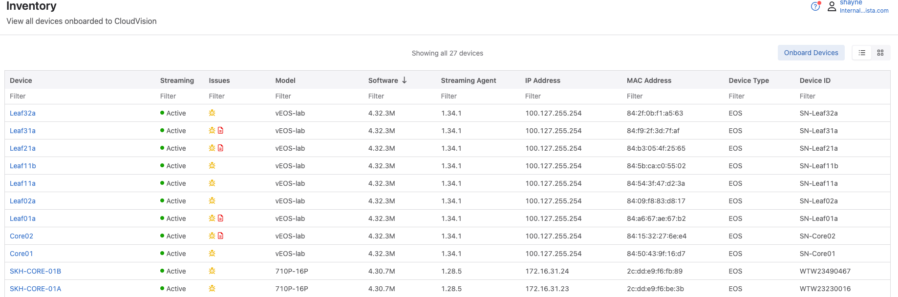
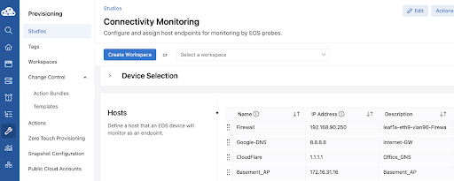

 

# Arista Southwest Region Newsletter

Welcome to the June 2025 newsletter for Arista customers in the U.S. Southwest Region!

 
We welcome your feedback on the newsletter. If you have any ideas on what you want to see, please reach out to southwest@arista.com.  

---

## **Leveraging Arista Cloud Test (ACT) for Network Modeling**
By: Shayne Kelly, Advanced Services Engineer, Southwest Region   

Arista Cloud Test (ACT) is a virtualized network modeling environment that can be used for testing configurations and features, or as a full ‘digital twin’. This allows you to have a full working model of your network, whether you are trying to get a head start on port mapping and configurations, testing out a difficult migration, applying a new set of features, or creating a full digital twin of your existing production network, where you can test changes and designs before applying them to your production environment.   

I use ACT on a regular basis, as customers frequently come to me and ask, ‘How do I migrate from a traditional 3-Tier design to an EVPN/VxLAN CLOS network?’, ‘How do I set up the routing policy for my Metro Area Network?’, or even, ‘What is the best way to configure my BGP policies?’. Any number of these situations can easily be modeled with ACT.   

Also, given that ACT allows you to specify the device model and have the correct port mapping applied, you are able to get a head start on modeling out your configuration and even your automation, before you ever rack your new Arista Gear. I have worked with many customers, using ACT to create and test the configurations and automation models they have employed in their production environments, which allowed them to build out everything they needed for their deployment, long before the switches arrived. This includes switch configurations, Network Automation Variable Files, for both customer Ansible Scripts and Arista Validated Design (AVD) models, and even integrations with third party services, such DHCP and IPAM (IP Address Management) systems.   

Lastly, because you can provision connectivity outside of this virtual environment, you can connect these virtual switches to CVaaS (Arista Cloud Vision as a Service), allowing you to use the same Cloud Vision that you use to manage your other switches, to manage your test environment. This allows you to manage your switches via Cloud Vision, whether that is with Studios, or a different Automation Platform, and view your configuration and changes the same way you will with your switches in your production environment.   

Obviously a deep dive into this technology is a rather lengthy article. So in this article, we will cover the ‘highlights’ of ACT, some basic steps and requirements to get your ACT environment up and running, and show what this looks like in CVaaS.   

**ACT Setup and Configuration**  

ACT leverages simple YAML files for constructing your device inventory and the connections between the devices. This allows you a simple way to create your lab environment. I love the fact that YAML files are so flexible and easy to read. For someone who is not an automation ‘expert’ this format is easy for me to work with and understand. I have worked with customers who have never used automation before, but due to the structure of YAML files, they were able to quickly understand how to edit these files and use them in their environment.   

Once you have all of your topology file completed, now you simply use that to ‘create’ your virtual environment and ACT does the rest[^1]. ACT will verify that the topology file is valid and even call out any errors, if they exist. Once the file is validated, you can generate your lab and away you go. The screenshot below shows an example of a lab that I recently built to test out some of the new Campus Studios features for a customer. You can see each of the devices is listed, with the details about the device.  

**Working with Your Virtual Environment**  

For this lab, I choose to use CVaaS as the way that I would configure and manage my devices. I have an existing CVaaS instance that I use for testing, and adding these devices to my CVaaS instance was exactly the same as I would do for an on-site deployment. Because there are only a few devices in my lab, I choose not to host a ZTP (Zero Touch Provisioning) server, which would have added the security token and the required network information to connect the device to CVaaS automatically. Instead, I choose to do this manually, however, I have used the ZTP method in the past, and it works exactly as it does in a production environment.   

In the screenshot below, you can see the Inventory Page from my CVaaS environment. The virtual devices for this lab have been onboarded and you can see them in the inventory, alongside other production, physical devices in my environment. I like to use CVaaS when I am testing features specific to CloudVision as it provides me with the most up to date features and functionality.   

<figure markdown="span">
  
  <figcaption>Inventory List in CVaaS</figcaption>
</figure>

Again, all of these devices that you see here are virtual devices, running in Cloud Hosted Instance, that you can use to test with. I have done the same or similar work for Data Center Deployments, WAN routing deployments, tests for AVD and other automation frameworks, you name it. The possibilities are endless with ACT. While this example is relatively small and simple, I have built ACT topologies with Customers that literally span 100s of devices, in large 5 Stage CLOS fabrics, with multiple uplinks and dozens of connected end-hosts, all running iPerf and other network testing technologies.   

**Summary**  

ACT is a very easy to use tool that allows you to test out features, pre-build your network or create a digital twin that you can use to test out changes. It provides you a platform to create extremely large networks, or test out features in a small sandbox, catered to Arista Devices.   

If you are interested in learning more about ACT, or would like to speak to someone about ordering this or seeing a live demo, please contact your local account team.  

Alternatively, you can also read the following Data Sheet for additional information:  
[ACT Data Sheet](https://www.arista.com/assets/data/pdf/Datasheets/Cloud-Test-Datasheet.pdf)  

[^1]: Virtually all of the ‘fixed’ switches can be specified, with the correct port mapping applied. It is possible to use Chassis switches as well, but this takes a bit more effort    

## **Simple and Straightforward Network Monitoring - Arista Connectivity Monitoring Studio**
By: Alex Bojko, Advanced Services Engineer, Southwest Region   

High latency, packet loss, and jitter are all words we despise as network engineers. We design and build networks to combat and prevent each of those events from happening. However, some things are out of our control and still find a way to occur despite our best efforts. Clients, Endpoints, and Applications are isolated in discrete locations, away from the local network. Managing and determining the performance and user experience of a modern network has proven to be a tough challenge.   

The Connectivity Monitor Studio built into Arista CloudVision serves as a simple and straightforward solution to help address this challenge. Connectivity Monitor is a feature introduced in EOS 4.24.2F that aims to allow users to monitor their network resources directly from their Arista switches. It works by periodically sending ICMP probes to designated endpoints, tracking latency, packet loss, jitter, and HTTP response time. An Endpoint can be classified as an EOS device, third-party device, access point, server, or application. As long as ICMP and HTTP ports to these endpoints are open, Connectivity Monitor will be able to track a device's connection to them.  

Using the Connectivity Monitor Studio in Arista CloudVision, we define a list of hosts (endpoints) that we would like to track by giving them a name and designating their destination IP address. Then, with the use of device tags, we define an Arista switch (or group of switches) that we will source the ICMP probes from. This can be one of or any number of our Arista EOS switches that have been onboarded into CloudVision. The last step is to simply map the defined hosts to the tagged Arista switch or group of switches we want to source the monitoring from.   

<figure markdown="span">
  {: style="height:300px;width:700px"}
  <figcaption>Hosts in Connectivity Monitoring Studios</figcaption>
</figure>

CloudVision Studios will then build out the configuration needed for each device that we defined in the Connectivity Monitor Studio. After executing the Change Control, within the Devices tab of CloudVision, under the Connectivity Monitor subsection, we can select any number of our devices and view Latency, Packet Loss, Jitter, and HTTP Response time statistics to the defined hosts.   

<figure markdown="span">
  {: style="height:200px;width:700px"}
  <figcaption>Latency View</figcaption>
</figure>

For CloudVision as a Service (CVaaS) customers, this information is stored for 30 days. This can greatly aid in troubleshooting network disruptions as we can view historical telemetry data up to 4 weeks in the past. Furthermore, using the Events tab in CloudVIsion, we can set Latency, Packet Loss, Jitter, or HTTP Response Time thresholds that, when breached, send alerts directly to a receiver of our choice. Coupled with the real-time state streaming of EOS, this ensures that we will not miss a single spike in latency or any of the other listed metrics that we are tracking thanks to Connectivity Monitor.    

To learn more about Connectivity Monitor and the Connectivity Monitor Studio, click the links below:  

[Connectivity Monitor](https://www.arista.io/help/articles/ZGV2aWNlcy5jb25uZWN0aXZpdHlNb25pdG9yLkFsbA==#connectivity-monitor)  
[Connectivity Monitor Studio](https://www.arista.io/help/articles/cHJvdmlzaW9uaW5nLnN0dWRpb3MuQWxsLmJ1aWx0SW4uY29ubmVjdGl2aXR5#connectivity-monitoring-studio)  
[Connectivity Monitor TOI](https://www.arista.com/en/support/toi/eos-4-20-1f/13913-connectivity-monitor)    

---

## __*Upcoming Events*__  
Arista hosts various events throughout the year for you! Members of our team organize these informative events to showcase Arista's ability to not only help improve your network, but to also assist by providing a set of tools to improve your operations! Click on the boxes below to be directed to Arista's website for lists of Webinars and Events.

-   __Webinars__  

    --- 

    We make is easy for you to view products that are of interest, all virtually! Technical memebers of the team showcase outstading explanation of the products. Click below to see our list of Webinars. 

    [Arista Webinars](https://www.arista.com/en/company/news/webinars){.md-button}

-   __Events__ 

    ---
    Join us in person to get a closer look in our list of produts and solution, as well as get the chance to meet members of the team. Click below to see our list of ipcoming Events. 

    [Upcoming Events](https://www.arista.com/en/company/news/events){ .md-button }

--- 

## __*Software Updates*__
<figure markdown>
{: style="height:200px;width:300px"}    
    <figcaption></figcaption>
</figure>
For new code releases, click [here](https://www.arista.com/en/support/software-download) 

   |  Softwares    | Versions      |  Release Date |
   | :-----------: | :-----------: | :-----------:
   | __EOS__           | 4.32.6M   4.34.1F   4.32.0.2F   4.33.2.1F    | June 20th, 2025   June 16th, 2025   May 20th, 2025   May 14th, 2025   
   | __CVP__           | Portal 2025.1.1  Appliance 7.0.1  Sensor 1.1.0      | May 7th, 2025   January 28th, 2025  March 24th, 2025  
   | __DMF__           | 8.5.3  | June 20th, 2025   
   | __WLAN__  CV-CUE Wireless Manager  |  13.0.0-67 19.0.0        |  December 15th, 2022 June 12th, 2025 
   | __Arista NDR__         | 5.2.4         | August 2024
   | __TerminAttr__    | 1.27.2         | April 9th, 2025   

---

## __*Software Advisories*__
Below is a list of advisories that are announced by Arista. To view more details on the specific advisories, please click the links in the middle row.

| Name          | Advisory Link           | Date of Advisory Notice  |
| :-----------: |:-------------:| :-----:|
|  __ACL Policies__   | [Security Advisory 0120](https://www.arista.com/en/support/advisories-notices/security-advisory/21414-security-advisory-0120)  | May 27th, 2025   |  
|  __IPSec__   | [Security Advisory 0119](https://www.arista.com/en/support/advisories-notices/security-advisory/21413-security-advisory-0119)  | May 27th, 2025   |  
|  __VLAN Isolation__   | [Security Advisory 0118](https://www.arista.com/en/support/advisories-notices/security-advisory/21411-security-advisory-0118)  | May 20th, 2025   |  
|  __32bit EOS CCS-750X__   | [Field Notice 0102](https://www.arista.com/en/support/advisories-notices/field-notice/21629-field-notice-0102)  | June 23rd, 2025   | 
|  __DMF Analytics Node__   | [Field Notice 0101](https://www.arista.com/en/support/advisories-notices/field-notice/21628-field-notice-0101)  | June 18th, 2025   |   
|  __AP Point Firmware 19.0__   | [Field Notice 0100](https://www.arista.com/en/support/advisories-notices/field-notice/21415-field-notice-0100)  | May 28th, 2025   |  

For a list of the most current advisories and notices, click [Here](https://www.arista.com/en/support/advisories-notices)

---

## __*Product Updates*__
<figure markdown>
{: style="height:200px;width:400px"}   
    <figcaption></figcaption>
</figure>
**End of Sale** notices are listed below.

| Device        | Name           | End Of Sale Date  |
| :-----------: |:-------------: |     :----:        |
| Software      | [End of Software for CloudVision Portal 2023.2](https://www.arista.com/en/support/advisories-notices/end-of-support/21412-end-of-software-support-for-cloudvision-portal-2023-2-release-train) [End of Software Support for EOS 4.28](https://www.arista.com/en/support/advisories-notices/end-of-support/21275-end-of-software-support-for-eos-4-28) [DMF and CCF Deployments on Accton/ Edgecore Switches](https://www.arista.com/en/support/advisories-notices/end-of-support/21094-end-of-support-for-dmf-and-ccf-deployments-on-accton-edgecore-switches) [EOS-4.34 and later no longer supported on select switches](https://www.arista.com/en/support/advisories-notices/end-of-support/21089-end-of-software-support-for-7280r-r2-7500r-r2-and-7020r-series)  | May 27th. 2025   March 14, 2025  January 31st, 2025  January 15th, 2025   |
| Module        | [7500R2 Series Linecards](https://www.arista.com/en/support/advisories-notices/end-of-sale/18886-end-of-sale-of-the-arista-7500r2-series-line-cards) | December 20th, 2023    |
| Access Points | [AP Model W-118](https://www.arista.com/en/support/advisories-notices/end-of-sale/20652-end-of-sale-of-ap-model-w-118)        |   November 20th, 2024   |
| CVP           | [CVP 2023.2](https://www.arista.com/en/support/advisories-notices/end-of-support/21627-end-of-software-support-for-cloudvision-portal-2023-3-release-train)   [CVP 2023.2](https://www.arista.com/en/support/advisories-notices/end-of-support/21412-end-of-software-support-for-cloudvision-portal-2023-2-release-train)          |  June 17th, 2025   May 27th, 2025   |
| DMF           | [DMF 8.3](https://www.arista.com/en/support/advisories-notices/end-of-support/21417-end-of-software-support-for-dmf-8-3)          |  June 3rd, 2025           |
| Switches      | [DCS-7020R Series](https://www.arista.com/en/support/advisories-notices/end-of-sale/21052-end-of-sale-of-the-arista-dcs-7020r-series)  |  December 20th, 2024  |

**New Releases** of Arista's device are listed below 

|  Device       | More Information |  Release Date 
    | :-----------: | :-----------:    | :-----------:
    |  Arista SWAG    |   [Modern Stacking for Campus](https://www.arista.com/en/company/news/press-release/20693-pr-12032024)                | Q1 2025 
    | Arista Multi-Domain Segmentaton Service  | [Arista MSS](https://www.arista.com/en/company/news/press-release/19297-pr-20240430)         | Q3 2024
    | Arista CV UNO  | [CloudVision Universal Network Observability](https://www.arista.com/en/company/news/press-release/19195-pr-20240305)  | Q1 2024

---
# *Feel Free to Reach Out To Us For Your Network Needs* 
<figure markdown>
{: style="height:300px;width:800px"}  
    <figcaption></figcaption>
</figure>
We thank you for taking the time to read out newsletter today. Feel free to reach out to your SE or ASE for more information or questions regardsing your network operations. Until next month, have a good one! 

