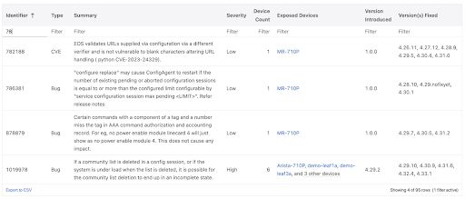
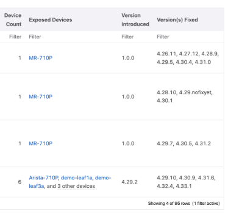

 

# Arista March Southwest Region Newsletter

Welcome to the March 2025 newsletter for Arista customers in the U.S. Southwest Region!

 
We welcome your feedback on the newsletter. If you have any ideas on what you want to see, please reach out to southwest@arista.com.  

You're invited to out Southwest Users Group event on March 26, 2025! Learn how modern network practices are orchestrated through Arista Validated Designs. Sign up for the event below:  

[Arista Southwest User Group Sign up Link](https://events.arista.com/2025-03-26-q1-southwest-users-group)  

---

## **Arista Ethernetlink Portfolio for AI Networking**
By: Salman Zahid, Director of Systems Engineering, Southwest Region  

In the rapidly evolving world of Artificial Intelligence, network performance can make or break the success of AI initiatives. Arista Networks has stepped up to this challenge with its groundbreaking Etherlink AI platforms (a set of hardware platforms and a suite of software capabilities in Arista EOS and CloudVision), offering a comprehensive solution for high-performance AI networking.  

**Unparalleled Performance and Efficiency**  

Etherlink delivers up to 65% improved performance compared to traditional Ethernet systems, ensuring faster AI job completion times. This performance boost is achieved through lossless, low-latency platforms and innovative RDMA-aware load balancing and congestion avoidance features.
Moreover, Etherlink shines in failure recovery scenarios, offering up to 30x faster convergence than InfiniBand. This rapid recovery is crucial in large-scale AI clusters where component failures are inevitable.  

**Scalability for AI Workloads of Any Size**  

Etherlink offers unmatched flexibility, supporting AI clusters ranging from just 32 XPUs to over 100,000 parallel XPUs. This scalability is made possible through a variety of deployment options:  

1. Single systems: Up to 576 800G or 1,152 ports of 400G with a single modular 7800R4 series system.

2. Single-hop distributed Etherlink switching: Up to 4608 800G or 9216  ports of 400G (7700R4 series) in a single-stage cluster. 16k ports of 800G or 32k of 400G in multi-stage cluster.

3. Two- and three-tier leaf/spine or planar topologies: Supporting over 100k XPUs using modular 7800R4 series systems in leaf and spine roles.

**Cutting-Edge Hardware Portfolio**  

Arista offers a range of AI-optimized platforms as part of the Etherlink portfolio:

1. 7060X6 series: Fixed AI leaf switches with up to 64 800G or 128 ports of 400G.

2. 7800R4 series: Modular AI spine systems with up to 576 ports of 800G or 1,152 ports of 400G. 

3. 7700R4 series: Innovative Distributed Etherlink Switch for single-hop, large-scale deployments.  

**Power Efficiency**  

Etherlink enables significant power reduction for AI clusters at both the system and optical interconnect levels:

* Arista's Etherlink systems use best-in-class 5nm silicon, consuming at least 25% lower power per Gb than prior generations.

* Support for Linear-drive Pluggable Optics (LPO - LPOs remove DSPs) further reduces net power consumption by 50% compared to traditional pluggable optics and Active Optical Cables (AOCs).  

**Intelligent Software Suite**  

Arista EOS (Extensible Operating System) provides advanced features tailored for AI workloads:  

* RDMA-aware dynamic load balancing

* Advanced congestion control 

* Cluster Load Balancing, where congestion management is done end-to-end instead of on just a local hop   

* Support for Data Center Quantized Congestion Notification (DCQCN)  

**EOS-based AI Agent**  

Arista's EOS-based AI Agent optimizes coordinated performance between networking and compute domains. It provides:  

*  Local configuration management of NICs

*  Streaming telemetry of NIC performance

*  Consistent application of QoS parameters from NIC to network  

**AI Observability**  

Arista's AI observability solution offers comprehensive insights into the AI ecosystem:  

*  Streaming data from Arista EOS-based AI platforms and compute nodes

*  CV UNO (CloudVision Universal Network Observability) —an AI-driven, 360° network observability feature set within CloudVision—integrates AI job visibility with network and system data, providing real-time insights to optimize AI job performance and pinpoint bottlenecks and hardware issues with unmatched precision for rapid resolution  

**Future-Ready with Ultra Ethernet Consortium**  

As a founding Ultra Ethernet Consortium (UEC) member, Arista is at the forefront of developing next-generation Ethernet technologies for AI and HPC workloads. Etherlink platforms are forward-compatible with future UEC specifications, ensuring long-term viability and performance improvements.  

In conclusion, Arista's Etherlink solution stands at the forefront of networking innovation for AI workloads. By combining high-performance hardware, intelligent software, and a unified vision for AI infrastructure, Arista empowers organizations to build scalable, efficient, and powerful AI networks that drive the future of artificial intelligence.  

For more information, check these resources:  

*  AI Netoworking White Paper
*  ARISTA AI Ethernet Portfolio
*  Arista and NVIDIA Collaboration Press Release
*  AI Center Video

---

## **Managing Bug and Threat Compliance in the Modern Network** 
By: Alex Bojko, Advanced Services Engineer, Southwest Region  

Keeping a production network in compliance can prove to be a challenging task, especially when it comes to managing bugs and CVE's (Common Vulnerabilities and Exposures) on our network infrastructure. For starters, there can be a wide range of devices deployed in a network, many of which are running various versions of code. Bugs and Security Advisories are unpredictable, and keeping track of them across a wide range of devices and code can become cumbersome. Failing to bring devices into compliance can result in network downtime, outages, and a vulnerable network.   

The Compliance Overview section of CloudVision makes managing and maintaining a secure production network simple and straightforward. Once EOS devices are onboarded into CloudVision, they are automatically included in the compliance overview section. CloudVisions Bug and Security Advisory database can be automatically updated by syncing with Arista's AlertBase server within the Settings > Compliance Update section of CloudVision. Once the AlertBase server is synced, you can view any new and existing Bugs and CVE's present on your EOS infrastructure. A table will be auto-populated:    

<figure markdown>
{: style="height:250px;width:850px"}
    <figcaption> CloudVision view of bugs </figcaption>
</figure>   

<figure markdown>

    <figcaption> First 3 columns zoomed in </figcaption>
</figure>   

<figure markdown>

    <figcaption> Last 3 columns zoomed in </figcaption>
</figure>   

The table will inform you of the following information:  

*  The Bug/CVE identifier number
*  A brief summary of the Bug/CVE
*  The associated severity level
*  The total number of affected devices and the exact devices that are affected
*  The version of code that the Bug/CVE was introduced in as well as the version of code that it was fixed in  

Levering this information makes monitoring and maintaining a secure and compliant network a seamless experience. By staying up to date on Bug and Security Advisories affecting devices in your production network, you can avoid network downtime all while ensuring your network is secure. Having one central location to view a list of all affected platforms and the remediation methods for them saves network operators time and energy.   

Arista devices use a single operating system, EOS, across all network domains. This further adds to the simplicity of managing and remediating various Bugs and CVE's on our infrastructure, since they are limited to affecting one single operating system instead of many operating systems across devices in various network domains. EOS has historically been, and continues to be, an extremely high quality operating system, as illustrated in the image below.  

<figure markdown>

    <figcaption>  </figcaption>
</figure>  

 To learn more about additional features of CloudVisions Compliance Overview section, like image and configuration compliance as well as End of Life information, click on the link below:  

[CloudVision Compliance Overview](https://www.cv-staging.corp.arista.io/help/articles/ZGV2aWNlcy5zZWxlY3RlZERldmljZS5jb21wbGlhbmNl)   
 

---

## __*Upcoming Events*__  
Arista hosts various events throughout the year for you! Members of our team organize these informative events to showcase Arista's ability to not only help improve your network, but to also assist by providing a set of tools to improve your operations! Click on the boxes below to be directed to Arista's website for lists of Webinars and Events.

-   __Webinars__  

    --- 

    We make is easy for you to view products that are of interest, all virtually! Technical memebers of the team showcase outstading explanation of the products. Click below to see our list of Webinars. 

    [Arista Webinars](https://www.arista.com/en/company/news/webinars){.md-button}

-   __Events__ 

    ---
    Join us in person to get a closer look in our list of produts and solution, as well as get the chance to meet members of the team. Click below to see our list of ipcoming Events. 

    [Upcoming Events](https://www.arista.com/en/company/news/events){ .md-button }

--- 

## __*Software Updates*__
<figure markdown>
{: style="height:200px;width:300px"}    
    <figcaption></figcaption>
</figure>
For new code releases, click [here](https://www.arista.com/en/support/software-download) 

   |  Softwares    | Versions      |  Release Date |
   | :-----------: | :-----------: | :-----------:
   | __EOS__           | 4.32.4.1M   4.33.2F   4.32.4FM   4.28.13M   4.30.9M     | February 25th, 2025   February 20th, 2025   January 29th, 2025   January 20th, 2025   January 13th, 2025   
   | __CVP__           | Portal 2024.3.1  Appliance 7.0.0  Sensor 1.0.0      | December 13th, 2024   November 15th, 2024  October 16th, 2024  
   | __DMF__           | 8.6.1  8.5.2   | March 4th, 2025   November 1st, 2024   
   | __WLAN__  CV-CUE Wireless Manager  |  13.0.0-67 18.0.0        |  December 15th, 2022 December 2024 
   | __Arista NDR__         | 5.2.4         | August 2024
   | __TerminAttr__    | 1.35.1         | November 5th, 2024   

---

## __*Software Advisories*__
Below is a list of advisories that are announced by Arista. To view more details on the specific advisories, please click the links in the middle boxes.

| Name          | Advisory Link           | Date of Advisory Notice  |
| :-----------: |:-------------:| :-----:|
|  __BGP Agent Moomory Leak__   | [Security Advisory 0112](https://www.arista.com/en/support/advisories-notices/security-advisory/21098-security-advisory-0111)  | March 11th, 2025   |
|  __OpenConfig gNOI Request__   | [Security Advisory 0111](https://www.arista.com/en/support/advisories-notices/security-advisory/21098-security-advisory-0111)  | February 25th, 2025   |
| __CPU Monitor Sessions__    | [Field Notice 0096](https://www.arista.com/en/support/advisories-notices/field-notice/21117-field-notice-0096) | March 7th, 2025   |
| __Power Source Equipment (PSE)__    | [Field Notice 0095](https://www.arista.com/en/support/advisories-notices/field-notice/21099-field-notice-0095) | February 26th, 2025   |
| __Intermittent link flaps__    | [Field Notice 0094](https://www.arista.com/en/support/advisories-notices/field-notice/21095-field-notice-0094)   | February 28th, 2025   |

For a list of the most current advisories and notices, click [Here](https://www.arista.com/en/support/advisories-notices)

---

## __*Product Updates*__
<figure markdown>
{: style="height:200px;width:400px"}   
    <figcaption></figcaption>
</figure>
**End of Sale** notices are listed below.

| Device        | Name           | End Of Sale Date  |
| :-----------: |:-------------: |     :----:        |
| Software      | [DMF and CCF Deployments on Accton/ Edgecore Switches](https://www.arista.com/en/support/advisories-notices/end-of-support/21094-end-of-support-for-dmf-and-ccf-deployments-on-accton-edgecore-switches) [EOS-4.34 and later no longer supported on select switches](https://www.arista.com/en/support/advisories-notices/end-of-support/21089-end-of-software-support-for-7280r-r2-7500r-r2-and-7020r-series) [CloudVision Portal 2023.1 Train](https://www.arista.com/en/support/advisories-notices/end-of-support/21053-end-of-software-support-for-cloudvision-portal-2023-1-release-train)    | January 31st, 2025  January 15th, 2025  December 20th, 2024      |
| Module        | [7500R2 Series Linecards](https://www.arista.com/en/support/advisories-notices/end-of-sale/18886-end-of-sale-of-the-arista-7500r2-series-line-cards) | December 20th, 2023    |
| Access Points | [AP Model W-118](https://www.arista.com/en/support/advisories-notices/end-of-sale/20652-end-of-sale-of-ap-model-w-118)        |   November 20th, 2024   |
| DMF           | [Recorder Node DCA-DM-RA3](https://www.arista.com/en/support/advisories-notices/end-of-sale/21087-end-of-sale-end-of-life-for-arista-recorder-node-appliance-dca-dm-ra3)          |  January 14th, 2025           |
| Switches      | [DCS-7020R Series](https://www.arista.com/en/support/advisories-notices/end-of-sale/21052-end-of-sale-of-the-arista-dcs-7020r-series)  |  December 20th, 2024  |

**New Releases** of Arista's device are listed below 

|  Device       | More Information |  Release Date 
    | :-----------: | :-----------:    | :-----------:
    |  Arista SWAG    |   [Modern Stacking for Campus](https://www.arista.com/en/company/news/press-release/20693-pr-12032024)                | Q1 2025 
    | Arista Multi-Domain Segmentaton Service  | [Arista MSS](https://www.arista.com/en/company/news/press-release/19297-pr-20240430)         | Q3 2024
    | Arista CV UNO  | [CloudVision Universal Network Observability](https://www.arista.com/en/company/news/press-release/19195-pr-20240305)  | Q1 2024

---
# *Feel Free to Reach Out To Us For Your Network Needs* 
<figure markdown>
{: style="height:300px;width:800px"}  
    <figcaption></figcaption>
</figure>
We thank you for taking the time to read out newsletter today. Feel free to reach out to your SE or ASE for more information or questions regardsing your network operations. Until next month, have a good one! 

