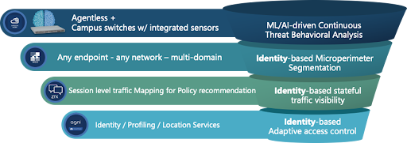
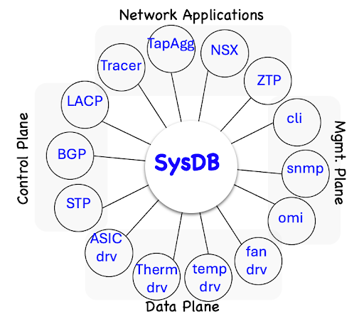
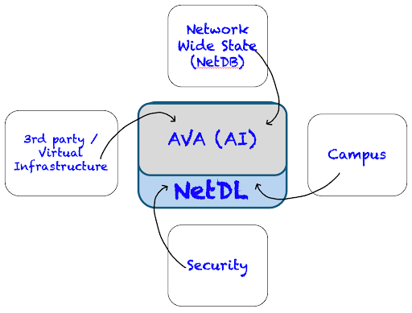

 

# Arista Southwest Region Newsletter

Welcome to the April 2025 newsletter for Arista customers in the U.S. Southwest Region!

 
We welcome your feedback on the newsletter. If you have any ideas on what you want to see, please reach out to southwest@arista.com.  

---

## **Arista Zero Trust Networking Stack: Key Concepts**
By: Salman Zahid, Director of Systems Engineering, Southwest Region  

Safeguarding enterprise assets has always been essential for maintaining business continuity. However, as the traditional network perimeter disappears—driven by the dynamic placement of applications in the cloud and the adoption of SaaS solutions—organizations now face greater vulnerabilities. The push to offer seamless access to key resources for employees and contractors, often through BYOD policies, further increases this risk. Additionally, many threat actors now employ sophisticated, malware-free techniques that can cause significant damage, even when data is fully encrypted.  

Driven by evolving security challenges, Zero Trust has emerged as a top priority for enterprises. As a leading provider of networking solutions to enterprise customers, Arista recognizes that the network itself can be leveraged to enhance enterprise security in innovative and efficient ways—delivering robust protection without adding unnecessary complexity while maintaining a seamless experience for all users and stakeholders. While Zero Trust encompasses a broad range of security domains and requires contributions from various technologies—including firewalls, endpoint detection and response (EDR), and other security services—the network remains foundational. Every user, device, and application relies on the network to communicate, positioning it as a critical control point for enforcing security policies and enabling real-time visibility and threat response across the enterprise.  

<figure markdown>
{: style="height:300px;width:800px"} 
    <figcaption> Arista Zero Trust Networking </figcaption>
</figure>  

Arista’s Zero Trust architecture is a combination of various functions starting from  

1. Identity-based adaptive access control: Arista’s AGNI (Arista Guardian Network Identity) system serves as a network access control policy engine that provides access to users and devices no matter where they connect over wired or wireless networks. It can be a policy engine for corporate users, devices, guest users, BYOD, and IoT. It meets the zero-trust requirement of trusting nothing and always knowing the identity of every endpoint. AGNI also helps operators restrict what users or devices can access once they are on the network.  

2. Based on the user’s identity, we can create identity-aware microperimeters that are completely decoupled from the underlying network topology. Arista’s ZTX traffic mapper appliance (physical or virtual) can then monitor all session-level activity in the network and provide the operator a clear view of the communication activity. The operator can create policies based on that identity-aware view.  

3. Multi Domain Microsegmentation Services (Arista MSS) can then enforce the identity-aware segmentation at the network's edge and greatly simplify or limit the need for the firewall to just inter-zone traffic—this kind of identity-aware enforcement further limits lateral movement within the network. Even if someone were to infiltrate the network, Arista MSS would greatly reduce the attacker's ability by restricting movement beyond what is allowed for that group, which is explicitly governed through the policy. Any traffic that does not match the policy is redirected to the firewalls for further inspection.  

4. The native built-in NDR (Network Detection and Response) capability within Arista switches discovers, profiles, and tracks devices, users, and applications using AI-based fingerprinting and detects sophisticated threats with the lowest noise possible. This meets the continuous monitoring requirement of a network built with Zero Trust principles.  

To learn more about Arista’s Zero Trust approach, please visit the following link below:  
[Arista Zero Trust Networking](https://www.arista.com/en/solutions/security)  

---

## **The Evolution of Arista EOS: From SysDB to NetDL** 
By: Frough Taihary & Alex Bojko, Advanced Services Engineer, Southwest Region  

Arista Networks’ Extensible Operating System (EOS) has been a game-changer in networking, offering a modular, programmable, and highly resilient architecture. Unlike traditional network operating systems, EOS is built on a database-driven model, enabling real-time state streaming and management.    

 This article explores the evolution of EOS, focusing on its core databases—SysDB, NetDB, and NetDL.  

 SysDB is the core of a switch that holds the state information of a switch. SysDB, or System Database,  exists in every Arista switch. It stores the state of all 100+ agents, or processes, running on the switch. The agents communicate through a publish and subscribe model to SysDB, therefore agents do not communicate with each other directly but only with SysDB. This prevents agent interdependency and cascading failures within the operating system. Also, by separating agent state from processing, we have created a more resilient and fault tolerant switching architecture. An agent that goes offline simply needs to pull its last known state from SysDB upon re-initilization to begin processing as if no failure occurred. To summarize, SysDB serves as a centralized database within each EOS switch, however, the next evolution of EOS goes beyond a single device.   
 

<figure markdown>

    <figcaption>  </figcaption>
</figure>  

NetDB is the next evolution of EOS, and it operates by collecting data from all of our Arista EOS switches. NetDB allows us to aggregate all the switches' state information in one location. The evolution from SysDB to NetDB led to the creation of our Network management and orchestration platform CloudVision. While this was a big step forward, we wanted to expand our visibility from EOS devices to now include information from all aspects of our network.   

NetDL is the latest evolution of EOS. NetDL is a series of databases that aggregates information from all aspects of our network, not just the switching infrastructure. This can include data from our EOS devices, wireless, security, IoT, Virtualized, and 3rd party infrastructure. This led to the creation of CV-UNO (Universal Network Observability), which ingests all of the additional data into CloudVision, giving the network operator much wider visibility into their entire network. Also, since NetDL provides us with an expansive collection of network data in one location, Arista's AI/ML solution AVA (Autonomous Virtual Assist) can leverage the data to provide customers with real time remediation recommendations, reducing MTTR.   

<figure markdown>

    <figcaption>  </figcaption>
</figure> 

In conclusion, EOS evolved from a single database located on a single switch, to a network wide database aggregating every switch's state information, to an encompassing series of databases aggregating data from every aspect and interaction within our network.  

To learn more, click on the links below:  
[Ken Duda "EOS: A Tale of Opposite Architectures"](https://www.youtube.com/watch?v=Hfwr6sY27hA)  
[Ken Duda "Arista NetDL Evolution"](https://www.youtube.com/watch?v=FWvceu6c-gY)  
[Arista AVA (Autonomous Virtual Assist)](https://www.arista.com/assets/data/pdf/Whitepapers/Arista-AVA-Whitepaper.pdf)  

---

## __*Upcoming Events*__  
Arista hosts various events throughout the year for you! Members of our team organize these informative events to showcase Arista's ability to not only help improve your network, but to also assist by providing a set of tools to improve your operations! Click on the boxes below to be directed to Arista's website for lists of Webinars and Events.

-   __Webinars__  

    --- 

    We make is easy for you to view products that are of interest, all virtually! Technical memebers of the team showcase outstading explanation of the products. Click below to see our list of Webinars. 

    [Arista Webinars](https://www.arista.com/en/company/news/webinars){.md-button}

-   __Events__ 

    ---
    Join us in person to get a closer look in our list of produts and solution, as well as get the chance to meet members of the team. Click below to see our list of ipcoming Events. 

    [Upcoming Events](https://www.arista.com/en/company/news/events){ .md-button }

--- 

## __*Software Updates*__
<figure markdown>
{: style="height:200px;width:300px"}    
    <figcaption></figcaption>
</figure>
For new code releases, click [here](https://www.arista.com/en/support/software-download) 

   |  Softwares    | Versions      |  Release Date |
   | :-----------: | :-----------: | :-----------:
   | __EOS__           | 4.32.5M   4.32.4.1M   4.33.2F    | March 27th, 2025   February 25th, 2025   February 20th, 2025   
   | __CVP__           | Portal 2025.1.0  Appliance 7.0.1  Sensor 1.1.0      | April 3rd, 2025   January 28th, 2025  March 24th, 2025  
   | __DMF__           | 8.6.1  8.5.2   | March 6th, 2025   November 1st, 2024   
   | __WLAN__  CV-CUE Wireless Manager  |  13.0.0-67 18.0.0        |  December 15th, 2022 December 2024 
   | __Arista NDR__         | 5.2.4         | August 2024
   | __TerminAttr__    | 1.35.1         | November 5th, 2024   

---

## __*Software Advisories*__
Below is a list of advisories that are announced by Arista. To view more details on the specific advisories, please click the links in the middle row.

| Name          | Advisory Link           | Date of Advisory Notice  |
| :-----------: |:-------------:| :-----:|
|  __Time Bound Device Onboarding__   | [Security Advisory 0116](https://www.arista.com/en/support/advisories-notices/security-advisory/21316-security-advisory-0116)  | April 15th, 2025   |
|  __ZTP Admin Privileges__   | [Security Advisory 0115](https://www.arista.com/en/support/advisories-notices/security-advisory/21315-security-advisory-0115)  | April 15th, 2025   |
|  __Malicious Authenticated User__   | [Security Advisory 0114](https://www.arista.com/en/support/advisories-notices/security-advisory/21314-security-advisory-0114)  | April 15th, 2025   |
|  __EOS Secure Vxlan__   | [Security Advisory 0113](https://www.arista.com/en/support/advisories-notices/security-advisory/21289-security-advisory-0113)  | April 8th, 2025   |
|  __Renaming Arista WAN Routing Models__   | [Field Notice 0098](https://www.arista.com/en/support/advisories-notices/field-notice/21286-field-notice-0098)  | March 26th, 2025   |
|  __CloudVision On-Prem Incomplete Database Writes__   | [Field Notice 0097](https://www.arista.com/en/support/advisories-notices/field-notice/21272-field-notice-0097)  | March 12th, 2025   |
|  __CPU Monitor Sessions__   | [Field Notice 0096](https://www.arista.com/en/support/advisories-notices/field-notice/21117-field-notice-0096)  | March 7th, 2025   |

For a list of the most current advisories and notices, click [Here](https://www.arista.com/en/support/advisories-notices)

---

## __*Product Updates*__
<figure markdown>
{: style="height:200px;width:400px"}   
    <figcaption></figcaption>
</figure>
**End of Sale** notices are listed below.

| Device        | Name           | End Of Sale Date  |
| :-----------: |:-------------: |     :----:        |
| Software      | [End of Software Support for EOS 4.28](https://www.arista.com/en/support/advisories-notices/end-of-support/21275-end-of-software-support-for-eos-4-28) [DMF and CCF Deployments on Accton/ Edgecore Switches](https://www.arista.com/en/support/advisories-notices/end-of-support/21094-end-of-support-for-dmf-and-ccf-deployments-on-accton-edgecore-switches) [EOS-4.34 and later no longer supported on select switches](https://www.arista.com/en/support/advisories-notices/end-of-support/21089-end-of-software-support-for-7280r-r2-7500r-r2-and-7020r-series) [CloudVision Portal 2023.1 Train](https://www.arista.com/en/support/advisories-notices/end-of-support/21053-end-of-software-support-for-cloudvision-portal-2023-1-release-train)    | March 14, 2025  January 31st, 2025  January 15th, 2025  December 20th, 2024      |
| Module        | [7500R2 Series Linecards](https://www.arista.com/en/support/advisories-notices/end-of-sale/18886-end-of-sale-of-the-arista-7500r2-series-line-cards) | December 20th, 2023    |
| Access Points | [AP Model W-118](https://www.arista.com/en/support/advisories-notices/end-of-sale/20652-end-of-sale-of-ap-model-w-118)        |   November 20th, 2024   |
| DMF           | [Recorder Node DCA-DM-RA3](https://www.arista.com/en/support/advisories-notices/end-of-sale/21087-end-of-sale-end-of-life-for-arista-recorder-node-appliance-dca-dm-ra3)          |  January 14th, 2025           |
| Switches      | [DCS-7020R Series](https://www.arista.com/en/support/advisories-notices/end-of-sale/21052-end-of-sale-of-the-arista-dcs-7020r-series)  |  December 20th, 2024  |

**New Releases** of Arista's device are listed below 

|  Device       | More Information |  Release Date 
    | :-----------: | :-----------:    | :-----------:
    |  Arista SWAG    |   [Modern Stacking for Campus](https://www.arista.com/en/company/news/press-release/20693-pr-12032024)                | Q1 2025 
    | Arista Multi-Domain Segmentaton Service  | [Arista MSS](https://www.arista.com/en/company/news/press-release/19297-pr-20240430)         | Q3 2024
    | Arista CV UNO  | [CloudVision Universal Network Observability](https://www.arista.com/en/company/news/press-release/19195-pr-20240305)  | Q1 2024

---
# *Feel Free to Reach Out To Us For Your Network Needs* 
<figure markdown>
{: style="height:300px;width:800px"}  
    <figcaption></figcaption>
</figure>
We thank you for taking the time to read out newsletter today. Feel free to reach out to your SE or ASE for more information or questions regardsing your network operations. Until next month, have a good one! 

