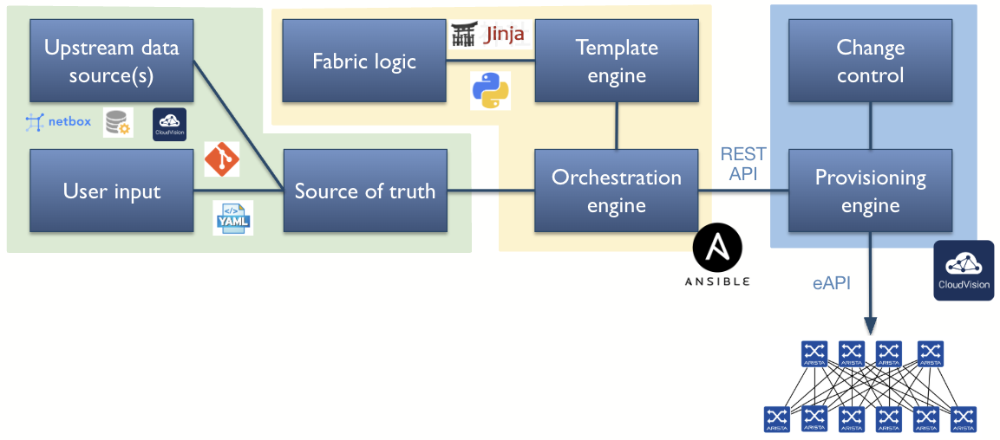
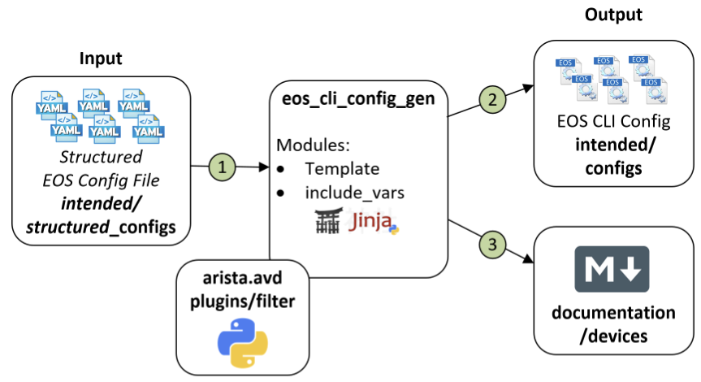
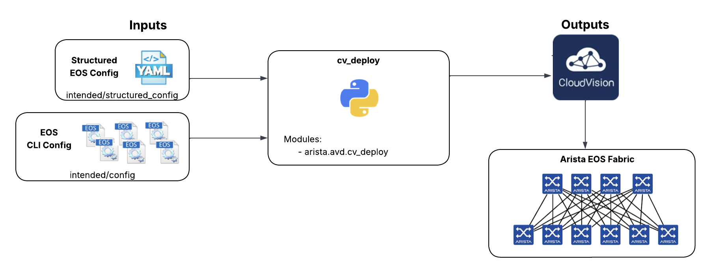
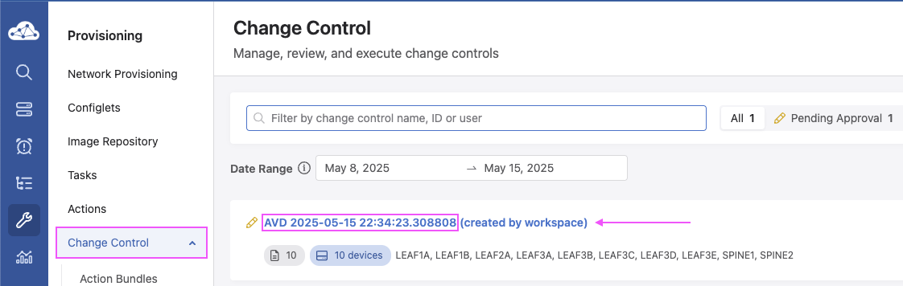
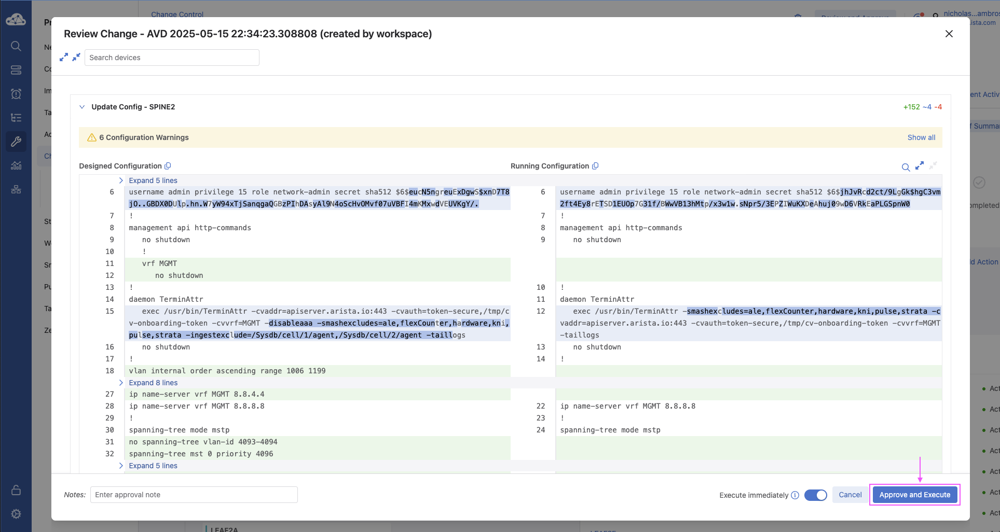
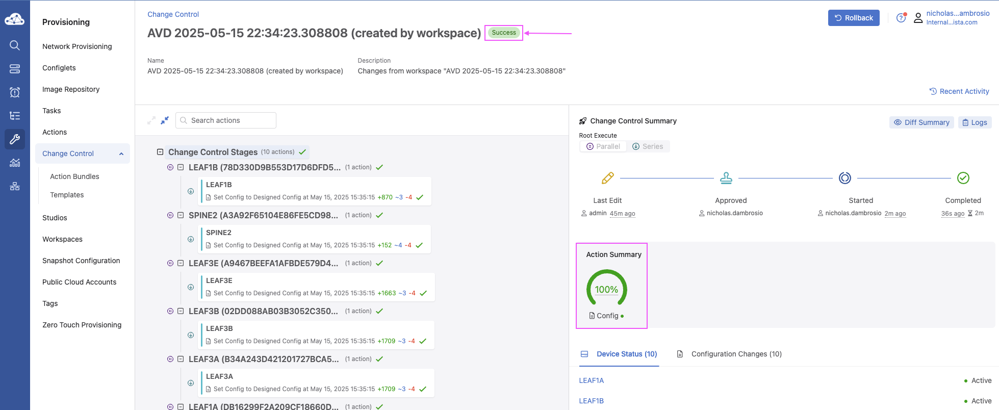

 


# Arista Southwest Region Newsletter

Welcome to the April 2025 newsletter for Arista customers in the U.S. Southwest Region!

 
We welcome your feedback on the newsletter. If you have any ideas on what you want to see, please reach out to southwest@arista.com.  

---

## **Arista AVD Workflow**
By: Nicholas D'ambrosio, Advanced Services Engineer, Southwest Region  

In this month's newsletter, we are introducing a new type of article. One in which you can follow along in your environment! Nicholas has written a tutorial on using an AVD Workflow to deploy network configurations. Follow the tutorial to gain practical knowledge on our AVD tools!  

## Table of Contents
- [Arista AVD Workflow](#arista-avd-workflow)
  - [Table of Contents](#table-of-contents)
  - [AVD Workflow Overview](#avd-workflow-overview)
  - [Inventory Structure](#inventory-structure)
    - [Role of Variables](#role-of-variables)
    - [Build Playbook](#build-playbook)
      - [How They Work Together](#how-they-work-together)
      - [Example Output](#example-output)
  - [Deploy Playbook](#deploy-playbook)
    - [Playbook Functionality](#playbook-functionality)
    - [CVaaS/CVP Authentication](#cvaascvp-authentication)
    - [Example Output](#example-output-1)
  - [Submit Pending Change Control via CVaaS](#submit-pending-change-control-via-cvaas)
    - [Review Studio Workspace and Pending Change Control](#review-studio-workspace-and-pending-change-control)
    - [Submit Change Control](#submit-change-control)
  - [References](#references)
    - [Getting Started](#getting-started)
    - [Arista AVD Ansible Roles](#arista-avd-ansible-roles)
    - [Addititional Information](#addititional-information)   


## AVD Workflow Overview

This document outlines the workflow for using Arista Ansible Validated Designs (AVD) to automate and deploy network configurations to EOS devices via CloudVision as-a-Service (CVaaS).  
 
   

## Inventory Structure

Below is a basic Ansible file structure breakdown:

```bash
project_root/
├── inventory.yml              # Main inventory file
├── group_vars/                # Global Ansible groups directory
│   ├── all.yml                # Global Ansible variables YAML file
│   ├── <group>.yml            # Group variables YAML file
│   └── custom-head.html       # Custom header/footer
├── host_vars/                 # Global Ansible hosts directory
│   └── <device-hostname>.yml  # Host-specific variables
├── build.yml                  # Playbook to render configuration
└── deploy.yml                 # Playbook to push configuration to CVaaS/CVP  
```


Here is an example of an Ansible inventory file that can be used to define your AVD topology. This YAML file defines the topology (fabric) and host relationships:  

```yaml


### AVD Topology inventory.yml
all:
  children:
    FABRIC:
      children:
        SPINES:
          hosts:
            spine1:
            spine2:
        LEAFS:
          hosts:
            leaf1a:
            leaf1b:
    NETWORK_SERVICES:
      children:
        LEAFS:
        SPINES:
    NETWORK_PORTS:
      children:
        LEAFS:
        SPINES:  

```  


### Role of Variables

<code style="background:#b4b4b4;padding:0.2em 0.4em;font-weight:bold">group_vars/all.yml</code> - Global All 'Shared' Variables

Global variables shared by all devices. This is where you store Arista eAPI and SSH connection parameters that Ansible can reference for all devices in the inventory file.

```yaml
ansible_user: admin
ansible_ssh_pass: "{{ vault_ansible_password }}"
ansible_network_os: eos
ansible_connection: network_cli
ansible_become: yes
ansible_become_method: enable
ansible_become_password: admin
```

<code style="background:#b4b4b4;padding:0.2em 0.4em;font-weight:bold">group_vars/FABRIC.yml:</code> - Top Level -  AVD Configuration Variables

Variables applied to all devices under the inventory hierarchy. This could include the FABRIC, DATACENTER, or CAMPUS top layer of the architecture. These configurations define device groups, mLAG settings, uplinks, and common domain configurations.

```yaml
# CloudVision TerminAtter definitions
cvp_instance_ips:
  - apiserver.arista.io
terminattr_smashexcludes: "ale,flexCounter,hardware,kni,pulse,strata"
terminattr_ingestexclude: "/Sysdb/cell/1/agent,/Sysdb/cell/2/agent"
terminattr_disable_aaa: true
terminattr_cvaddr: "apiserver.arista.io:443"
terminattr_cvauth: "token-secure,/tmp/cv-onboarding-token"
terminattr_cvvrf: MGMT
terminattr_taillogs: true

# Spine Switches
l3spine:
  defaults:
    platform: cEOSLab
    spanning_tree_mode: mstp
    spanning_tree_priority: 4096
    loopback_ipv4_pool: 172.16.1.0/24
    mlag_peer_ipv4_pool: 192.168.0.0/24
    mlag_peer_l3_ipv4_pool: 10.1.1.0/24
    virtual_router_mac_address: 00:1c:73:00:dc:01
    mlag_interfaces: [Ethernet55/1, Ethernet56/1]
  node_groups:
    - group: SPINES
      nodes:
        - name: spine1
          id: 1
          mgmt_ip: "192.168.101.13/24"
        - name: spine2
          id: 2
          mgmt_ip: "192.168.101.14/24"

# IDF - Leaf Switches
l2leaf:
  defaults:
    platform: cEOSLab
    mlag_peer_ipv4_pool: 192.168.0.0/24
    spanning_tree_mode: mstp
    spanning_tree_priority: 16384
    inband_mgmt_subnet: 10.10.10.0/24
    inband_mgmt_vlan: 10
  node_groups:
    - group: IDF1
      mlag: true
      uplink_interfaces: [Ethernet51]
      mlag_interfaces: [Ethernet53, Ethernet54]
      filter:
        tags: [ "110", "120" ]
      nodes:
        - name: leaf1a
          id: 3
          mgmt_ip: "192.168.101.111/24"
          uplink_switches: [SPINE1]
          uplink_switch_interfaces: [Ethernet1]
        - name: leaf1b
          id: 4
          mgmt_ip: "192.168.101.112/24"
          uplink_switches: [SPINE2]
          uplink_switch_interfaces: [Ethernet1]
```
<code style="background:#b4b4b4;padding:0.2em 0.4em;font-weight:bold">group_vars/SPINES.yml</code> & <code style="background:#b4b4b4;padding:0.2em 0.4em;font-weight:bold">LEAFS.yml</code> - Device Type Variables

These files specify the category (spine or leaf) that switch hosts belong to in the topology. The type designation aligns with parameters outlined in the FABRIC.yml variables file.

```yaml
---
### group_vars/SPINES.yml
type: l3spine     # Must be either spine|l3spine
```

```yaml  

### group_vars/LEAFS.yml
type: l2leaf     # Must be l2leaf
```

<code style="background:#b4b4b4;padding:0.2em 0.4em;font-weight:bold">group_vars/NETWORK_SERVICES.yml</code> - SVI Configuration

Variables for applying Switched Virtual Interfaces (SVI) to the default routing instance. Each SVI creates an associated VLAN configuration that is "tagged" for filtering trunk links between switches.

```yaml
---
### group_vars/NETWORK_SERVICES.yml
tenants:
  - name: FABRIC
    vrfs:
      - name: default
        svis:
          - id: 110
            name: 'IDF1-Data'
            tags: ["110"]
            enabled: true
            ip_virtual_router_addresses:
              - 10.1.10.1
            nodes:
              - node: SPINE1
                ip_address: 10.1.10.2/23
              - node: SPINE2
                ip_address: 10.1.10.3/23
          - id: 120
            name: 'IDF1-Voice'
            tags: ["120"]
            enabled: true
            ip_virtual_router_addresses:
              - 10.1.20.1
            nodes:
              - node: SPINE1
                ip_address: 10.1.20.2/23
              - node: SPINE2
                ip_address: 10.1.20.3/23
          - id: 130
            name: 'IDF1-Guest'
            tags: ["130"]
            enabled: true
            ip_virtual_router_addresses:
              - 10.1.30.1
            nodes:
              - node: SPINE1
                ip_address: 10.1.30.2/23
              - node: SPINE2
                ip_address: 10.1.30.3/23
```

<code style="background:#b4b4b4;padding:0.2em 0.4em;font-weight:bold">group_vars/NETWORK_PORTS.yml</code> - Port Configuration

Variables for applying switch port-level configuration in the form of profiles, including VLAN assignment, 802.1x, POE, and other features.

```yaml
---
### group_vars/DC1_NETWORK_PORTS.yml

### Port Profile
port_profiles:
  - profile: PP-DOT1X
    mode: "trunk phone"
    spanning_tree_portfast: edge
    spanning_tree_bpduguard: enabled
    poe:
      priority: critical
      reboot:
        action: maintain
      link_down:
        action: maintain
      shutdown:
        action: power-off
      limit:
        class: 4
    dot1x:
      port_control: auto
      reauthentication: true
      pae:
        mode: authenticator
      host_mode:
        mode: multi-host
        multi_host_authenticated: true
      mac_based_authentication:
        enabled: true
      timeout:
        reauth_period: server
        tx_period: 3
      reauthorization_request_limit: 3

# ---------------- IDF1 ----------------
# Assign switch interfaces the port porfile above
  - switches:
      - LEAF1[AB] # regex match LEAF1A & LEAF1B
    switch_ports:
      - Ethernet1-48
    description: IDF1 Standard Port
    profile: PP-DOT1X # Assigned port porfile
    native_vlan: 110
    structured_config: # Direct injection of EOS CLI-equivalent configuration into the interface, used for edge cases or features not abstracted by AVD.
      switchport:
        phone:
          trunk: untagged
          vlan: 120
    dot1x:
      authentication_failure:
        action: allow
        allow_vlan: 130
```

The global variables are now in place and ready for the next steps.

### Build Playbook

```yaml
---
# build.yml
- name: Build Configs
  hosts: FABRIC
  gather_facts: false
  tasks:

    - name: Generate AVD Structured Configurations and Fabric Documentation
      ansible.builtin.import_role:
        name: arista.avd.eos_designs

    - name: Generate Device Configurations and Documentation
      ansible.builtin.import_role:
        name: arista.avd.eos_cli_config_gen
```

<code style="background:#b4b4b4;padding:0.2em 0.4em;font-weight:bold">arista.avd.eos_designs</code>


**Purpose:** Generates structured configuration data models from your inventory (inventory.yml, group_vars, and host_vars) and builds fabric-wide documentation.

**Outputs:**

- YAML data structures per device under <code style="background:#b4b4b4;padding:0.2em 0.4em;font-weight:bold">structured_configs/</code>
- Markdown-based documentation in <code style="background:#b4b4b4;padding:0.2em 0.4em;font-weight:bold">documentation/fabric/</code>

**Include:**

- Interface assignments 
- BGP/EVPN settings
- VLANs/SVI definitions
- Underlay/Overlay routing logic

<code style="background:#b4b4b4;padding:0.2em 0.4em;font-weight:bold">arista.avd.eos_cli_config_gen</code>



**Purpose:** Converts structured config output from eos_designs into CLI-ready EOS configurations using Jinja2 templates.

**Outputs:**

- Flat text configuration files per device in <code style="background:#b4b4b4;padding:0.2em 0.4em;font-weight:bold">intended/configs/</code>
- Optionally, <code style="background:#b4b4b4;padding:0.2em 0.4em;font-weight:bold">intended/structured_configs/</code> for CVP Studio

**Include:**

- Complete running-config per device
- Platform-specific syntax (MLAG, port-channel, BGP, etc.)
- Ready to push to EOS or CVaaS

#### How They Work Together

**eos_designs:**

- Processes inventory and variables
- Computes design logic (interface IPs, routing adjacencies, etc.)
- Exports structured YAML data

**eos_cli_config_gen:**

- Reads structured YAML
- Renders Jinja2 templates to EOS CLI syntax
- Produces config files and optional configlets

💡 **Key Concept:**

- <code style="background:#b4b4b4;padding:0.2em 0.4em;font-weight:bold">eos_designs</code> = Defines "What should this network do?"
- <code style="background:#b4b4b4;padding:0.2em 0.4em;font-weight:bold">eos_cli_config_gen</code> = Generates "What CLI is needed to implement it?"

#### Example Output

```bash
(venv) root@057f4a3b7a6a:/app/examples/campus-fabric# ansible-playbook -i inventory.yml build.yml 

PLAY [Build Configs] **************************************************************************************************************************************************************************************

TASK [arista.avd.eos_designs : Verify Requirements] *******************************************************************************************************************************************************
AVD version 5.1.0
Use -v for details.
ok: [SPINE1 -> localhost]

TASK [arista.avd.eos_designs : Create required output directories if not present] *************************************************************************************************************************
ok: [SPINE1 -> localhost] => (item=/app/examples/campus-fabric/intended/structured_configs)
ok: [SPINE1 -> localhost] => (item=/app/examples/campus-fabric/documentation/fabric)

TASK [arista.avd.eos_designs : Set eos_designs facts] *****************************************************************************************************************************************************
ok: [SPINE1]

TASK [arista.avd.eos_designs : Generate device configuration in structured format] ************************************************************************************************************************
ok: [SPINE1 -> localhost]
ok: [SPINE2 -> localhost]
ok: [LEAF1A -> localhost]
ok: [LEAF1B -> localhost]

TASK [arista.avd.eos_designs : Generate fabric documentation] *********************************************************************************************************************************************
ok: [SPINE1 -> localhost]

TASK [arista.avd.eos_designs : Remove avd_switch_facts] ***************************************************************************************************************************************************
ok: [SPINE1]

TASK [arista.avd.eos_cli_config_gen : Verify Requirements] ************************************************************************************************************************************************
skipping: [SPINE1]

TASK [arista.avd.eos_cli_config_gen : Generate eos intended configuration and device documentation] *******************************************************************************************************
ok: [SPINE1 -> localhost]
ok: [SPINE2 -> localhost]
ok: [LEAF1A -> localhost]
ok: [LEAF1B -> localhost]

PLAY RECAP ************************************************************************************************************************************************************************************************
LEAF1A                     : ok=2    changed=0    unreachable=0    failed=0    skipped=0    rescued=0    ignored=0   
LEAF1B                     : ok=2    changed=0    unreachable=0    failed=0    skipped=0    rescued=0    ignored=0      
SPINE1                     : ok=7    changed=0    unreachable=0    failed=0    skipped=1    rescued=0    ignored=0   
SPINE2                     : ok=2    changed=0    unreachable=0    failed=0    skipped=0    rescued=0    ignored=0   
```

## Deploy Playbook



Example deploy playbook using the cv_deploy role to connect to CVaaS:

```yaml
- name: Deploy Configurations to Devices Using CloudVision Portal
  hosts: DC1_FABRIC
  gather_facts: false
  connection: local
  tasks:
    - name: Push Configuration to CVaaS Studio
      ansible.builtin.import_role:
        name: arista.avd.cv_deploy
      vars:
        cv_server: www.cv-prod-us-central1-c.arista.io
        cv_token: "{{ lookup('env', 'CVP_PASSWORD') }}"
```

### Playbook Functionality

The **deploy.yml** playbook pushes rendered EOS configurations to CloudVision as-a-Service (CVaaS) using the <code style="background:#b4b4b4;padding:0.2em 0.4em;font-weight:bold">arista.avd.cv_deploy</code> role:

<code style="background:#b4b4b4;padding:0.2em 0.4em;font-weight:bold">cv_deploy</code> Role Workflow:

1. Reads intended configs from intended_configs/
2. Connects to CVaaS using cv_server and cv_token
3. Creates/updates configlets in CloudVision Studio
4. Assigns configlets to appropriate devices
5. Optionally initiates config proposals for approval (Studio mode)
6. Verifies assignment and returns status

### CVaaS/CVP Authentication

**Token Requirements:**

1. Create a CloudVision service account in **Settings > Users > Service Accounts**
2. Generate an API access token
3. Store token as an environment variable or in Ansible Vault

```bash
export CVP_PASSWORD="your_cvaas_service_account_token"
```

The playbook references this token via:

```yaml
cv_token: "{{ lookup('env', 'CVP_PASSWORD') }}"
```

**Note:** The service account requires read/write access to Config Studio, Devices, and Provisioning APIs.

### Example Output

```bash
(venv) root@057f4a3b7a6a:/app/examples/campus-fabric# ansible-playbook -i inventory.yml deploy-studio.yml 

PLAY [Deploy Configurations to Devices Using CloudVision Portal] ********************************************************************

TASK [arista.avd.cv_deploy : Verify Requirements] ***********************************************************************************
AVD version 5.1.0
Use -v for details.
ok: [SPINE1 -> localhost]

TASK [arista.avd.cv_deploy : Deploy device configurations and tags to CloudVision] **************************************************
changed: [SPINE1 -> localhost]

PLAY RECAP **************************************************************************************************************************
SPINE1                     : ok=2    changed=1    unreachable=0    failed=0    skipped=0    rescued=0    ignored=0   

(venv) root@057f4a3b7a6a:/app/examples/campus-fabric# 
```

## Submit Pending Change Control via CVaaS

### Review Studio Workspace and Pending Change Control

After the deploy.yml playbook completes:

1. A workspace is created in Studio with device-specific configurations
2. A pending change control ticket is generated after validation




### Submit Change Control

1. Click on the pending change ticket
2. Review changes
3. Click "Approve and Execute" when ready

CVaaS will push configurations to all switches in the fabric.





## References

### Getting Started

- [Install Arista AVD](https://avd.arista.com/5.4/docs/installation/collection-installation.html)
- [Getting Started Guide](https://avd.arista.com/5.4/docs/getting-started/intro-to-ansible-and-avd.html)
- [Campus Fabric Example](https://avd.arista.com/5.4/ansible_collections/arista/avd/examples/campus-fabric/index.html)

### Arista AVD Ansible Roles
- [eos_design](https://avd.arista.com/5.4/ansible_collections/arista/avd/roles/eos_designs/index.html)
- [eos_cli_config_gen](https://avd.arista.com/5.4/ansible_collections/arista/avd/roles/eos_cli_config_gen/index.html)
- [cv_deploy](https://avd.arista.com/5.4/ansible_collections/arista/avd/roles/cv_deploy/index.html)

### Addititional Information

- [Arista Netdevops Community](https://github.com/arista-netdevops-community)
- [Arista AVD](https://avd.arista.com/5.4/index.html)
- [Ansible Galaxy: arista.avd](https://galaxy.ansible.com/ui/repo/published/arista/avd/)
- [Arista ANTA Framework](https://anta.arista.com/stable/)
- [Arista PyAVD](https://avd.arista.com/5.4/docs/pyavd/pyavd.html)  


---

## __*Upcoming Events*__  
Arista hosts various events throughout the year for you! Members of our team organize these informative events to showcase Arista's ability to not only help improve your network, but to also assist by providing a set of tools to improve your operations! Click on the boxes below to be directed to Arista's website for lists of Webinars and Events.


<div class="grid cards" markdown>

-   __Webinars__  

    --- 

    We make is easy for you to view products that are of interest, all virtually! Technical memebers of the team showcase outstading explanation of the products. Click below to see our list of Webinars. 

    [Arista Webinars](https://www.arista.com/en/company/news/webinars){.md-button}

-   __Events__ 

    ---
    Join us in person to get a closer look in our list of produts and solution, as well as get the chance to meet members of the team. Click below to see our list of ipcoming Events. 

    [Upcoming Events](https://www.arista.com/en/company/news/events){ .md-button }


</div>

--- 

## __*Software Updates*__
<figure markdown>
{: style="height:200px;width:300px"}    
    <figcaption></figcaption>
</figure>
For new code releases, click [here](https://www.arista.com/en/support/software-download) 


   |  Softwares    | Versions      |  Release Date |
   | :-----------: | :-----------: | :-----------:
   | __EOS__           | 4.33.2.1F <br> 4.33.3F <br> 4.34.0F <br> 4.30.10M <br>  | May 14th, 2025 <br> May 2nd, 2025 <br> April 25th, 2025 <br > April 21st, 2025 <br >
   | __CVP__           | Portal 2025.1.1 <br>Appliance 7.0.1<br> Sensor 1.1.0 <br>    | May 7th, 2025 <br> January 28th, 2025<br> March 24th, 2025 <br>
   | __DMF__           | 8.4.5 <br >| April 28th, 2025 <br> 
   | __WLAN__ <br>CV-CUE<br>Wireless Manager<br> | <br>13.0.0-67<br>18.0.0<br>       | <br>December 15th, 2022<br>December 2024<br>
   | __Arista NDR__         | 5.2.4         | August 2024
   | __TerminAttr__    | 1.27.2 <br>       | April 9th, 2025 <br> 


---

## __*Software Advisories*__
Below is a list of advisories that are announced by Arista. To view more details on the specific advisories, please click the links in the middle row.

| Name          | Advisory Link           | Date of Advisory Notice  |
| :-----------: |:-------------:| :-----:|
|  __gNMI Transport__   | [Security Advisory 0117](https://www.arista.com/en/support/advisories-notices/security-advisory/21394-security-advisory-0117)  | May 6th, 2025   |
|  __Time Bound Device Onboarding__   | [Security Advisory 0116](https://www.arista.com/en/support/advisories-notices/security-advisory/21316-security-advisory-0116)  | April 15th, 2025   |
|  __ZTP Admin Privileges__   | [Security Advisory 0115](https://www.arista.com/en/support/advisories-notices/security-advisory/21315-security-advisory-0115)  | April 15th, 2025   |
|  __Malicious Authenticated User__   | [Security Advisory 0114](https://www.arista.com/en/support/advisories-notices/security-advisory/21314-security-advisory-0114)  | April 15th, 2025   |
|  __Secure Boot__   | [Field Notice 0099](https://www.arista.com/en/support/advisories-notices/field-notice/21317-field-notice-0099)  | April 22nd, 2025   |
|  __Renaming Arista WAN Routing Models__   | [Field Notice 0098](https://www.arista.com/en/support/advisories-notices/field-notice/21286-field-notice-0098)  | March 26th, 2025   |
|  __CloudVision On-Prem Incomplete Database Writes__   | [Field Notice 0097](https://www.arista.com/en/support/advisories-notices/field-notice/21272-field-notice-0097)  | March 12th, 2025   |


For a list of the most current advisories and notices, click [Here](https://www.arista.com/en/support/advisories-notices)

---

## __*Product Updates*__
<figure markdown>
{: style="height:200px;width:400px"}   
    <figcaption></figcaption>
</figure>
**End of Sale** notices are listed below.

| Device        | Name           | End Of Sale Date  |
| :-----------: |:-------------: |     :----:        |
| Software      | [End of Software Support for EOS 4.28](https://www.arista.com/en/support/advisories-notices/end-of-support/21275-end-of-software-support-for-eos-4-28)<br>[DMF and CCF Deployments on Accton/ Edgecore Switches](https://www.arista.com/en/support/advisories-notices/end-of-support/21094-end-of-support-for-dmf-and-ccf-deployments-on-accton-edgecore-switches)<br>[EOS-4.34 and later no longer supported on select switches](https://www.arista.com/en/support/advisories-notices/end-of-support/21089-end-of-software-support-for-7280r-r2-7500r-r2-and-7020r-series)<br>[CloudVision Portal 2023.1 Train](https://www.arista.com/en/support/advisories-notices/end-of-support/21053-end-of-software-support-for-cloudvision-portal-2023-1-release-train) <br>  | March 14, 2025 <br>January 31st, 2025 <br>January 15th, 2025 <br>December 20th, 2024 <br>    |
| Module        | [7500R2 Series Linecards](https://www.arista.com/en/support/advisories-notices/end-of-sale/18886-end-of-sale-of-the-arista-7500r2-series-line-cards) | December 20th, 2023    |
| Access Points | [AP Model W-118](https://www.arista.com/en/support/advisories-notices/end-of-sale/20652-end-of-sale-of-ap-model-w-118) <br>      |   November 20th, 2024 <br> |
| DMF           | [DMF 8.2](https://www.arista.com/en/support/advisories-notices/end-of-support/21409-end-of-software-support-for-dmf-8-2)          |  May 12th, 2025           |
| Switches      | [DCS-7020R Series](https://www.arista.com/en/support/advisories-notices/end-of-sale/21052-end-of-sale-of-the-arista-dcs-7020r-series)<br> |  December 20th, 2024  |


**New Releases** of Arista's device are listed below 

|  Device       | More Information |  Release Date 
    | :-----------: | :-----------:    | :-----------:
    |  Arista SWAG    |   [Modern Stacking for Campus](https://www.arista.com/en/company/news/press-release/20693-pr-12032024)                | Q1 2025 
    | Arista Multi-Domain Segmentaton Service  | [Arista MSS](https://www.arista.com/en/company/news/press-release/19297-pr-20240430)         | Q3 2024
    | Arista CV UNO  | [CloudVision Universal Network Observability](https://www.arista.com/en/company/news/press-release/19195-pr-20240305)  | Q1 2024


---
# *Feel Free to Reach Out To Us For Your Network Needs* 
<figure markdown>
{: style="height:300px;width:800px"}  
    <figcaption></figcaption>
</figure>
We thank you for taking the time to read out newsletter today. Feel free to reach out to your SE or ASE for more information or questions regardsing your network operations. Until next month, have a good one! 


