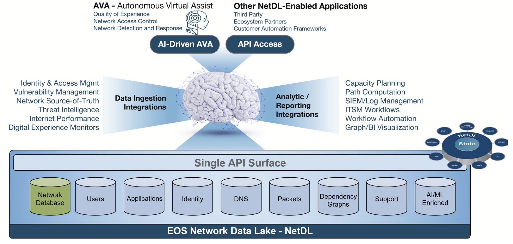

 

# Arista April Southwest Region Newsletter

Welcome to the April 2024 newsletter for Arista customers in the U.S. Southwest Region!

Our theme for this month is: Artificial Intelligence and Machine Learning! It seems as if in every corner of the industry AI is being heavily embraced. At Arista, we are creating solutions that leverage the sheer power and capabilities of AI to improve the security, productivity, and overall efficiency of the modern network. Our very own Senior Manager of Systems Engineer, Salman Zahid, introduces CloudVision Universal Network Observability (CV UNO), which expands visibility into your network infrastructure and provides enhanced insights through Machine Learning.

While CloudVision UNO is primarily focused on identifiying infrastruture behavior, our next article elaborates on the AI based virtual assistant solution. By integrating a virtual assitant that is constantly observing the network enviornment, operators can complete their tasks with additional help at a faster rate. Alex Bojko, Advanced Services Engineer, is one of the creators of this newsletter and helps manage the publication. He also provides a detailed insight to the workings of our AI based assistant, Arista AVA (Autonomous Virtual Assistant).
 
We welcome your feedback on the newsletter. If you have any ideas on what you want to see, please reach out to southwest@arista.com.

---

## **Application-Aware Network Performance with Cloud Vision Universal Network Observability** 
By: Salman Zahid, Sr Manager Systems Engineering Southwest Region 

Enterprise networks are becoming increasingly complex, with the network perimeter often extending well beyond the enterprise boundaries in the public Cloud, with many users working remotely. With this increasing complexity, the network operations team is expected to quickly resolve any issues that may arise to provide business continuity, improve user experience, ensure the network is not at fault, and reduce mean time to resolution for any network or application performance-related issue. Network operations tools must evolve beyond device management and operations to offer comprehensive visibility across the entire infrastructure to meet these demands. With the introduction of Cloud Vision Unified Network Observability, or CV UNO for short, Arista has a couple of primary goals.

!!! note "Goals"
    * Expand Visibility: CV-UNO builds upon the capabilities of Arista's network infrastructure, providing holistic insight that encompasses applications infrastructure and third-party network devices like Cisco. This 360-degree view empowers networking teams to understand the entire network ecosystem comprehensively.

    * Enhanced Insights through Machine Learning: CV-UNO employs advanced machine learning algorithms to deliver more accurate insights by leveraging the data obtained from applications and third-party networks. These insights translate to faster issue resolution and an enriched user experience.

Operators familiar with Arista Cloud Vision's capabilities in provisioning and monitoring Arista infrastructure recognize the value of EOS real-time streaming telemetry in troubleshooting network issues. With CV-UNO, Arista extends this functionality, enabling the collection of telemetry and flow data from diverse systems, including vCenter for application discovery, Cisco routers for flow information, and Servicenow CMDB.  Additionally, it leverages other Arista products like the (DANZ) Monitoring Fabric (DMF) for end-to-end TCP session latency and visibility of SaaS applications. This integration enhances overall visibility and delivers application-aware network performance, enriching the Arista Cloud Vision ecosystem user experience.

<figure markdown>
{: style="height:450px;width:550px"}
    <figcaption>CloudVision Universal Network Observability</figcaption>
</figure>

While CV UNO's initial use case focus is improving application visibility within the data center, Arista plans to evolve the platform to encompass additional visibility in all parts of the network, including Enterprise LANs.
Some of the use cases enabled by Cloud Vision UNO are summarized below.

<figure markdown>

    <figcaption>CV UNO Capabilities</figcaption>
</figure>

For more information, please visit [here](https://www.arista.com/en/solutions/network-observability/cv-uno)

CV UNO Release announcement, [click here](https://www.arista.com/en/company/news/press-release/19195-pr-20240305)

CV UNO Blog, [click here](https://blogs.arista.com/blog/network-observability)

Attend the CV UNO Webinar - Register, [click here](https://events.arista.com/uno-2024-webinar)

---

## **Arista AVA: AI/ML Capabilities in the Modern Network**
By: Alex Bojko, Advanced Services Engineer 

Artificial intelligence (AI) is taking the world by storm, and for good reason. Why not embrace a technology that could make our everyday life as a network or security operator just a little bit easier? After all, we continue to embrace network automation for this very reason.

Introducing Arista Autonomous Virtual Assistant, or "AVA" for short. AVA ingests relevant, real-time telemetry data gathered from Arista EOS NetDL (Network DataLake) stack as well as a collection of anonymized data from our global technical assistance center (TAC) database to train itself on exactly what is happening in the network. Examples of data that AVA learns from includes application, in-band network telemetry, flow visibility, and complete control plane state information from devices spread around all domains of the modern network. AVA leverages this high quality data to serve as an accurate AI-based expert, helping to automate complex tasks like troubleshooting, perform root cause analysis, and identify and remediate network security threats.

<figure markdown>

    <figcaption>Autonomous Virtual Assistant: AVA</figcaption>
</figure>

AVA exists to assist the network and security operator in their day to day tasks, increasing efficiency and productivity. Below is a list of use-cases, derived from the field, that showcase various features of AVA that your team can leverage: 

!!! note "Utilizing AVA"
    * "Ask AVA" serves as a conversational (GPT) AI feature within CloudVision AGNI, Arista's Cloud based NAC solution. Operators can leverage the "Ask AVA" feature to aid in configuring, troubleshooting, and analyzing policy configurations. 

    * "Autonomous NDR" enables AVA to identify and track users, devices, applications, and other entities over time. AVA can also identify and classify  patterns of activity that relate to attacker tactics, techniques, and procedures. By profiling these entities, AVA mitigates much of the false positives that might typically occur with legacy NDR tools. 

    * "Quality of Experience" is constantly monitored by AVA, which provides network operators with a clear view of the root cause of poor user application experience. AVA also generates remedial action recommendations that can be taken to improve the experience. 

The combination of Arista AVA and EOS NetDL provides predictive and prescriptive intelligence for modern data driven networks. To learn more about Arista AVA and how it can help facilitate a much more efficient and secure network, click on the following links below. 

Learn more about Arista's AVA Solution below:

Our very own CEO Jayshree Ullal's blog post on AI Networking, [click here](https://blogs.arista.com/blog/new-ai-era) 

Arista AVA White Paper, [click here](https://www.arista.com/assets/data/pdf/Whitepapers/Arista-AVA-Whitepaper.pdf)  

---

## __*Upcoming Events*__  
Arista hosts various events throughout the year for you! Members of our team organize these informative events to showcase Arista's ability to not only help improve your network, but to also assist by providing a set of tools to improve your operations! Click on the boxes below to be directed to Arista's website for lists of Webinars and Events.

-   __Webinars__  

    --- 

    We make is easy for you to view products that are of interest, all virtually! Technical memebers of the team showcase outstading explanation of the products. Click below to see our list of Webinars. 

    [Arista Webinars](https://www.arista.com/en/company/news/webinars){.md-button}

-   __Events__ 

    ---
    Join us in person to get a closer look in our list of produts and solution, as well as get the chance to meet members of the team. Click below to see our list of ipcoming Events. 

    [Upcoming Events](https://www.arista.com/en/company/news/events){ .md-button }

--- 

## __*Software Updates*__
<figure markdown>
{: style="height:200px;width:300px"}    
    <figcaption></figcaption>
</figure>
For new code releases, click [here](https://www.arista.com/en/support/software-download) 

   |  Softwares    | Versions      |  Release Date |
   | :-----------: | :-----------: | :-----------:
   | __EOS__           | 4.29.7M  4.31.2F  4.26.13M 4.30.5M 4.23.15M      | February 20th, 2024  February 9th, 2024 February 1st, 2024 January 23rd, 2024 January 13th, 2024 
   | __CVP__           | 2023.3.1      | March 18th, 2024
   | __DMF__           | 8.5.0         | February 5th, 2024
   | __WLAN__  CV-CUE Wireless Manager  |  13.0.0-67 15.0.1-22        |  December 15th, 2022 August 29th, 2023 
   | __Arista NDR__         | 5.1.2         | February 15th, 2024
   | __TerminAttr__    | 1.28.3        | February 1st, 2024

---

## __*Software Advisories*__
Below is a list of advisories that are announced by Arista. To view more details on the specific advisories, please click the links in the middle boxes.

| Name          | Advisory Link           | Date of Advisory Notice  |
| :-----------: |:-------------:| :-----:|
| __L3LS CloudVision Studio__   | [Field Notice 0080](https://www.arista.com/en/support/advisories-notices/field-notice/19211-field-notice-0080) | March 19th, 2024
| __SQL Injection__    | [Security Advisory 0093](https://www.arista.com/en/support/advisories-notices/security-advisory/19038-security-advisory-0093) | February 28th, 2024 |
| __CVP Virtual Appliances__      | [Security Advisory 0092](https://www.arista.com/en/support/advisories-notices/security-advisory/19025-security-advisory-0092)      |  February 20th, 2024 | 
| __7130 ACLs__                   | [Security Advisory 0091](https://www.arista.com/en/support/advisories-notices/security-advisory/19023-security-advisory-0091)     | February 20th, 2024

For a list of the most current advisories and notices, click [Here](https://www.arista.com/en/support/advisories-notices)

---

## __*Product Updates*__
<figure markdown>
{: style="height:200px;width:400px"}   
    <figcaption></figcaption>
</figure>
**End of Sale** notices are listed below.

| Device        | Name           | End Of Sale Date  |
| :-----------: |:-------------: |     :----:        |
| Module        | [7500R2 Series Linecards](https://www.arista.com/en/support/advisories-notices/end-of-sale/18886-end-of-sale-of-the-arista-7500r2-series-line-cards) | December 20th, 2023    |
| Access Points | [Arista 802.11ac Wave 2 Devices](https://www.arista.com/en/support/advisories-notices/end-of-sale/14911-end-of-sale-of-arista-802-11ac-wave-2-devices)      |  June 30th, 2022 |
| Switches      | [DCS-7020SRG-24C2](https://www.arista.com/en/support/advisories-notices/end-of-sale/18884-end-of-sale-of-the-arista-dcs-7020srg-24c2-series) [DCS-7280SR-48C6 & 7280TR-48C6](https://www.arista.com/en/support/advisories-notices/end-of-sale/17491-end-of-sale-of-the-arista-dcs-7280sr-48c6-and-dcs-7280tr-48c6-series) [DCS-7280CR2-60 Series](https://www.arista.com/en/support/advisories-notices/end-of-sale/17490-end-of-sale-of-the-arista-dcs-7280cr2-60-series) [DCS-7010T-48](https://www.arista.com/en/support/advisories-notices/end-of-sale/16538-end-of-sale-7010t-48)       |    Varies by Device |

**New Releases** of Arista's device are listed below 

   |  Device       | More Information |  Release Date 
   | :-----------: | :-----------:    | :-----------:
   |  Arista 7130 Series             |  [Ultra Low Latency Network](https://www.arista.com/en/company/news/press-release/18273-pr-20231011)  | Q4 2023
   |  Arista AGNI    |   [AI Driven Network Identity](https://www.arista.com/en/company/news/press-release/17244-pr-20230424)                | Q2 2023 
   | Arista CV UNO  | [CloudVision Universal Network Observability](https://www.arista.com/en/company/news/press-release/19195-pr-20240305)  | Q1 2024

---

# *Feel Free to Reach Out To Us For Your Network Needs* 
<figure markdown>
{: style="height:300px;width:800px"}  
    <figcaption></figcaption>
</figure>
We thank you for taking the time to read out newsletter today. Feel free to reach out to your SE or ASE for more information or questions regardsing your network operations. Until next month, have a good one! 

