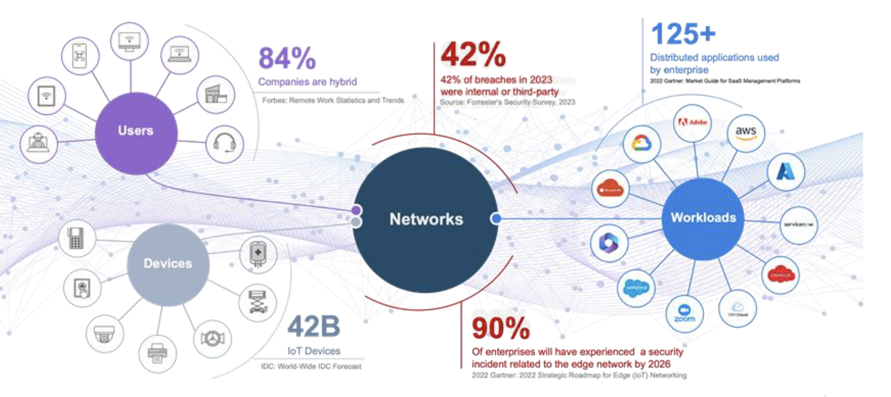

 

# Arista October Southwest Region Newsletter

Welcome to the October 2024 newsletter for Arista customers in the U.S. Southwest Region!
 
We welcome your feedback on the newsletter. If you have any ideas on what you want to see, please reach out to southwest@arista.com.

---

## **How to approach network segmentation for  Zero Trust Architecture with Arista Multi Domain Segmentation Services (MSS)**
By: Salman Zahid, Sr. Systems Engineer Manager, Southwest Region

The frequency of security breaches in an enterprise network coupled with how these breaches are occurring - often internal is creating a sense of urgency among customers to implement a Zero Trust Networking architecture. Here is a chart that represents some statistics, including the sources of the statistics. The two statistics that I find particularly valuable are that 42% of the breaches are internal and that 90% of the companies will have a security breach. Given those things, how is the enterprise best positioned to minimize its impact if a security breach happens? 

<figure markdown>

    <figcaption>  </figcaption>
</figure> 

This is where the idea of identity-aware microperimeters comes into play. We recommend customers decouple the security policy from the underlying topology. Customers have often used the network topology as one way to define the security perimeter, but in the current security landscape, that is not sufficient and leaves the customer vulnerable. If you look at the first picture below, you will see the current security architecture. Once the user/device is granted access to the network, they are free to roam around the network and move about laterally. The critical concept of zero trust is to minimize the lateral movement and allow access to any resource in the network explicitly and only if needed. In an ideal state, we want to get what is represented in the second visual below.  

<figure markdown>

    <figcaption>  </figcaption>
</figure> 

<figure markdown>

    <figcaption>  </figcaption>
</figure> 

With the goal of the above-mentioned end state in mind, Arista is introducing a groundbreaking security architecture called Multi-Domain Segmentation Services (MSS). This innovative solution empowers customers to establish identity-aware security perimeters across all network domains (campus, DC, and WAN) using a single EOS across the entire network.  

MSS allows customers to decouple the security policy from the underlying network topology and design a security policy based on asset tags (devices, users, VMs). These tags can either be defined manually (less desirable) or imported into other systems that naturally maintain the identity of the endpoints (Vcenter for VM tags), Network Access Control or NAC  systems for end users, and device tags.  

Another important aspect of this security architecture is knowing the patterns of communication. Without that, it's impossible to come up with the right policy. Arista is providing an MSS monitor node that monitors all communications, letting the network and security operator audit those communications and permit/deny each set of flows.  

MSS delivers four key capabilities:   

    1. Endpoint identity and microperimeter tags  
    2. “Zero Trust” policy planning with traffic map  
    3. Microperimeter enforcement in the network or redirect to Firewall    
    4. Continuous Traffic monitoring and visibility of policy violations

Learn more about Arista MSS solution by clicking below:  
[Arista MSS Addition Information Here](https://www.arista.com/en/solutions/security/mss)  

---

## **Design Consideration: To Buffer or not to Buffer** 
By: Hue McGraw, Systems Engineer, Southwest Region
 
When it comes to designing a modern-day Data Center, it’s important to understand the different workflows you might have to address and where, within your DC, will traffic have the potential to be introduced to congestion.  Where is deep buffing needed?  

<figure markdown>

    <figcaption>  </figcaption>
</figure> 

To understand where deep buffering is needed, let’s think about how the Transmit Control Packet protocol works.  TCP is a layer four stateful error correction protocol.  After a three-way handshake, TCP establishes a window and starts a data flow that slowly starts ramping up to port speed (Building trust) if no errors are occurring.  Once an error occurs (Breaking the trust), TCP drops the window size down by half and once again, slowly starts ramping up.  

As congestion tends to impact multiple flows, over time multiple (or all) flows will tend to grow at the same rate, and throttle at the same rate, Increasing the change of microburst congestion and wasting bandwidth.

<figure markdown>
{: style="height:300px;width:600px"}
    <figcaption>  </figcaption>
</figure> 

The picture above shows two things.  The firsts thing that it shows is that large buffers give for a very fair averaging of flows.  And second, In low buffer switches, a certain number of flows on 10G links can have as low as 5% of the average speed.  In this test, that meant that 7 flows were sending data at 12Mbps on a 10G link (Not good)!  This is what happens when users complain of slow speeds on specific hosts, but the network looks fine.  Finger pointing begins and it’s because your switches have low buffers.  This is because congestion happens when a device receives more traffic than it can buffer or send out of an egress port.  A Congested network produces symptoms such as packet loss, low throughput, and high latency.  

Methods of preventing congestion  

* QoS
* Flow Control / Priority Flow Control
* Buffer tuning
* Increasing Bandwidth of the interface

  

To learn more about Buffers, visit the links below:   
[Big Data Big Buffer Whitepaper](https://www.arista.com/assets/data/pdf/Whitepapers/BigDataBigBuffers-WP.pdf)  
[Deploying Storage Net White Paper](https://solutions.arista.com/hubfs/Arista/White_Papers/Deploying_Storage_Net_WhitePaper.pdf)  
[How To Troubleshoot Congestion](https://arista.my.site.com/AristaCommunity/s/article/how-to-troubleshoot-congestion) 

---

## __*Upcoming Events*__  
Arista hosts various events throughout the year for you! Members of our team organize these informative events to showcase Arista's ability to not only help improve your network, but to also assist by providing a set of tools to improve your operations! Click on the boxes below to be directed to Arista's website for lists of Webinars and Events.

-   __Webinars__  

    --- 

    We make is easy for you to view products that are of interest, all virtually! Technical memebers of the team showcase outstading explanation of the products. Click below to see our list of Webinars. 

    [Arista Webinars](https://www.arista.com/en/company/news/webinars){.md-button}

-   __Events__ 

    ---
    Join us in person to get a closer look in our list of produts and solution, as well as get the chance to meet members of the team. Click below to see our list of ipcoming Events. 

    [Upcoming Events](https://www.arista.com/en/company/news/events){ .md-button }

--- 

## __*Software Updates*__
<figure markdown>
{: style="height:200px;width:300px"}    
    <figcaption></figcaption>
</figure>
For new code releases, click [here](https://www.arista.com/en/support/software-download) 

   |  Softwares    | Versions      |  Release Date |
   | :-----------: | :-----------: | :-----------:
   | __EOS__           | 4.32.2.1F  4.29.7.1M  4.31.5M 4.30.8M 4.28.8.4M      | October 2nd, 2024  September 27th, 2024 September 26th, 2024 September 26th, 2024 September 20th, 2024 
   | __CVP__           | Portal 2024.2.0  Appliance 6.0.7      | July 24th, 2024  September 18th, 2024 
   | __DMF__           | 8.4.4  8.5.1         | September 26th, 2024  August 15th, 2024
   | __WLAN__  CV-CUE Wireless Manager  |  13.0.0-67 17.0.0        |  December 15th, 2022 July 12th, 2024 
   | __Arista NDR__         | 5.2.3         | August 2024
   | __TerminAttr__    | 1.31.1        | August 1st, 2024

---

## __*Software Advisories*__
Below is a list of advisories that are announced by Arista. To view more details on the specific advisories, please click the links in the middle boxes.

| Name          | Advisory Link           | Date of Advisory Notice  |
| :-----------: |:-------------:| :-----:|
| __CloudVision Appliance__   | [Security Advisory 0104](https://www.arista.com/en/support/advisories-notices/security-advisory/20405-security-advisory-0104) | September 24th, 2024
| __EOS in 802.1X mode__   | [Security Advisory 0103](https://www.arista.com/en/support/advisories-notices/security-advisory/19917-security-advisory-0103) | July 23rd, 2024
| __EOS with MACsec and egress ACLs__   | [Security Advisory 0102](https://www.arista.com/en/support/advisories-notices/security-advisory/19908-security-advisory-0102) | July 23rd, 2024
|  __RADIUS Protocol__   | [Security Advisory 0101](https://www.arista.com/en/support/advisories-notices/security-advisory/19905-security-advisory-0101)  | July 9th, 2024   |
| __OpenSSH__    | [Security Advisory 0100](https://www.arista.com/en/support/advisories-notices/security-advisory/19904-security-advisory-0100) |   July 8th, 2024             |
| __Wi-Fi Integration with WLAN Controllers__         |  [Field Notice 0086](https://www.arista.com/en/support/advisories-notices/field-notice/20411-field-notice-0086) | October 1st, 2024    |
| __Wi-Fi 7 AP-C-460__    | [Field Notice 0085](https://www.arista.com/en/support/advisories-notices/field-notice/20410-field-notice-0085)               | September 30th, 2024             |
| __7130 Platform__              |  [Field Notice 0084](https://www.arista.com/en/support/advisories-notices/field-notice/20160-field-notice-0084)             | August 16th, 2024       |

For a list of the most current advisories and notices, click [Here](https://www.arista.com/en/support/advisories-notices)

---

## __*Product Updates*__
<figure markdown>
{: style="height:200px;width:400px"}   
    <figcaption></figcaption>
</figure>
**End of Sale** notices are listed below.

| Device        | Name           | End Of Sale Date  |
| :-----------: |:-------------: |     :----:        |
| Software      | [EOS 4.27 Series](https://www.arista.com/en/support/advisories-notices/end-of-support/20174-end-of-software-support-for-eos-4-27) | September 27th, 2024    |
| Module        | [7500R2 Series Linecards](https://www.arista.com/en/support/advisories-notices/end-of-sale/18886-end-of-sale-of-the-arista-7500r2-series-line-cards) | December 20th, 2023    |
| Access Points | [Arista 802.11ac Wave 2 Devices](https://www.arista.com/en/support/advisories-notices/end-of-sale/14911-end-of-sale-of-arista-802-11ac-wave-2-devices)      |  June 30th, 2022 |
| DMF           | [Analytics Node DCA-DM-AA3](https://www.arista.com/en/support/advisories-notices/end-of-sale/20142-end-of-sale-end-of-life-for-arista-analytics-node-appliance-dca-dm-aa3)          |  August 3rd, 2024             |
| DMF           | [Pluribus NVOS, UNUM, Freedom 9000](https://www.arista.com/en/support/advisories-notices/end-of-sale/20133-end-of-sale-pluribus-nvos-unum-freedom-9000-series)          |  August 2nd, 2024             |
| Switches      | [DCS-7130-96S Series](https://www.arista.com/en/support/advisories-notices/end-of-sale/20381-end-of-sale-of-the-arista-dcs-7130-96s-series) [DCS-7170 and 7170B Series](https://www.arista.com/en/support/advisories-notices/end-of-sale/19846-end-of-sale-of-the-arista-7170-and-7170b-series) [DCS-7130B-32QD](https://www.arista.com/en/support/advisories-notices/end-of-sale/19845-end-of-sale-of-the-arista-dcs-7130b-32qd-series) [DCS-7170-32CD](https://www.arista.com/en/support/advisories-notices/end-of-sale/19266-end-of-sale-of-the-arista-dcs-7170-32cd-series) [DCS-7010T-48](https://www.arista.com/en/support/advisories-notices/end-of-sale/16538-end-of-sale-7010t-48)       |    Varies by Device |

**New Releases** of Arista's device are listed below 

   |  Device       | More Information |  Release Date 
   | :-----------: | :-----------:    | :-----------:
   | Arista Multi-Domain Segmentaton Service  | [Arista MSS](https://www.arista.com/en/company/news/press-release/19297-pr-20240430)         | Q3 2024
   |  Arista 7130 Series             |  [Ultra Low Latency Network](https://www.arista.com/en/company/news/press-release/18273-pr-20231011)  | Q4 2023
   |  Arista AGNI    |   [AI Driven Network Identity](https://www.arista.com/en/company/news/press-release/17244-pr-20230424)                | Q2 2023 
   | Arista CV UNO  | [CloudVision Universal Network Observability](https://www.arista.com/en/company/news/press-release/19195-pr-20240305)  | Q1 2024

---

## __**We're Hiring!**__

Our team is looking to hire the following roles, located in Los Angeles and Phoenix area:

*Network Systems Engineer*  
https://www.smartrecruiters.com/AristaNetworks/743999994606279-network-systems-engineer-pre-sales-  
https://www.smartrecruiters.com/AristaNetworks/744000011382271-network-systems-engineer-pre-sales-

*Network Advanced Services Engineer*
https://www.smartrecruiters.com/AristaNetworks/744000000783368-network-advanced-services-engineer

---
# *Feel Free to Reach Out To Us For Your Network Needs* 
<figure markdown>
{: style="height:300px;width:800px"}  
    <figcaption></figcaption>
</figure>
We thank you for taking the time to read out newsletter today. Feel free to reach out to your SE or ASE for more information or questions regardsing your network operations. Until next month, have a good one! 

