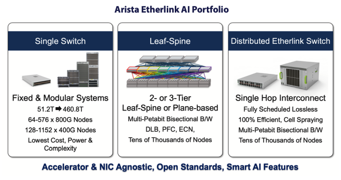

 

# Arista Southwest Region Newsletter

Welcome to the August 2025 newsletter for Arista customers in the U.S. Southwest Region!  

Did you hear? VeloCloud is now a part of Arista. Check out the latest blog, written by our CEO, Jayshree Ullal below!  
[Next Generation SD-WAN in the AI Era, by Arista CEO Jayshree Ullal](https://blogs.arista.com/blog/next-generation-sd-wan-in-the-ai-era)  

 
We welcome your feedback on the newsletter. If you have any ideas on what you want to see, please reach out to southwest@arista.com.  

---

## **Arista Networking for AI: It's Only A Matter of Time**
By: Akashdeep Takhar, Advanced Services Engineer, Southwest Region   

The impact that Artificial Intelligence has on our lives today is quite extraordinary. It seems as if no matter where we travel to or which screen we face, you will eventually hear about AI. Artificial Intelligence (AI) is revolutionizing the way networks are built, managed, and optimized. As AI workloads grow in scale and complexity, traditional network infrastructures are struggling to keep up. A significant portion of AI job time is spent on network communications, making network bottlenecks a critical concern in job completion in workflows from the constant inputs and requests to the AI cluster. This shift is placing networking at the core of innovation, with AI applications requiring massive data exchange, real-time responsiveness, and robust connectivity. The role of the network is no longer just about transport—it’s about enabling intelligence at scale.  

Arista Networks is leading this transformation with a suite of AI-ready solutions designed to meet these next-generation challenges. Arista’s Networking for AI solutions, including its AI Spine-Leaf fabric and high-performance Ethernet switching platforms, support 100G to 800G connectivity for demanding GPU clusters. The Etherlink Smart Networking Portfolio further enhances this architecture by providing visibility, automation, and simplified deployment across AI infrastructure. Hardware platforms such as the 7060X, 7800R, and 7700R4 Series are ready to handle AI centers that comprise tens to thousands of XPUs. To give you a complete set of tools to run a grand AI cluster, we have also enhanced our EOS software to handle the traffic by adding features such as: Cluster Load Balancing, AI Flow Observability, and RoCEv2 support, just to name a few.  

<figure markdown="span">
  
  <figcaption>Arista AI Portfolio</figcaption>
</figure>  

These innovations help adapt you to the modern changes in the world of computing and networks.. Arista’s platforms are designed to simplify the deployment and management of networking for AI, reducing operational overhead while delivering the speed and reliability required for AI success. AI is here, and networks must evolve with it. Arista offers the performance, intelligence, and ease of use that modern AI-driven businesses need. Explore how Arista can help you build your AI-ready future today with the links below:  
[Deployment Guide](https://www.arista.com/assets/data/pdf/AI-Network-Fabric_Deployment_Guide.pdf)  
[AI Network Whitepaper](https://www.arista.com/assets/data/pdf/Whitepapers/AI-Network-WP.pdf)  
[Product Portfolio](https://www.arista.com/assets/data/pdf/Arista-Etherlink-Smart-Networking-Portfolio-Solution-Brief.pdf)  
[Demystifying Ultra Ethernet](https://blogs.arista.com/blog/demystifying-ultra-ethernet)

## **Initial Onboarding Of Your Arista Device: The DO's and DO NOT's**
By: Akashdeep Takhar, Advanced Services Engineer, Southwest Region    

The day has finally arrived: You are ready to rack your new Arista switch and begin to onboard it to production. After waiting for shipment, scheduling the team to rack the switches, and allocating space in your environment, you can now start to use the switch. However, there are some checklist items that we need to take into consideration to prevent problems from arising. Poor preparation leads to poor execution, and as an Advanced Service Engineer that has seen problems occur, it’s best to have some action items taken care of early on. Listed below are 4 best practices to use during the initial onboarding of your devices. In addition, we have also included 4 crucial steps you should avoid in order to execute the onboarding process to perfection with the least amount of trouble.   

<figure markdown="span">
  
  <figcaption>To DO List Below</figcaption>
</figure>  

Do List:  

1.  If using Zero Touch Provisioning, please set up Option 66 and 67 on your DHCP Server:   
   To enable ZTP for initial onboarding, it is required to enable options 66 and 67 within your DHCP server for the Arista switches to grab a configuration file. Note that if you are running EOS version 4.30.X and above, this requirement is not necessary. The purpose of ZTP is to have a pre-set configuration installed onto your switch. In addition, the next step is to check for reachability to Arista.io   
2. Ensure that you have the proper length rack mounts:  
  Sometimes we are busy with discussion of architecture, so busy that in fact we glance over some detail that might seem obvious. Upon arrival of your device, ensure that the proper rack equipment is ready to hold the switches in place. If a custom rack mount is needed, your fellow SE would be more than happy to find one for you.  
3. Determine method of device management:    
  Depending on your choice of either in band or out of band management, it is best practice to have that decision made before the devices are set up. One of the final steps to ensure that onboarding is complete is for the device to reach out to your cloud tenant instance on https://arista.io. Open port 443 to gain reachability to https://arista.io if using CloudVision as a Service (CVaaS). 
4. Create a Port Map for device connectivity:  
  Time saving step here. Wiring devices together seems easy, until you realize the distance between devices are far apart or that the port speed is not what you had expected. Save time by creating a design or port mapping sheet to quickly wire devices together.    

<figure markdown="span">
  
  <figcaption>To NOT Do List Below</figcaption>
</figure> 

Do NOT:  

1. Do not wait last minute to see if your CVP instance is set up:   
  As your equipment arrives, it’s best practice to begin communicating with the Account Manager to check for your CVP instance. If it’s not ready, and your equipment arrives, this may add additional time to your plans for onboarding the devices to use CVP.  
2. Do not wait to build configurations for the device, as they begin to onboard:  
  Having at least an idea of the features and protocols to use prior to the device’s arrival is crucial. Without having a set plan, or even discussing the protocols to use, will add more time to setting up your network. If there is a set deadline, this should be a high priority. It’s best to have this set up as the devices ship over, even better when talking to your SE representative to have questions answered faster.  
3. Do not forget to check transceiver and optic bandwidth capabilities:  
  This is one of those steps that we might overlook because we are sure the fibers and optics will work together….until it doesn’t. Mismatch speeds and troubleshooting Layer 1 problems take longer than anticipated since there are many sources of truth for the issue.   

If you’re able to limit the amount of time it takes to troubleshoot the matter because you had prepared ahead of time, wouldn’t your future self thank you for that? Of course, at Arista we have teams that help with the onboarding process, along with SE’s that check to see if the essential fundamentals of your networks are ready for production. If there’s any questions regarding the onboarding process of your new devices, please ask and we would be happy to help!  

Additional tips here, click the links below:  
[Tips and Tricks](https://arista.my.site.com/AristaCommunity/s/article/eos-tricks-and-tips-that-make-life-easier)    

---

## __*Upcoming Events*__  
Arista hosts various events throughout the year for you! Members of our team organize these informative events to showcase Arista's ability to not only help improve your network, but to also assist by providing a set of tools to improve your operations!  

Our next upcoming event will showcase hitless upgrades. Schedule for August 21st, join us by clicking on the link below!  

[Arista Presents: Achieve Seamless Networking with Hitless Upgrades](https://events.arista.com/2025-08-21-arista-presents-achieve-seamless-networking-with-hitless-upgrades-virtual)

Click on the boxes below to be directed to Arista's website for additional lists of Webinars and Events.

-   __Webinars__  

    --- 

    We make is easy for you to view products that are of interest, all virtually! Technical memebers of the team showcase outstading explanation of the products. Click below to see our list of Webinars. 

    [Arista Webinars](https://www.arista.com/en/company/news/webinars){.md-button}

-   __Events__ 

    ---
    Join us in person to get a closer look in our list of produts and solution, as well as get the chance to meet members of the team. Click below to see our list of ipcoming Events. 

    [Upcoming Events](https://www.arista.com/en/company/news/events){ .md-button }

--- 

## __*Software Updates*__
<figure markdown>
{: style="height:200px;width:300px"}    
    <figcaption></figcaption>
</figure>
For new code releases, click [here](https://www.arista.com/en/support/software-download) 

   |  Softwares    | Versions      |  Release Date |
   | :-----------: | :-----------: | :-----------:
   | __EOS__           | 4.32.6.1M   4.33.4M   4.32.6M   4.34.1F    | July 2nd, 2025   June 23rd, 2025   June 20th, 2025   June 16th, 2025   
   | __CVP__           | Portal 2025.2.0   Appliance 7.0.1   Sensor 1.1.0      | July 4th, 2025   January 28th, 2025  March 24th, 2025  
   | __DMF__           | 8.6.2  | June 23rd, 2025   
   | __WLAN__  CV-CUE Wireless Manager  |   19.0.0  19.0.0        |   July 25th, 2025 June 12th, 2025 
   | __Arista NDR__         | 5.3.5         | July 16th, 2025
   | __TerminAttr__    | 1.37.2         | April 9th, 2025   

---

## __*Software Advisories*__
Below is a list of advisories that are announced by Arista. To view more details on the specific advisories, please click the links in the middle row.

| Name          | Advisory Link           | Date of Advisory Notice  |
| :-----------: |:-------------:| :-----:|
|  __Global Common Encryption Key__   | [Security Advisory 0122](https://www.arista.com/en/support/advisories-notices/security-advisory/22022-security-advisory-0122)  | July 22nd, 2025   |  
|  __UDP Source Port 3503 Packets__   | [Security Advisory 0121](https://www.arista.com/en/support/advisories-notices/security-advisory/22021-security-advisory-0121)  | July 22nd, 2025   |  
|  __Neighbor AP Detection on Wi-Fi 7 AP's__   | [Field Notice 0106](https://www.arista.com/en/support/advisories-notices/field-notice/22024-field-notice-0106)  | July 29th, 2025   |  
|  __Deprecated Command Removal__   | [Field Notice 0105](https://www.arista.com/en/support/advisories-notices/field-notice/22016-field-notice-0105)  | July 14th, 2025   | 
|  __Prolonged Network Churn Events__   | [Field Notice 0104](https://www.arista.com/en/support/advisories-notices/field-notice/22011-field-notice-0104)  | July 14th, 2025   |   
|  __Secure Boot__   | [Field Notice 0103](https://www.arista.com/en/support/advisories-notices/field-notice/21651-field-notice-0103)  | July 1st, 2025   |  

For a list of the most current advisories and notices, click [Here](https://www.arista.com/en/support/advisories-notices)

---

## __*Product Updates*__
<figure markdown>
{: style="height:200px;width:400px"}   
    <figcaption></figcaption>
</figure>
**End of Sale** notices are listed below.

| Device        | Name           | End Of Sale Date  |
| :-----------: |:-------------: |     :----:        |
| Software      | [End of Software for CloudVision Portal 2023.2](https://www.arista.com/en/support/advisories-notices/end-of-support/21412-end-of-software-support-for-cloudvision-portal-2023-2-release-train) [End of Software Support for EOS 4.28](https://www.arista.com/en/support/advisories-notices/end-of-support/21275-end-of-software-support-for-eos-4-28) [DMF and CCF Deployments on Accton/ Edgecore Switches](https://www.arista.com/en/support/advisories-notices/end-of-support/21094-end-of-support-for-dmf-and-ccf-deployments-on-accton-edgecore-switches) [EOS-4.34 and later no longer supported on select switches](https://www.arista.com/en/support/advisories-notices/end-of-support/21089-end-of-software-support-for-7280r-r2-7500r-r2-and-7020r-series)  | May 27th. 2025   March 14, 2025  January 31st, 2025  January 15th, 2025   |
| CVP           | [CVP IPAM Application](https://www.arista.com/en/support/advisories-notices/endofsupport)   [CVP 2023.3](https://www.arista.com/en/support/advisories-notices/end-of-support/21627-end-of-software-support-for-cloudvision-portal-2023-3-release-train)          |  July 14th, 2025   June 17th, 2025   |
| DMF           | [DMF 8.3](https://www.arista.com/en/support/advisories-notices/end-of-support/21417-end-of-software-support-for-dmf-8-3)          |  June 3rd, 2025           |
| Switches      | [DCS-7020R Series](https://www.arista.com/en/support/advisories-notices/end-of-sale/21052-end-of-sale-of-the-arista-dcs-7020r-series)  |  December 20th, 2024  |

**New Releases** of Arista's device are listed below 

|  Device       | More Information |  Release Date 
    | :-----------: | :-----------:    | :-----------:
    | Arista VeloCloud | [VeloCloud Acquisition](https://www.arista.com/en/company/news/press-release/21646-pr-07012025) | Q3 2025
    |  Arista SWAG    |   [Modern Stacking for Campus](https://www.arista.com/en/company/news/press-release/20693-pr-12032024)                | Q1 2025 
    | Arista Multi-Domain Segmentaton Service  | [Arista MSS](https://www.arista.com/en/company/news/press-release/19297-pr-20240430)         | Q3 2024
    | Arista CV UNO  | [CloudVision Universal Network Observability](https://www.arista.com/en/company/news/press-release/19195-pr-20240305)  | Q1 2024

---
# *Feel Free to Reach Out To Us For Your Network Needs* 
<figure markdown>
{: style="height:300px;width:800px"}  
    <figcaption></figcaption>
</figure>
We thank you for taking the time to read out newsletter today. Feel free to reach out to your SE or ASE for more information or questions regardsing your network operations. Until next month, have a good one! 

