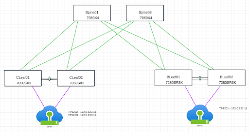
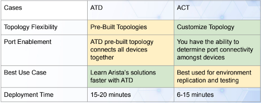

 


# Arista Southwest Region Newsletter

Welcome to the September 2025 newsletter for Arista customers in the U.S. Southwest Region!  

Did you hear? VeloCloud is now a part of Arista. Check out the latest blog, written by our CEO, Jayshree Ullal below!  
[Next Generation SD-WAN in the AI Era, by Arista CEO Jayshree Ullal](https://blogs.arista.com/blog/next-generation-sd-wan-in-the-ai-era)  

Check out additional Blog Posts below!  
[CloudVision: The First Decade](https://blogs.arista.com/blog/cloudvision-the-first-decade-2025)  
[All Blogs](https://blogs.arista.com/blog)  
 
We welcome your feedback on the newsletter. If you have any ideas on what you want to see, please reach out to southwest@arista.com.  

---

## **Using Traffic Policies to Assist with QoS and Congestion Management**
By: Shayne Kelly, Advanced Services Engineer, Southwest Region  

As applications within the Data Center and even end host devices inside our Campuses, use an ever increasing amount of network bandwidth, QoS and Congestion Management have become a hot topic in network design and implementation. The previous answer of ‘throw more bandwidth at it’, is being pushed to the limit as AI continues to place demands on the network infrastructure. But how do you build a QoS policy that is dynamic and does not need to be amended each time you add a subnet? The answer is Arista Traffic Polices.   

**What are Traffic Policies?**  

In the most simple definition, a Traffic Policy allows the user to configure rules to match on certain packets through the packet processing pipeline. In the context of QoS Polices, Traffic Polices allow us to match on certain criteria, maybe a field-set [field-set TOI link](https://www.arista.com/en/support/toi/eos-4-29-2f/17201-bgp-peer-field-sets-for-use-with-traffic-policies) that we created to match various subnets from certain BGP peers, and then take an action on the packets contained in the match criteria, by setting a DSCP value and/or a transit queue.   

As you can see in this TOI [Link](https://www.arista.com/en/support/toi/eos-4-27-1f/14873-bgp-community-based-prefix-sets-for-use-with-traffic-policies), by using traffic policies in conjunction with BGP, we can get away from ACL based matching criteria and statically configured IP prefix matches, and instead leverage BGP to manage the IP prefix field sets, to use within our traffic policy.    

**A Brief Example of Using Traffic Policies to set DSCP Values**  

In order to show how traffic policies can be used, I set up a quick lab, using some Arista Devices in a Typical Spine/Leaf Configuration. I have (2) sets of Leaf or ToR switches, each connected to an ESXI host that has various Linux Virtual Machines. I prefer to use Linux as it is easier to verify traffic using TCPDUMP.   

The diagram below shows the layout of the Lab that I am using (please note, while there is an MLAG shown in the diagram, I am not using MLAG for this lab):  
  
<figure markdown="span">
  
  <figcaption>Lab</figcaption>
</figure>   


Using this lab, I tested various scenarios and configurations, but for the purpose of this article, we will focus on setting the DSCP value via a Dynamic Field-Set, using BGP Communities. My goal is to use the ‘B’ Leafs, which will be the ingress leaf in this traffic flow, to set a DSCP value of 48 on all packets that are being sent to 172.0.122.0/24. This subnet is connected to the ‘C’ Leafs.   

In the example configuration below, we will use a traffic-policy that references a field-set that is being sourced from BGP. This means that we can define a criteria in BGP, in this case matching upon a community (65104:22), and any routes that have this community will be matched to the PremiumPfx class in our traffic policy. With the traffic policy configured, we will apply it to the interface (See below configuration output):  

```
traffic-policies
    field-set ipv4 prefix basic
    source bgp
!
    field-set ipv4 prefix premium
    source bgp
!
router bgp 65107
   vrf default
      traffic-policy field-set mappings
         field-set ipv4 basic
            community 65104:11
         field-set ipv4 premium
            community 65104:22
traffic-policies
   traffic-policy transit
      match PremiumPfx ipv4
         destination prefix field-set premium
         !
         actions
            set dscp 48
!
interface Eth1
    traffic-policy input transit

```  

Now that this has been applied, we will source traffic from 172.0.121.11 (a VM attached to the ‘B’ Leafs) destined for 172.0.122.11 (a VM attached to the ‘C’ Leafs). In order to show the DSCP value being set (shown as tos 0xc0), we will compare the output of a tcpdump taken before applying the traffic-policy to the interface with the output of a tcpdump taken after applying the traffic-policy to the interface.   

```
lab@tp1202:~$ sudo tcpdump -i ens34 src host 172.0.121.11 -vvv
tcpdump: listening on ens34, link-type EN10MB (Ethernet), snapshot length 262144 bytes
21:14:09.374584 IP (tos 0x0, ttl 61, id 48402, offset 0, flags [DF], proto ICMP (1), length 84)

AFTER
lab@tp1202:~$ sudo tcpdump -i ens34 src host 172.0.121.11 -vvv
tcpdump: listening on ens34, link-type EN10MB (Ethernet), snapshot length 262144 bytes
21:15:24.006086 IP (tos 0xc0, ttl 61, id 22808, offset 0, flags [DF], proto ICMP (1), length 84)

```  

As you can see, we were able to set the DSCP value on packets destined for a particular subnet, based upon a BGP community that is being advertised by the ingress leaf.   

**Summary**  

Traffic Policies are a very flexible method for manipulating various aspects of your network. This same methodology could be used at the WAN edge, to mark inbound or outbound traffic based upon BGP attributes. You could use this to provide SLAs for certain applications in your data center, or even to police traffic coming from your campus. There are a multitude of use cases for this.   

If you are interested in learning more about Traffic Polices, or would like to speak to someone about seeing a live demonstration, please contact your local account team.   

---

## **Arista Virtual Lab Environments: An Opportunity to Test Your Creativity**
By: Akashdeep Takhar, Advanced Services Engineer, Southwest Region    

Reading about technical literature for new tools is great to stay ahead of the curve in the networking space, however the impact of the toolset is reinforced by testing it out. Our team can provide you the opportunity to test our EOS and CloudVision solutions in sandbox environments! We have two environments ready for you to use: Arista Test Drive (ATD) and Arista Cloud Test (ACT).  

Arista Test Drive (ATD) gives you the ability to use a pre-built topology to test, break apart, and build different functionalities of a network environment through EOS. With 3 pre-built topologies, you have the ability to choose the one that is closest to your production network. This allows for you to replicate real life production to test new features out. Have an ongoing issue in your live network? Replicate it in your ATD instance to test possible fixes and to identify root causes. In addition to CLI accessibility, you also have the opportunity to become more familiar with CloudVision as well. Create changes, push configurations, and utilize our Studios feature to learn more about CVP’s capabilities!  

<figure markdown="span">
  
  <figcaption>Use Cases For Each Lab</figcaption>
</figure>  

What if the pre-built topologies are not similar to the topology you had in mind? That’s where Arista Cloud Test (ACT) can help to fulfill that requirement. Arista Cloud Test creates a custom topology by taking the inputs from a YAML file to build out a topology of your choice. Included in ACT are also different device models to choose from. This allows for you to specifically choose which devices to deploy in your sandbox environment, further adding additional customability to test out features in EOS and CloudVision. You can also choose specific versions of CloudVision to use in your environment. Essentially, you can build out a digital twin of your live production to test out features and troubleshoot problems by replication in the lab environment. Debating to use new features or make changes to production? Start by testing those actions within the lab environment to prevent issues or record issues that arise.   

The opportunity to replicate your production, test out new features, or practice using Arista’s solution are all possible thanks to Arista Test Drive and Arista Cloud Test. Contact your SE to learn more on how to obtain access to these labs.  


---

## __*Upcoming Events*__  
Arista hosts various events throughout the year for you! Members of our team organize these informative events to showcase Arista's ability to not only help improve your network, but to also assist by providing a set of tools to improve your operations!  

Click on the boxes below to be directed to Arista's website for additional lists of Webinars and Events.


<div class="grid cards" markdown>

-   __Webinars__  

    --- 

    We make is easy for you to view products that are of interest, all virtually! Technical memebers of the team showcase outstading explanation of the products. Click below to see our list of Webinars. 

    [Arista Webinars](https://www.arista.com/en/company/news/webinars){.md-button}

-   __Events__ 

    ---
    Join us in person to get a closer look in our list of produts and solution, as well as get the chance to meet members of the team. Click below to see our list of ipcoming Events. 

    [Upcoming Events](https://www.arista.com/en/company/news/events){ .md-button }


</div>

--- 

## __*Software Updates*__
<figure markdown>
{: style="height:200px;width:300px"}    
    <figcaption></figcaption>
</figure>
For new code releases, click [here](https://www.arista.com/en/support/software-download) 


   |  Softwares    | Versions      |  Release Date |
   | :-----------: | :-----------: | :-----------:
   | __EOS__           | 4.34.2F <br>4.32.6.1M <br> 4.33.4M <br> 4.32.6M <br>  | August 3rd, 2025 <br>July 2nd, 2025 <br> June 23rd, 2025 <br> June 20th, 2025 <br> 
   | __CVP__           | Portal 2025.2.1 <br> Appliance 7.0.1 <br> Sensor 1.1.1 <br>    | August 21st, 2025 <br> January 28th, 2025<br> July 14th, 2025 <br>
   | __DMF__           | 8.8.0 <br >| August 15th, 2025 <br> 
   | __WLAN__ <br>CV-CUE<br> | <br> 19.0.0 <br>      | <br> July 25th, 2025<br>  
   | __Arista NDR__         | 5.3.5         | July 16th, 2025
   | __TerminAttr__    | 1.37.2 <br>       | April 9th, 2025 <br>  
   | __VeloCloud SD-WAN__  <br>Orchestrator/ Gateway / Edge<br>  | <br>6.4.0 <br>       | <br> May 2nd, 2025 <br> 


---

## __*Software Advisories*__
Below is a list of advisories that are announced by Arista. To view more details on the specific advisories, please click the links in the middle row.

| Name          | Advisory Link           | Date of Advisory Notice  |
| :-----------: |:-------------:| :-----:|
|  __Global Common Encryption Key__   | [Security Advisory 0122](https://www.arista.com/en/support/advisories-notices/security-advisory/22022-security-advisory-0122)  | July 22nd, 2025   |  
|  __UDP Source Port 3503 Packets__   | [Security Advisory 0121](https://www.arista.com/en/support/advisories-notices/security-advisory/22021-security-advisory-0121)  | July 22nd, 2025   |  
|  __CVP Reverse Proxy__   | [Field Notice 0111](https://www.arista.com/en/support/advisories-notices/field-notice/22238-field-notice-0111)  | September 3rd, 2025   |  
|  __CVP Disc Usage__   | [Field Notice 0110](https://www.arista.com/en/support/advisories-notices/field-notice/22237-field-notice-0110)  | September 3rd, 2025   | 
|  __Last Support Release WiFi 6 Platforms__   | [Field Notice 0109](https://www.arista.com/en/support/advisories-notices/field-notice/22049-field-notice-0109)  | August 13th, 2025   |   
|  __Guest Manager Analytics- Data Opt Out__   | [Field Notice 0108](https://www.arista.com/en/support/advisories-notices/field-notice/22034-field-notice-0108)  | August 1st, 2025   |  


For a list of the most current advisories and notices, click [Here](https://www.arista.com/en/support/advisories-notices)

---

## __*Product Updates*__
<figure markdown>
{: style="height:200px;width:400px"}   
    <figcaption></figcaption>
</figure>
**End of Sale** notices are listed below.

| Device        | Name           | End Of Sale Date  |
| :-----------: |:-------------: |     :----:        |
| Software      | [End of Software for CloudVision Portal 2023.2](https://www.arista.com/en/support/advisories-notices/end-of-support/21412-end-of-software-support-for-cloudvision-portal-2023-2-release-train)<br>[End of Software Support for EOS 4.28](https://www.arista.com/en/support/advisories-notices/end-of-support/21275-end-of-software-support-for-eos-4-28)<br>[DMF and CCF Deployments on Accton/ Edgecore Switches](https://www.arista.com/en/support/advisories-notices/end-of-support/21094-end-of-support-for-dmf-and-ccf-deployments-on-accton-edgecore-switches)<br>[EOS-4.34 and later no longer supported on select switches](https://www.arista.com/en/support/advisories-notices/end-of-support/21089-end-of-software-support-for-7280r-r2-7500r-r2-and-7020r-series)<br> | May 27th. 2025 <br> March 14, 2025 <br>January 31st, 2025 <br>January 15th, 2025 <br> |
| CVP           | [CVP IPAM Application](https://www.arista.com/en/support/advisories-notices/endofsupport) <br> [CVP 2023.3](https://www.arista.com/en/support/advisories-notices/end-of-support/21627-end-of-software-support-for-cloudvision-portal-2023-3-release-train)          |  July 14th, 2025 <br> June 17th, 2025   |
| DMF           | [DMF 8.3](https://www.arista.com/en/support/advisories-notices/end-of-support/21417-end-of-software-support-for-dmf-8-3)          |  June 3rd, 2025           |
| Switches      | [DCS-7020R Series](https://www.arista.com/en/support/advisories-notices/end-of-sale/21052-end-of-sale-of-the-arista-dcs-7020r-series)<br> |  December 20th, 2024  |
| VeloCloud      | [SASE Secured by Symantec](https://www.arista.com/en/support/advisories-notices/end-of-sale/22072-end-of-sale-life-velocloud-sase-secured-symantec)<br> [Software Defined (SD) Access](https://www.arista.com/en/support/advisories-notices/end-of-sale/21653-end-of-sale-end-of-life-for-velocloud-software-defined-sd-access) <br> |  August 20th, 2024 <br> July 1st, 2025 | 


**New Releases** of Arista's device are listed below 

|  Device       | More Information |  Release Date 
    | :-----------: | :-----------:    | :-----------:
    | Arista VeloCloud | [VeloCloud Acquisition](https://www.arista.com/en/company/news/press-release/21646-pr-07012025) | Q3 2025
    |  Arista SWAG    |   [Modern Stacking for Campus](https://www.arista.com/en/company/news/press-release/20693-pr-12032024)                | Q1 2025 
    | Arista Multi-Domain Segmentaton Service  | [Arista MSS](https://www.arista.com/en/company/news/press-release/19297-pr-20240430)         | Q3 2024
    | Arista CV UNO  | [CloudVision Universal Network Observability](https://www.arista.com/en/company/news/press-release/19195-pr-20240305)  | Q1 2024


---
# *Feel Free to Reach Out To Us For Your Network Needs* 
<figure markdown>
{: style="height:300px;width:800px"}  
    <figcaption></figcaption>
</figure>
We thank you for taking the time to read out newsletter today. Feel free to reach out to your SE or ASE for more information or questions regardsing your network operations. Until next month, have a good one! 


