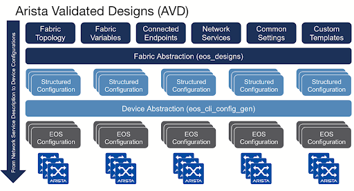

 

# Arista May Southwest Region Newsletter

Welcome to the May 2024 newsletter for Arista customers in the U.S. Southwest Region!
 
We welcome your feedback on the newsletter. If you have any ideas on what you want to see, please reach out to southwest@arista.com.

---

## **Unveiling the Power of AI: Transforming Enterprise Networks** 
By: Salman Zahid, Sr Manager Systems Engineering Southwest Region 

In the ever-evolving technological innovation landscape, a game-changing force emerges every so often that reshapes the trajectory of businesses across industries. Artificial Intelligence (AI) is one such transformative technology, promising to revolutionize every facet of enterprise operations. Already, we have witnessed the profound impact of generative AI in enhancing marketing efficiency, streamlining customer support, optimizing HR functions, and revolutionizing inbound sales leads through intuitive chatbots. Beyond these immediate applications, AI can potentially unleash autonomous vehicles at scale and accelerate the discovery of groundbreaking medical cures. It amplifies business capabilities, presenting myriad opportunities for growth and innovation. 

Businesses are embracing AI's potential and undergoing a paradigm shift in their approach to harnessing this transformative force.

**Arista's Insight: Pioneering Trends in Technology and Networking:**  
From its unique vantage point, Arista observes several distinct trends emerging in the realm of technology and networking. 

**Explosive Bandwidth Growth and Performance Demands:**  
 The rise of GPUs powering AI technologies necessitates exceptionally high-bandwidth systems with specific characteristics such as lossless fabric and deterministic latency. With GPUs boasting 400G connectivity requirements gaining traction, the demand for networking clusters or fabrics supporting dense 400G GPUs surges. Arista, a pioneer in networking solutions, has been at the forefront of addressing these demands, having shipped 400G switches in volume for years. Moreover, Arista is poised to introduce a cutting-edge 2RU 64X800GE system, boasting a remarkable 51.2 Tbps single SOC (System on Chip) very soon.

 **Ethernet's Ascendancy in AI Networks:**   
 As organizations scale their AI networks, they confront the inherent challenges and limitations of existing technologies like Infiniband. Arista Ethernet switches emerge as the preferred choice for some of the world's largest AI clusters, owing to their unmatched scalability and reliability. However, recognizing the need for continuous innovation to meet evolving demands, Arista takes proactive steps. As a founding member of the Ultra Ethernet Consortium (UEC), Arista is spearheading efforts to evolve Ethernet, ensuring it remains adaptable to the ever-expanding requirements of AI networks.

For insights into Arista's diverse portfolio and the cutting-edge technologies empowering customers to build AI clusters, visit Arista's AI Networking Solutions.

For more information, please visit:  
[https://www.arista.com/en/solutions/ai-networking](https://www.arista.com/en/solutions/ai-networking)  

---

## **Leveraging the Power of Arista Validated Design**
By: Bilal Syed, Systems Engineer Southwest Region 

Automating network provisioning and deployment tasks is becoming increasingly prevalent.
   
Enterprises are looking to be more efficient in network provisioning while also reducing errors and downtimes. Automating the right way is important. Automation that allows for easier maintenance, change controls, usability and repeatability is what will allow enterprise networks to operate efficiently and effectively. 
  
AVD is a community-based Free Open Source Software (FOSS) project sponsored by Arista Networks. AVD provides an extensible data model that defines Arista’s Unified Cloud Network architecture as “code”.
  
Arista Networks supports Ansible for managing devices running the EOS operating system natively through eAPI or CloudVision Portal (CVP). 
  
AVD collection includes a set of Ansible roles and modules to help kick-start your automation with Arista. The various roles and templates provided are designed to be customized and extended to your needs.
  
AVD Schematic representation:
Arista AVD data models cover fabric topology/variables, endpoints, services, common settings; and then convert these data models into per-device configurations. 

<figure markdown>

    <figcaption>Arista Validated Design Work Flow</figcaption>
</figure>

__Features__

* Flexibility with Open Data Models: Extensible fabric-wide network models, simplifying configuration, delivering consistency, and reducing errors

* Simplification through Multi-Domain Automation: A framework that can automate the data center, campus or wide area network, enabled by a consistent EOS software image and management platform

* Comprehensive Workflows: Automating the full life cycle of network provisioning from config generation to pre and post-deployment validation, and self-documentation of the network

__Roles Overview__

This repository provides content for Arista’s arista.avd collection. The following roles are included. The various roles and templates provided are designed to be customized and extended to your needs.

* [EOS Designs](https://avd.arista.com/4.7/roles/eos_designs/index.html) - Opinionated Data model to assist with the deployment of Arista Validated Designs.

* [EOS CLI Config Generation](https://avd.arista.com/4.7/roles/eos_cli_config_gen/index.html) - Generate Arista EOS cli syntax and device documentation.

* [EOS Config Deploy CVP](https://avd.arista.com/4.7/roles/eos_config_deploy_cvp/index.html) - Deploys intended configuration via CloudVision.

* [EOS Config Deplot eAPI](https://avd.arista.com/4.7/roles/eos_config_deploy_eapi/index.html) - Deploys intended configuration via eAPI.

* [CVP Configlet Upload](https://avd.arista.com/4.7/roles/cvp_configlet_upload/index.html) - Uploads configlets from a local folder to CloudVision Server.

* [EOS Validate State](https://avd.arista.com/4.7/roles/eos_validate_state/index.html) - Validate operational states of Arista EOS devices.

* [EOS Snapshot](https://avd.arista.com/4.7/roles/eos_snapshot/index.html) - Collect commands on EOS devices and generate report

* [DHCP Provisioner](https://avd.arista.com/4.7/roles/dhcp_provisioner/index.html) - Configure an ISC-DHCP server to provide ZTP services and CloudVision registration.

* [CV Deploy](https://avd.arista.com/4.7/roles/cv_deploy/index.html) - Deploys EOS device configurations and tags to the CloudVision management platform.

<figure markdown>
{: style="height:300px;width300px"}
    <figcaption>Arista Validated Design Work Flow</figcaption>
</figure>

Arista AVD Reference Designs:

Arista AVD provides example data models for Single/Dual DC L3 Leaf-Spine designs, EVPN Fabric, Campus Fabric (L2LS). These examples can be found [HERE](https://avd.arista.com), under the Examples section.

For latest Arista AVD documentation, please visit:  
[https://avd.arista.com](https://avd.arista.com)

For AVD github link, please visit:  
[https://github.com/aristanetworks/avd](https://github.com/aristanetworks/avd)

---

## __*Upcoming Events*__  
Arista hosts various events throughout the year for you! Members of our team organize these informative events to showcase Arista's ability to not only help improve your network, but to also assist by providing a set of tools to improve your operations! Click on the boxes below to be directed to Arista's website for lists of Webinars and Events.

-   __Webinars__  

    --- 

    We make is easy for you to view products that are of interest, all virtually! Technical memebers of the team showcase outstading explanation of the products. Click below to see our list of Webinars. 

    [Arista Webinars](https://www.arista.com/en/company/news/webinars){.md-button}

-   __Events__ 

    ---
    Join us in person to get a closer look in our list of produts and solution, as well as get the chance to meet members of the team. Click below to see our list of ipcoming Events. 

    [Upcoming Events](https://www.arista.com/en/company/news/events){ .md-button }

--- 

## __*Software Updates*__
<figure markdown>
{: style="height:200px;width:300px"}    
    <figcaption></figcaption>
</figure>
For new code releases, click [here](https://www.arista.com/en/support/software-download) 

   |  Softwares    | Versions      |  Release Date |
   | :-----------: | :-----------: | :-----------:
   | __EOS__           | 4.31.3M  4.30.6M  4.29.6.1M 4.29.7M 4.31.2F      | May 1st, 2024  April 12th, 2024 April 4th, 2024 February 20th, 2024 February 9th, 2024 
   | __CVP__           | 2024.1.1      | April 22nd, 2024
   | __DMF__           | 8.5.0         | February 5th, 2024
   | __WLAN__  CV-CUE Wireless Manager  |  13.0.0-67 15.0.1-22        |  December 15th, 2022 August 29th, 2023 
   | __Arista NDR__         | 5.1.2         | February 15th, 2024
   | __TerminAttr__    | 1.32.2        | April 12th, 2024

---

## __*Software Advisories*__
Below is a list of advisories that are announced by Arista. To view more details on the specific advisories, please click the links in the middle boxes.

| Name          | Advisory Link           | Date of Advisory Notice  |
| :-----------: |:-------------:| :-----:|
| __XZ Tarballs__              |  [Security Advisory 0095](https://www.arista.com/en/support/advisories-notices/security-advisory/19222-security-advisory-0095)             | April 3rd, 2024       |
| __HTTP/2 Continuation Frames__    | [Security Advisory 0094](https://www.arista.com/en/support/advisories-notices/security-advisory/19221-security-advisory-0094)               | April 5th, 2024             |
| __L3LS CloudVision Studio__   | [Field Notice 0080](https://www.arista.com/en/support/advisories-notices/field-notice/19211-field-notice-0080) | March 19th, 2024
| __SQL Injection__    | [Security Advisory 0093](https://www.arista.com/en/support/advisories-notices/security-advisory/19038-security-advisory-0093) | February 28th, 2024 |
| __CVP Virtual Appliances__      | [Security Advisory 0092](https://www.arista.com/en/support/advisories-notices/security-advisory/19025-security-advisory-0092)      |  February 20th, 2024 | 
| __7130 ACLs__                   | [Security Advisory 0091](https://www.arista.com/en/support/advisories-notices/security-advisory/19023-security-advisory-0091)     | February 20th, 2024

For a list of the most current advisories and notices, click [Here](https://www.arista.com/en/support/advisories-notices)

---

## __*Product Updates*__
<figure markdown>
{: style="height:200px;width:400px"}   
    <figcaption></figcaption>
</figure>
**End of Sale** notices are listed below.

| Device        | Name           | End Of Sale Date  |
| :-----------: |:-------------: |     :----:        |
| Module        | [7500R2 Series Linecards](https://www.arista.com/en/support/advisories-notices/end-of-sale/18886-end-of-sale-of-the-arista-7500r2-series-line-cards) | December 20th, 2023    |
| Access Points | [Arista 802.11ac Wave 2 Devices](https://www.arista.com/en/support/advisories-notices/end-of-sale/14911-end-of-sale-of-arista-802-11ac-wave-2-devices)      |  June 30th, 2022 |
| DMF           | [DMF/CCF Appliances](https://www.arista.com/en/support/advisories-notices/end-of-sale/19298-end-of-sale-end-of-life-for-arista-ccf-appliances-dca-dm-cdl-and-dca-cc-cdl)          |  April 30th, 2024             |
| Switches      | [DCS-7170-32CD](https://www.arista.com/en/support/advisories-notices/end-of-sale/19266-end-of-sale-of-the-arista-dcs-7170-32cd-series) [DCS-7020SRG-24C2](https://www.arista.com/en/support/advisories-notices/end-of-sale/18884-end-of-sale-of-the-arista-dcs-7020srg-24c2-series) [DCS-7280SR-48C6 & 7280TR-48C6](https://www.arista.com/en/support/advisories-notices/end-of-sale/17491-end-of-sale-of-the-arista-dcs-7280sr-48c6-and-dcs-7280tr-48c6-series) [DCS-7280CR2-60 Series](https://www.arista.com/en/support/advisories-notices/end-of-sale/17490-end-of-sale-of-the-arista-dcs-7280cr2-60-series) [DCS-7010T-48](https://www.arista.com/en/support/advisories-notices/end-of-sale/16538-end-of-sale-7010t-48)       |    Varies by Device |

**New Releases** of Arista's device are listed below 

   |  Device       | More Information |  Release Date 
   | :-----------: | :-----------:    | :-----------:
   | Arista Multi-Domain Segmentaton Service  | [Arista MSS](https://www.arista.com/en/company/news/press-release/19297-pr-20240430)         | April 30th, 2024
   |  Arista 7130 Series             |  [Ultra Low Latency Network](https://www.arista.com/en/company/news/press-release/18273-pr-20231011)  | Q4 2023
   |  Arista AGNI    |   [AI Driven Network Identity](https://www.arista.com/en/company/news/press-release/17244-pr-20230424)                | Q2 2023 
   | Arista CV UNO  | [CloudVision Universal Network Observability](https://www.arista.com/en/company/news/press-release/19195-pr-20240305)  | Q1 2024

---

# *Feel Free to Reach Out To Us For Your Network Needs* 
<figure markdown>
{: style="height:300px;width:800px"}  
    <figcaption></figcaption>
</figure>
We thank you for taking the time to read out newsletter today. Feel free to reach out to your SE or ASE for more information or questions regardsing your network operations. Until next month, have a good one! 

