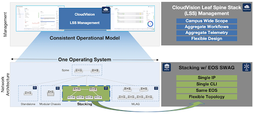
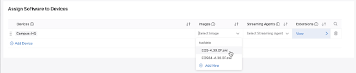

 

# Arista February Southwest Region Newsletter

Welcome to the February 2025 newsletter for Arista customers in the U.S. Southwest Region!
 
We welcome your feedback on the newsletter. If you have any ideas on what you want to see, please reach out to southwest@arista.com.

Have you signed up yet for the Arista Southwest Customer Exchange? Here's a chance to gain insights from industyr leaders on how Arista's latest technologies transform modern networks. The event will take place February 19, 2025 in Marina Del Rey. Sign up below today!

[Sign Up Link Below](https://www.arista.com/en/cg-cv/cv-accessing-events):  
https://events.arista.com/2025-02-19-sko-customer-event-marina-del-rey-ca

---

## **Arista Switch Aggregation Group - Evolution of Campus Stacking**
By: Salman Zahid, Director of Systems Engineering, Southwest Region  

Arista Networks' Switch Aggregation Group (SWAG™) redefines campus network stacking with a modern, standards-based approach that addresses decades-old challenges in enterprise network management. By leveraging Arista EOS® and CloudVision® Leaf Spine Stack (LSS™) Management, SWAG delivers scalable, flexible aggregation while eliminating proprietary dependencies.  

Key Benefits of Arista SWAG    

1.  Unified Management & Simplified Operations    
    * Single IP/CLI Interface: Manage up to 16( and 48 in the future)  switches as a single logical entity through one IP address and CLI session, reducing operational complexity.    
    * CloudVision Integration: Centrally provision, monitor, and troubleshoot stacks across entire campuses via a unified dashboard, eliminating siloed management.  

2. Cost Efficiency
    * Reduced Licensing Costs: Third-party tools licensing per IP can save significantly when managing multiple switches under one IP.
    * No Proprietary Hardware: Uses standard Ethernet cabling/optics instead of vendor-locked stacking cables, lowering CapEx and easing upgrades.  

3.  Architectural Flexibility
    * Multi-Topology Support: Deploy universal leaf-spine, ring, or chain designs, enabling seamless migration from legacy stacks.
    * Scalability: Scale from 16 (and in future, 48) switches per cluster, outperforming legacy systems limited to 10 switches. Architecture is designed from day 1 to scale up to 48 switches in a single stack, although that scale will be delivered over time.  

4. Resilient Modern Stacking
    * Distributed Control Plane: SWAG’s active/standby supervisor model ensures high availability, while worker switches handle forwarding.
    * Hitless Upgrades: Modify configurations or replace hardware without downtime.

Technical Advantages Over Legacy Stacking

| Feature                     | Leagacy Stacking                 | Arista SWAG |
| -----------                 | --------------------             | ---------------- |
| Cabling                     | Proprietary cables               | Standard Ethernet |
| Topology Flexibility        | Restricted to ring/chain         | Supports leaf-spine, ring, or hybrid  |
| Scalability                 | less than or equal to 10 switches per stack | Up to 48 switches  |
| Management                  | Per-stack CLI | CloudVision multi-stack orchestration  |
| Upgrade Impact              | Full-stack reboots | Hitless, incremental updates  |  

CloudVision LSS (Leaf Spine Stack) Management: Multi-Domain Stack Orchestration  

CloudVision LSS extends SWAG’s benefits by enabling hierarchical management:  

* Logical Grouping: Organize switches by physical location (closet, floor, building) or functional role 
* AI-Driven Insights: Proactively identify performance bottlenecks or misconfigurations across stacks
* Automated Compliance: Enforce security policies and audit configurations network-wide

<figure markdown>
{: style="height:350px;width:650px"}
    <figcaption> Arista SWAG </figcaption>
</figure> 
 

Links for additional information on Arista SWAG:  
[Whitepaper](https://www.arista.com/assets/data/pdf/Whitepapers/Cognitive-Campus-WP.pdf)  
[Video](https://www.youtube.com/watch?v=cMLYLz_3ZEk)  

Contact your SE or ASE to learn more!

---

## **A Simple Solution to Network Upgrades** 
By: Alex Bojko, Advanced Services Engineer, Southwest Region  

Upgrading network infrastructure is oftentimes viewed as a tedious and stressful task that has the potential to lead to disruptions in network operations and even outages. Extensive planning for an upgrade is typically required, as we need to ensure we have the right software version in place, a time window to execute the upgrade within, and a fallback plan in case things go wrong. When it comes time to perform the upgrade, depending on the scale of the infrastructure, it can prove to be a very time consuming task.   

Arista's CloudVision Software Management Studio is a new addition to Studios that streamlines the process of upgrading network infrastructure. The Software Management Studio greatly simplifies the formerly tedious and time consuming task of upgrading your network infrastructure. Here is how the process works:  

You start by creating a new Workspace, opening the Software Management Studio, and selecting "Add Software". 

<figure markdown>
{: style="height:150px;width:650px"}
    <figcaption> Studios add software feature </figcaption>
</figure>   

Software in this case can be an EOS image, extension, or TerminAttr image. You can download an image or extension onto your local device, then upload it into your CloudVision instance using the "Local" option, or you can download an image directly into CloudVision using the "Cloud" option.  

Once the required images are in place, you simply add them to devices based on a tagging schema you have created. For example, if you are upgrading network infrastructure at a specific site, you can tag each device with that site name, and assign an EOS image or extension to that tag. Once completed, review and submit the Workspace, and execute the associated Change Control to apply the images to the device.  

<figure markdown>
{: style="height:150px;width:650px"}
    <figcaption> Image assignment to device </figcaption>
</figure>  

The Software Management Studio makes upgrading network infrastructure a seamless experience, all while reducing network disruptions and giving you time back in your day.  

To learn more about the Software Management Studio, or CloudVision Studios in general, select the links below:  

Links for additional information on Arista SWAG:  
[Software Management Article](https://www.arista.io/help/articles/cHJvdmlzaW9uaW5nLnN0dWRpb3MuQWxsLmJ1aWx0SW4uc29mdHdhcmU=)  
[CloudVision Studios Article](https://www.arista.io/help/articles/cHJvdmlzaW9uaW5nLnN0dWRpb3MuQWxsLnN0dWRpb3M=#studios) 
 

---

## __*Upcoming Events*__  
Arista hosts various events throughout the year for you! Members of our team organize these informative events to showcase Arista's ability to not only help improve your network, but to also assist by providing a set of tools to improve your operations! Click on the boxes below to be directed to Arista's website for lists of Webinars and Events.

-   __Webinars__  

    --- 

    We make is easy for you to view products that are of interest, all virtually! Technical memebers of the team showcase outstading explanation of the products. Click below to see our list of Webinars. 

    [Arista Webinars](https://www.arista.com/en/company/news/webinars){.md-button}

-   __Events__ 

    ---
    Join us in person to get a closer look in our list of produts and solution, as well as get the chance to meet members of the team. Click below to see our list of ipcoming Events. 

    [Upcoming Events](https://www.arista.com/en/company/news/events){ .md-button }

--- 

## __*Software Updates*__
<figure markdown>
{: style="height:200px;width:300px"}    
    <figcaption></figcaption>
</figure>
For new code releases, click [here](https://www.arista.com/en/support/software-download) 

   |  Softwares    | Versions      |  Release Date |
   | :-----------: | :-----------: | :-----------:
   | __EOS__           | 4.32.4FM   4.28.13M   4.30.9M     | January 29th, 2025   January 20th, 2025   January 13th, 2025   
   | __CVP__           | Portal 2024.3.1  Appliance 7.0.0  Sensor 1.0.0      | December 13th, 2024   November 15th, 2024  October 16th, 2024  
   | __DMF__           | 8.5.2  8.4.4   | November 1st, 2024   September 26th, 2024  
   | __WLAN__  CV-CUE Wireless Manager  |  13.0.0-67 18.0.0        |  December 15th, 2022 December 2024 
   | __Arista NDR__         | 5.2.4         | August 2024
   | __TerminAttr__    | 1.35.1         | November 5th, 2024   

---

## __*Software Advisories*__
Below is a list of advisories that are announced by Arista. To view more details on the specific advisories, please click the links in the middle boxes.

| Name          | Advisory Link           | Date of Advisory Notice  |
| :-----------: |:-------------:| :-----:|
|  __BGP Agent Moomory Leak__   | [Security Advisory 0110](https://www.arista.com/en/support/advisories-notices/security-advisory/21092-security-advisory-0110)  | January 24th, 2025   |
|  __AAA Dynamic ACL__   | [Security Advisory 0109](https://www.arista.com/en/support/advisories-notices/security-advisory/21086-security-advisory-0109)  | January 14th, 2025   |
| __PoE power-disable port status__    | [Field Notice 0093](https://www.arista.com/en/support/advisories-notices/field-notice/21088-field-notice-0093) | January 15th, 2025   |
| __CV-CUE 18.0__    | [Field Notice 0092](https://www.arista.com/en/support/advisories-notices/field-notice/21085-field-notice-0092)   | January 7th, 2025   |

For a list of the most current advisories and notices, click [Here](https://www.arista.com/en/support/advisories-notices)

---

## __*Product Updates*__
<figure markdown>
{: style="height:200px;width:400px"}   
    <figcaption></figcaption>
</figure>
**End of Sale** notices are listed below.

| Device        | Name           | End Of Sale Date  |
| :-----------: |:-------------: |     :----:        |
| Software      | [DMF and CCF Deployments on Accton/ Edgecore Switches](https://www.arista.com/en/support/advisories-notices/end-of-support/21094-end-of-support-for-dmf-and-ccf-deployments-on-accton-edgecore-switches) [EOS-4.34 and later no longer supported on select switches](https://www.arista.com/en/support/advisories-notices/end-of-support/21089-end-of-software-support-for-7280r-r2-7500r-r2-and-7020r-series) [CloudVision Portal 2023.1 Train](https://www.arista.com/en/support/advisories-notices/end-of-support/21053-end-of-software-support-for-cloudvision-portal-2023-1-release-train)   [EOS 4.27 Series](https://www.arista.com/en/support/advisories-notices/end-of-support/20174-end-of-software-support-for-eos-4-27) | January 31st, 2025  January 15th, 2025  December 20th, 2024  August 27th, 2024    |
| Module        | [7500R2 Series Linecards](https://www.arista.com/en/support/advisories-notices/end-of-sale/18886-end-of-sale-of-the-arista-7500r2-series-line-cards) | December 20th, 2023    |
| Access Points | [AP Model W-118](https://www.arista.com/en/support/advisories-notices/end-of-sale/20652-end-of-sale-of-ap-model-w-118)        |   November 20th, 2024   |
| DMF           | [Recorder Node DCA-DM-RA3](https://www.arista.com/en/support/advisories-notices/end-of-sale/21087-end-of-sale-end-of-life-for-arista-recorder-node-appliance-dca-dm-ra3)          |  January 14th, 2025           |
| Switches      | [DCS-7020R Series](https://www.arista.com/en/support/advisories-notices/end-of-sale/21052-end-of-sale-of-the-arista-dcs-7020r-series)  |  December 20th, 2024  |

**New Releases** of Arista's device are listed below 

|  Device       | More Information |  Release Date 
    | :-----------: | :-----------:    | :-----------:
    |  Arista SWAG    |   [Modern Stacking for Campus](https://www.arista.com/en/company/news/press-release/20693-pr-12032024)                | Q1 2025 
    | Arista Multi-Domain Segmentaton Service  | [Arista MSS](https://www.arista.com/en/company/news/press-release/19297-pr-20240430)         | Q3 2024
    | Arista CV UNO  | [CloudVision Universal Network Observability](https://www.arista.com/en/company/news/press-release/19195-pr-20240305)  | Q1 2024

---
# *Feel Free to Reach Out To Us For Your Network Needs* 
<figure markdown>
{: style="height:300px;width:800px"}  
    <figcaption></figcaption>
</figure>
We thank you for taking the time to read out newsletter today. Feel free to reach out to your SE or ASE for more information or questions regardsing your network operations. Until next month, have a good one! 

