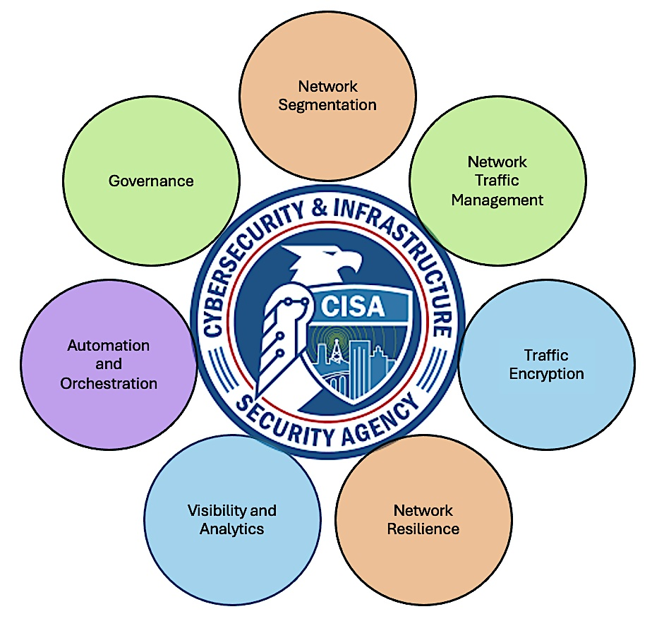

 

# Arista March Southwest Region Newsletter

Welcome to the March 2024 newsletter for Arista customers in the U.S. Southwest Region!

Exploitation of enterprise networks continues to rise every year. As more security threats emerge, the importance of security maintenance and best practices for network vulnerabilities are crucial. Our very own Senior Manager of Systems Engineer, Salman Zahid, provides powerful insight to the importance of Zero Trust Security. 

WiFi technology is constantly improving over time by delivering faster speeds and enhancing wireless infrastructures. It is crucial to understand the changes within the WiFi realm for future connectivity endeavors. Dang Nguyen, Manager Systems Engineering, provides his technical expertise and extensive knowledge on WiFi in our 2nd article of our newsletter to help you stay up to date on the latest wireless trends.
 
We welcome your feedback on the newsletter. If you have any ideas on what you want to see, please reach out to southwest@arista.com.

---

## **Zero Trust Security: Addressing Challenges & Embracing Opportunities** 
By: Salman Zahid, SE Senior Manager Southwest Region 

In the realm of enterprise security, the relentless pursuit of staying ahead of potential threats weighs heavily on the minds of security teams. A recent survey conducted by Forrester Research revealed a startling statistic: a staggering 77% of firms fell victim to breaches in 2023. The inevitability of security breaches has transformed from a question of "if" to "when." It often feels like a game of whack-a-mole for security professionals, where one vulnerability is patched only for another to surface. However, amidst these challenges, there lies an opportunity to approach security strategically, fortifying our networks with greater resilience and protection. 

Established organizations recognize that breaches are an unfortunate reality. With this acknowledgment, they craft security policies aimed at minimizing the impact of any potential breaches. Moreover, there's a growing awareness that many security threats originate from within the organization itself, underscoring the importance of creating a robust network foundation and security policies capable of defending against both internal and external attacks. 

Arista is at the forefront of tackling the zero-trust challenge by aligning with recommendations from the Cybersecurity & Infrastructure Security Agency (CISA). According to CISA, the network serves as the nucleus of a mature zero-trust security architecture. Networking teams wield considerable influence in elevating the entire enterprise's security posture by embracing these crucial recommendations for enterprise networks. 

<figure markdown>

    <figcaption>Cybersecurity & Infrastructure Security Agency Recommendations</figcaption>
</figure>

In following the recommendations from CISA, Arista is providing solutions across seven key areas identified for zero-trust maturity. Implementing these recommendations is a journey, not a destination. While it may not happen overnight, committing to a zero-trust architecture can significantly enhance enterprise security, reducing susceptibility to both internal and external security threats.

<figure markdown>

    <figcaption>Arista's Pillars of Zero Trust Security</figcaption>
</figure>

!!! quote
    "Arista is at the forefront of tackling the zero-trust challenge by aligning with recommendations from the Cybersecurity & Instrastructure Security Agency"

 

Learn more about these seven Arista architectural pillars of zero trust security by [clicking here](https://www.arista.com/assets/data/pdf/Arista-ZTNO-Solution-Brief.pdf) and [here](https://www.arista.com/assets/data/pdf/Whitepapers/Zero-Trust-Maturity-Model-WP.pdf)

---

## **High Performance Wi-Fi Today and Tomorrow**
By Dang Nguyen, SE Manager Arizona/ San Diego Region 

Technology has become an integral part of daily life and, at times, a bare necessity. Ultra-fast, reliable connectivity to information and applications is critical, especially for devices on the go.  Wireless LAN has evolved and grown in many ways to become the preferred and, at times, primary connectivity method.  Let’s take a high-level look at the current state of Wi-Fi 7, its benefits and challenges. 

Wi-Fi 7 is the latest technology in this space and has undoubtedly built upon and improved on the most significant update to the Wi-Fi Spectrum since 1999 to increase speed, capacity, and efficiency. 

| Release Year    | WiFi Name    | Standards                       | Frequency Bands      |
| --------------- | ------------ | ----------                      | -------------------- |
| 1999            | Wi-Fi 1      | 802.11b (1 to 11 Mbits/s)       | 2.4 GHz              |
| 1999            | Wi-Fi 2      | 802.11a (1.5 to 54 Mbits/s)     | 5 Ghz                |
| 2003            | Wi-Fi 3      | 802.11g (3 to 54 Mbits/s)       | 2.4 Ghz              | 
| 2009            | Wi-Fi 4      | 802.11n (72 to 600 Mbits)       | 2.4/5 Ghz            | 
| 2014            | Wi-Fi 5      | 802.11ac (433 to 6933 Mbits)    | 5 Ghz                | 
| 2019            | Wi-Fi 6      | 802.11ax (600 to 9608 Mbits)    | 2.4/5 Ghz            | 
| 2020            | Wi-Fi 6E     | 802.11ax (600 to 9608 Mbits)    | 6 Ghz                | 

It holds the promise of theoretic speeds above 30Gbps while reducing latency and providing for the support of multiple simultaneous devices.  It will utilize even wider channels than Wi-Fi 6E leveraging the new 802.11be standards to provide for this improved performance.  The standard has also introduced a clever innovation to get around interference in the form of preamble puncturing.  These and other advancements will pave a path for transformational applications throughout many industries, from education to manufacturing.  These applications will range from extended reality that requires high-fidelity visuals and low latency to the ever-increasing demand of enterprise network workloads that require high performance from the wired and now wireless infrastructure.  With all this performance, the new standard also brings additional security with Opportunistic Wireless Encryption (OWE) with unique keys for each session.  This prevents attackers from decrypting past communications should they be able to obtain the key. 

The allure of new technology and its promises can surely be enticing, but we need to recognize the current challenges.  The most challenging yet most hard to define is that it is still in development, and there may be obstacles yet to be seen.  One of the biggest known challenges will be compatibility of end user devices and also routers and switches.  Due to the higher energy requirements, there will be higher power consumption on the part of the access points and also the for end devices.  Currently very few of these end user devices have been released that support the new standard.  Infrastructure will also need to be upgraded to accommodate to take full advantage of the increased speeds.

For current deployments of wireless LAN, Wi-Fi 6E is the viable option.  It is a more mature technology within the access point itself and also supported endpoints.  It utilizes the same 6 GHz spectrum as Wi-Fi 7 but is more cost effective itself, with most infrastructures already capable of supporting the power and bandwidth requirements.  The benefits of this technology are more immediate, yet still offers future proofing.

Learn more about Wi-Fi and Arista specific solutions:  
[Wi-Fi 7: A Leap Towards Time-Sensitive Networking](https://www.arista.com/assets/data/pdf/Whitepapers/Arista-Wi-Fi-7-White-Paper.pdf)  
[Wi-Fi 6E and Future-Proofing Wireless Infrastruture](https://www.arista.com/assets/data/pdf/Whitepapers/Arista-Wi-Fi-6E-White-Paper.pdf)  
[Arista Cognitive Wi-Fi](https://www.arista.com/en/products/cloudvision-cue)  

---

## __*Upcoming Events*__  
Arista hosts various events throughout the year for you! Members of our team organize these informative events to showcase Arista's ability to not only help improve your network, but to also assist by providing a set of tools to improve your operations! Click on the boxes below to be directed to Arista's website for lists of Webinars and Events.

-   __Webinars__  

    --- 

    We make is easy for you to view products that are of interest, all virtually! Technical memebers of the team showcase outstading explanation of the products. Click below to see our list of Webinars. 

    [Arista Webinars](https://www.arista.com/en/company/news/webinars){.md-button}

-   __Events__ 

    ---
    Join us in person to get a closer look in our list of produts and solution, as well as get the chance to meet members of the team. Click below to see our list of ipcoming Events. 

    [Upcoming Events](https://www.arista.com/en/company/news/events){ .md-button }

--- 

## __*Software Updates*__
<figure markdown>
{: style="height:200px;width:300px"}    
    <figcaption></figcaption>
</figure>
For new code releases, click [here](https://www.arista.com/en/support/software-download) 

   |  Softwares    | Versions      |  Release Date |
   | :-----------: | :-----------: | :-----------:
   | __EOS__           | 4.29.7M  4.31.2F  4.26.13M 4.30.5M 4.23.15M      | February 20th, 2024  February 9th, 2024 February 1st, 2024 January 23rd, 2024 January 13th, 2024 
   | __CVP__           | 2023.3.0      | December 21st, 2023
   | __DMF__           | 8.5.0         | February 5th, 2024
   | __WLAN__  CV-CUE Wireless Manager  |  13.0.0-67 15.0.1-22        |  December 15th, 2022 August 29th, 2023 
   | __Arista NDR__         | 5.1.0         | December 20th, 2023
   | __TerminAttr__    | 1.28.3        | February 1st, 2024

---

## __*Software Advisories*__
Below is a list of advisories that are announced by Arista. To view more details on the specific advisories, please click the links in the middle boxes.

| Name          | Advisory Link           | Date of Advisory Notice  |
| :-----------: |:-------------:| :-----:|
| __SQL Injection__    | [Security Advisory 0093](https://www.arista.com/en/support/advisories-notices/security-advisory/19038-security-advisory-0093) | February 28th, 2024 |
| __CVP Virtual Appliances__      | [Security Advisory 0092](https://www.arista.com/en/support/advisories-notices/security-advisory/19025-security-advisory-0092)      |  February 20th, 2024 | 
| __7130 ACLs__                   | [Security Advisory 0091](https://www.arista.com/en/support/advisories-notices/security-advisory/19023-security-advisory-0091)     | February 20th, 2024

For a list of the most current advisories and notices, click [Here](https://www.arista.com/en/support/advisories-notices)

---

## __*Product Updates*__
<figure markdown>
{: style="height:200px;width:400px"}   
    <figcaption></figcaption>
</figure>
**End of Sale** notices are listed below.

| Device        | Name           | End Of Sale Date  |
| :-----------: |:-------------: |     :----:        |
| Module        | [7500R2 Series Linecards](https://www.arista.com/en/support/advisories-notices/end-of-sale/18886-end-of-sale-of-the-arista-7500r2-series-line-cards) | December 20th, 2023    |
| Access Points | [Arista 802.11ac Wave 2 Devices](https://www.arista.com/en/support/advisories-notices/end-of-sale/14911-end-of-sale-of-arista-802-11ac-wave-2-devices)      |  June 30th, 2022 |
| Switches      | [DCS-7020SRG-24C2](https://www.arista.com/en/support/advisories-notices/end-of-sale/18884-end-of-sale-of-the-arista-dcs-7020srg-24c2-series) [DCS-7280SR-48C6 & 7280TR-48C6](https://www.arista.com/en/support/advisories-notices/end-of-sale/17491-end-of-sale-of-the-arista-dcs-7280sr-48c6-and-dcs-7280tr-48c6-series) [DCS-7280CR2-60 Series](https://www.arista.com/en/support/advisories-notices/end-of-sale/17490-end-of-sale-of-the-arista-dcs-7280cr2-60-series) [DCS-7010T-48](https://www.arista.com/en/support/advisories-notices/end-of-sale/16538-end-of-sale-7010t-48)       |    Varies by Device |

**New Releases** of Arista's device are listed below 

   |  Device       | More Information |  Release Date 
   | :-----------: | :-----------:    | :-----------:
   |  Arista 7130 Series             |  [Ultra Low Latency Network](https://www.arista.com/en/company/news/press-release/18273-pr-20231011)  | Q4 2023
   |  Arista AGNI    |   [AI Driven Network Identity](https://www.arista.com/en/company/news/press-release/17244-pr-20230424)                | Q2 2023 

---

# *Feel Free to Reach Out To Us For Your Network Needs* 
<figure markdown>
{: style="height:300px;width:800px"}  
    <figcaption></figcaption>
</figure>
We thank you for taking the time to read out newsletter today. Feel free to reach out to your SE or ASE for more information or questions regardsing your network operations. Until next month, have a good one! 

