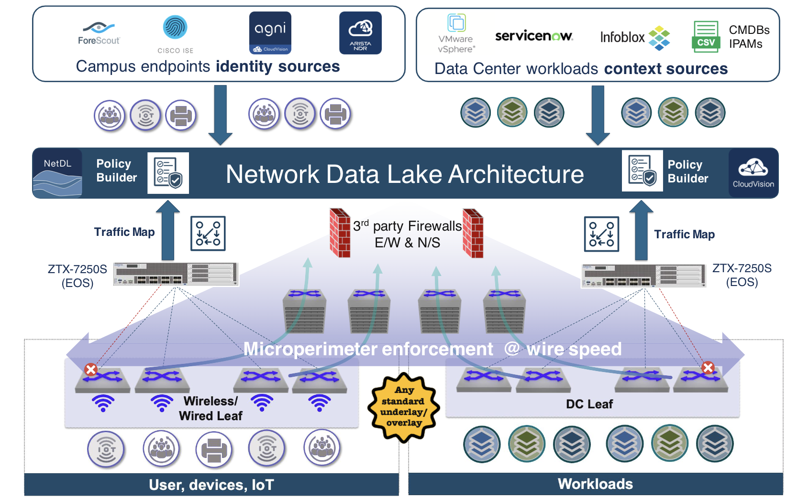

 

# Arista May Southwest Region Newsletter

Welcome to the June 2024 newsletter for Arista customers in the U.S. Southwest Region!
 
We welcome your feedback on the newsletter. If you have any ideas on what you want to see, please reach out to southwest@arista.com.

---

## **Addressing Evolving Enterprise Security Needs: Arista's Multi-Domain Segmentation Services (MSS)** 
By: Salman Zahid, Sr Manager Systems Engineering Southwest Region & Akashdeep Takhar, Advanced Services Engineer

In the contemporary landscape of enterprise architecture, the traditional concept of a network perimeter has become obsolete. With applications spanning across multiple clouds, both public and private, the distributed nature of modern networks presents new challenges for security. Attack methodologies have evolved as well, with a shift away from malware-centric approaches towards exploiting credentials to infiltrate networks and maneuver laterally, necessitating a reevaluation of conventional security paradigms. 

Traditional network boundaries, such as VLANs and VRFs, often prove inadequate for enforcing robust security policies in these dynamic environments. There arises a need for more flexible and granular control over intra-segment communication and the grouping of endpoints dispersed across various VLANs. 

Arista's Multi-Domain Segmentation Services (MSS) addresses these challenges by enabling the creation of micro-perimeters that restrict intra-segment communication and facilitate the grouping of endpoints for streamlined security policy enforcement. Departing from the conventional reliance on network subnets for access control, Arista MSS leverages tags assigned to endpoints, allowing for more nuanced policy enforcement based on these tags. Each endpoint can be associated with multiple tags, providing enhanced granularity in access control.

<figure markdown>

    <figcaption>Arista Multi-Domain Segmentation Services </figcaption>
</figure>

A brief explanation of Arista MSS is shown above. Let’s take a look at this: 

a) By identifying the endpoints of a network, we can keep a record of all the endpoints to where traffic is traveling. By utilizing this data, you can parse through information faster to identify the source cause of potential attacks.  

b) Traffic maps help create policies allowing expected traffic to pass along. This gives users the ability to apply additional rules for further enhancement of traffic flow.  

c) Applying Microperimeter practices allows or denies specified traffic. The traffic can also be redirected to travel to the firewalls set up in your existing infrastructure.  

d) Observing the network traffic by applying the previous steps above gives you the access to gain visibility to your network. Additional changes can be made as applications are added into the infrastructure.

Arista MSS further allows for us to provide you better tools for a Zero Trust Network equipped with best practices of monitoring endpoints as well as sourcing potential threats. As an effort to simplify our tools,  Arista MSS requires NO custom software or custom protocols to utilize our solution. Interested in learning more? Contact your SE or read the links shown below.  

Links for more information on Arista MSS:  
[Arista MSS Press Release](https://www.arista.com/en/company/news/press-release/19297-pr-20240430)  
[The Era of Microperimeters](https://blogs.arista.com/blog/the-era-of-microperimeters)  
[VIDEO: Arista MSS for Campus and Data Center](https://www.youtube.com/watch?v=yHgPwDmqtj0)
---

## **Workflow Enhancement: Organize Configurations with CloudVision Studio’s Static Configlets Feature**
By: Akashdeep Takhar, Advanced Services Engineer Southwest Region 

By now, you may have heard or interacted with the Configlet feature within the Provisioning tab of CloudVision. Applying configurations via Configlets is a great method for the network team to push multiple changes onto various devices, as well as save significant time during maintenance windows. Along with Configlets, another feature called Studios can further assist in tracking changes, in addition to deploying new fabrics within the network environment. Rather than utilizing the feature separately, why not combine the two together?  To enhance the capabilities of tracking configuration changes, we take a look at a feature called Studios Static Configlets!  

Let’s take a look at the differences in workflow between traditional Configlets and Studio Static Configlets. Below is a table of Configlets in a CloudVision instance:  

<figure markdown>

    <figcaption>Configlet Table</figcaption>
</figure>

In a typical operation, each device’s configlet is stored in this table. While it is great to know that you can use the search bar to find a specific configlet for the device of interest, the fact is that there should be a more efficient manner to organize configlets per device. Below is a picture of CloudVision Studio’s Static Configlet:

<figure markdown>

    <figcaption>Studios Static Configlet</figcaption>
</figure>

Rather than storing every single configlet from every device, we can place devices in a hierarchy manner, and store configlets within those devices! As shown above, Spine 1 has multiple tabs on the right, within each tab is a configlet that stores configurations pertaining to the device. This feature has simplified the Configlet’s table by allowing you to organize the configlets per device.  

Another tool integrated in Studio's Static Configlet is the hierarchy model. Take a look at the devices on the left panel. Every device has the option of inheriting the child device’s configurations. Example: Spine 1 and Spine 2 are the “children” of Tenant. You can enable the hierarchy schema for Tenant to inherit both Spine 1 and Spine 2 configurations. This allows for the tenant instance to collect configurations without the hassle of you specifically having to create a separate configlet by itself.  

Optimizing the workflow of device operations by using Studio Static Configlets will lead to enhanced operations for your Arista devices. Studio’s delivers various other features as well to manage multiple devices in a simplified manner. Although Studio’s does take additional learning to maximize its capabilities, the knowledge is fairly easy to grasp! Please reach out to your SE or ASE for more additional information or training.  

Links for additional information:  
[CloudVision Video Series](https://www.arista.com/en/support/product-documentation/cloudvision-video-guide)  
[CloudVision Studios Whitepaper](https://www.arista.com/assets/data/pdf/Whitepapers/Network-Automation-CloudVision-Studios-WP.pdf)  

---

## __*Upcoming Events*__  
Arista hosts various events throughout the year for you! Members of our team organize these informative events to showcase Arista's ability to not only help improve your network, but to also assist by providing a set of tools to improve your operations! Click on the boxes below to be directed to Arista's website for lists of Webinars and Events.

-   __Webinars__  

    --- 

    We make is easy for you to view products that are of interest, all virtually! Technical memebers of the team showcase outstading explanation of the products. Click below to see our list of Webinars. 

    [Arista Webinars](https://www.arista.com/en/company/news/webinars){.md-button}

-   __Events__ 

    ---
    Join us in person to get a closer look in our list of produts and solution, as well as get the chance to meet members of the team. Click below to see our list of ipcoming Events. 

    [Upcoming Events](https://www.arista.com/en/company/news/events){ .md-button }

--- 

## __*Software Updates*__
<figure markdown>
{: style="height:200px;width:300px"}    
    <figcaption></figcaption>
</figure>
For new code releases, click [here](https://www.arista.com/en/support/software-download) 

   |  Softwares    | Versions      |  Release Date |
   | :-----------: | :-----------: | :-----------:
   | __EOS__           | 4.32.0.1F  4.26.14M  4.29.8M 4.28.11M 4.31.3M      | May 16th, 2024  May 15th, 2024 May 14th, 2024 May 3rd, 2024 May 1st, 2024 
   | __CVP__           | 2023.3.2  2024.1.2      | May 14th, 2024  May 10th, 2024 
   | __DMF__           | 8.5.0         | February 5th, 2024
   | __WLAN__  CV-CUE Wireless Manager  |  13.0.0-67 15.0.1-22        |  December 15th, 2022 August 29th, 2023 
   | __Arista NDR__         | 5.1.2         | February 15th, 2024
   | __TerminAttr__    | 1.28.4        | May 14th, 2024

---

## __*Software Advisories*__
Below is a list of advisories that are announced by Arista. To view more details on the specific advisories, please click the links in the middle boxes.

| Name          | Advisory Link           | Date of Advisory Notice  |
| :-----------: |:-------------:| :-----:|
|  __SSID Confusion__   | [Security Advisory 0097](https://www.arista.com/en/support/advisories-notices/security-advisory/19476-security-advisory-0097)  | May 24th, 2024   |
| __802.1x Authentication on Ports__    | [Security Advisory 0096](https://www.arista.com/en/support/advisories-notices/security-advisory/19462-security-advisory-0096) |   May 21st, 2024             |
| __XZ Tarballs__              |  [Security Advisory 0095](https://www.arista.com/en/support/advisories-notices/security-advisory/19222-security-advisory-0095)             | April 3rd, 2024       |
| __HTTP/2 Continuation Frames__    | [Security Advisory 0094](https://www.arista.com/en/support/advisories-notices/security-advisory/19221-security-advisory-0094)               | April 5th, 2024             |
| __L3LS CloudVision Studio__   | [Field Notice 0080](https://www.arista.com/en/support/advisories-notices/field-notice/19211-field-notice-0080) | March 19th, 2024
| __SQL Injection__    | [Security Advisory 0093](https://www.arista.com/en/support/advisories-notices/security-advisory/19038-security-advisory-0093) | February 28th, 2024 |

For a list of the most current advisories and notices, click [Here](https://www.arista.com/en/support/advisories-notices)

---

## __*Product Updates*__
<figure markdown>
{: style="height:200px;width:400px"}   
    <figcaption></figcaption>
</figure>
**End of Sale** notices are listed below.

| Device        | Name           | End Of Sale Date  |
| :-----------: |:-------------: |     :----:        |
| Module        | [7500R2 Series Linecards](https://www.arista.com/en/support/advisories-notices/end-of-sale/18886-end-of-sale-of-the-arista-7500r2-series-line-cards) | December 20th, 2023    |
| Access Points | [Arista 802.11ac Wave 2 Devices](https://www.arista.com/en/support/advisories-notices/end-of-sale/14911-end-of-sale-of-arista-802-11ac-wave-2-devices)      |  June 30th, 2022 |
| DMF           | [DMF/CCF Appliances](https://www.arista.com/en/support/advisories-notices/end-of-sale/19298-end-of-sale-end-of-life-for-arista-ccf-appliances-dca-dm-cdl-and-dca-cc-cdl)          |  April 30th, 2024             |
| Switches      | [DCS-7170-32CD](https://www.arista.com/en/support/advisories-notices/end-of-sale/19266-end-of-sale-of-the-arista-dcs-7170-32cd-series) [DCS-7020SRG-24C2](https://www.arista.com/en/support/advisories-notices/end-of-sale/18884-end-of-sale-of-the-arista-dcs-7020srg-24c2-series) [DCS-7280SR-48C6 & 7280TR-48C6](https://www.arista.com/en/support/advisories-notices/end-of-sale/17491-end-of-sale-of-the-arista-dcs-7280sr-48c6-and-dcs-7280tr-48c6-series) [DCS-7280CR2-60 Series](https://www.arista.com/en/support/advisories-notices/end-of-sale/17490-end-of-sale-of-the-arista-dcs-7280cr2-60-series) [DCS-7010T-48](https://www.arista.com/en/support/advisories-notices/end-of-sale/16538-end-of-sale-7010t-48)       |    Varies by Device |

**New Releases** of Arista's device are listed below 

   |  Device       | More Information |  Release Date 
   | :-----------: | :-----------:    | :-----------:
   | Arista Multi-Domain Segmentaton Service  | [Arista MSS](https://www.arista.com/en/company/news/press-release/19297-pr-20240430)         | Q3 2024
   |  Arista 7130 Series             |  [Ultra Low Latency Network](https://www.arista.com/en/company/news/press-release/18273-pr-20231011)  | Q4 2023
   |  Arista AGNI    |   [AI Driven Network Identity](https://www.arista.com/en/company/news/press-release/17244-pr-20230424)                | Q2 2023 
   | Arista CV UNO  | [CloudVision Universal Network Observability](https://www.arista.com/en/company/news/press-release/19195-pr-20240305)  | Q1 2024

---

# *Feel Free to Reach Out To Us For Your Network Needs* 
<figure markdown>
{: style="height:300px;width:800px"}  
    <figcaption></figcaption>
</figure>
We thank you for taking the time to read out newsletter today. Feel free to reach out to your SE or ASE for more information or questions regardsing your network operations. Until next month, have a good one! 

