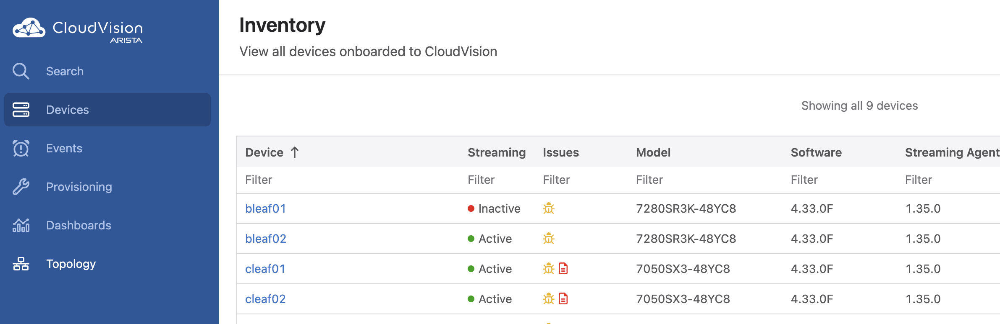
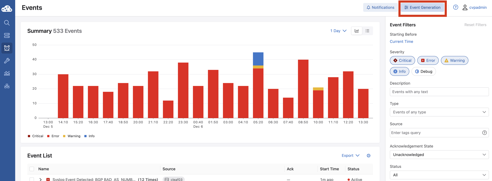

 

# Arista December Southwest Region Newsletter

Welcome to the December 2024 newsletter for Arista customers in the U.S. Southwest Region!
 
We welcome your feedback on the newsletter. If you have any ideas on what you want to see, please reach out to southwest@arista.com.

---

## **Arista Roaming And Mobility Support **
By: Steven King, Systems Engineer, Southwest Region  

The main objectives for good client roaming support are:  
**1.** Maintain quality of experience  
**2.** Maintain security  

This means it is desirable for clients to roam and not experience  interruptions to the services they are using, as well as for security to be maintained without unnecessary reauthentication.  

The general roaming process steps are:  
**1.** Client scans network for candidate “target” APs  
**2.** Client and target AP exchange 802.11 reauthentication messages  
**3.** Client and target AP exchange 802.11 reassociation messages  
**4.** If the SSID is using 802.1X, the 802.1X EAP authentication begins with derivation of a Pairwise Master Key (PMK) by the client and target AP  
**5.** Client and target AP do a 4-way handshake (Defined in 802.11i) to derive the Pairwise Transient Key (PTK) - the unique encryption key for their association, derived from PMK.  

The EAP process generally takes longer than the 4-way handshake, so many of the mechanisms that reduce roaming times do so by skipping the EAP authentication step (Step 4).    

**The 802.11k Amendment**  
The 802.11k amendment defines methods allowing stations to inform each other about their respective RF environments, with the end goal to make faster and better-informed roaming decisions. A client can request an AP to send a Neighbor Report.  This reduces scanning needing to be done by the client (Optimizing step 1 in the roaming process).  

**The 802.11v Amendment**  
The 802.11v amendment is also known as Wireless Network Management(WNM), and includes a service called BSS Transition Management(BTSM).  When an AP decides to disassociate with a client because the AP knows that a neighboring AP can better serve the client, it sends an 802.11v frame called a BTSM Request that tells the client that the AP intends to disassociate, which allows the client time to find a better AP and associate with it.  

Both 802.11k and 802.11v are supported by Arista.

**PMK Caching and Opportunistic Key Caching (OKC)**  
Arista APs use Pairwise Master Key (PMK) caching. With PMK caching, an AP caches the PMK ID used by the client and the AP during their association. Consider a client that roams from AP1 to AP2, and then back.  If the client also caches PMKIDs, the client and AP will skip the 802.1x EAP authentication step (Step 4 above) and go right into the 4-way handshake.  

OKC can be thought of as a network-wide, 802.1X version of PMK caching, where the PMK for a client is cached for as long as the client is associated with the network, again allowing step 4 above to be skipped and proceed directly to the 4-way handshake.

**Preauthentication**  
This is when a client initiates authentication and establishes a PMK Security Association (SA) with the target AP while still associated with the current AP.  The client does this via the current AP over the wired network.  When preauth completes, the client and the target AP both have a PMK SA (cached) for their future association.  So when the client roams, step 4 above is skipped and it goes right into the 4-way handshake.  

However preauthentication doesn’t scale well because all clients need to establish PMK SAs with all possible APs they could roam to, greatly increasing network traffic.  802.11r solves this problem.  

**802.11r or Fast BSS Transition**  
802.11r speeds up roaming in two ways:  
**1.** When the SSID uses 802.1X without 802.11r, the client needs to perform EAP auth every time it roams to a different AP. 802.11r bypasses this step by caching part of the key derived from the RADIUS server, eliminating step 4.  This builds on the OKC method of caching keys (OKC was a precursor of or a step towards 802.11r).    
802.11r specifies a key hierarchy: a first-level key for storage in the RADIUS server (PMK-R0), and a second-level key for storage in APs (PMK-R1), used to derive the PTK for encryption.  
**2.** 802.11r also piggybacks the 4-way handshake messages between the client and the target AP onto the reassociation messages, combining steps 3 and 5.  This is done whether the SSID uses 802.1X or WPA2-PSK.  

Arista supports 802.11r as well as a Mixed Mode option to allow clients that do not support 802.11r to connect the SSID.  

**Role of Inter-AP Coordination in Roaming**

Rather than using a controller, the APs coordinate amongst themselves.  APs do this using L2 broadcast, among their RF neighbors, or through the Wireless Manager (WM) service. Regardless of the method chosen, the APs ensure a seamless roaming experience by sharing necessary information across all APs in the ESS.  For example when a SSID uses a captive portal, the state of the client with respect to the captive portal (authenticated with or logged off from the portal) is communicated to all APs in the ESS even if the inter-AP coordination method selected is narrower in scope.  

An additional consideration for an SSID using NAT-ed IP addresses is that DHCP messages need to be shared among APs so that a client connected to the SSID retains its IP address as it roams.  The relevant DHCP messages are therefore exchanged among all APs in the ESS. PMK caching information on the other hand, is shared per the specific configured  Inter-AP Coordination method.  

The table below shows the roaming-related information exchanged and the method used to exchange this information.  

<figure markdown>

    <figcaption> Roaming Related Information Exchange </figcaption>
</figure> 
 

Contact your SE or ASE to learn more!

---

## **CloudVision Series Part 2/2: Stay Aware of Abnormal Network Behavior with Event Alerts** 
By: Akashdeep Takhar, Advanced Services Engineer, Southwest Region  
 

In last month’s newsletter, we began our tour of the “Events” tab within CloudVision. The article provided the steps necessary to send alert messages from CloudVision to your 3rd party collaboration platform (Slack, Microsoft Teams, Syslog Server, etc). Along with the configuration, the article bridged the gap of sending alert messages by explaining the purpose of utilizing Webhooks. This leads to the question, how do I configure specific activities to monitor in my network? In this month’s article, we will complete our discussion of the Events tab by taking a dive into the “Event Generation” section. Upon completion of these steps, your instance will be prepared to monitor and receive alert messages based on your customized requirements.  

We began our previous article by navigating to the Events tab. At this point, the “Event Notifications” setup is complete and CloudVision understands the destination to send messages towards. However, how is CloudVision supposed to know what to monitor? This is where the “Event Generation” tab is factored in. Upon clicking on the “Events” tab, click on the “Event Generation” section.  

<figure markdown>

    <figcaption> Click on the events tab located on the left side of the page </figcaption>
</figure> 

<figure markdown>

    <figcaption> Click on the event generation button, located on the top right</figcaption>
</figure>  

Event types are a list of anomalies that occur in your network. You can choose from over 70+ different types to monitor for activities ranging from traffic disruption, to potential hardware outages. By sending alerts, CloudVision protects your production from potential catastrophic damage by anticipating the anomaly through user input. You have the ability to set a numeric threshold value that will trigger CloudVision to send messages informing the user of the event. For our example, we will set up an event generation with the event type “Device stopped streaming”.   

<figure markdown>

    <figcaption> Navigate the lists of event types to find "Device Stopped Streaming"</figcaption>
</figure>  

As you click on the event type, notice that there is a default section. This is called a “rule”. You have the ability to add multiple rules for CloudVision to inspect prior to sending out messages. If none of the rules are configured, the default rule will be responsible for checking events.   

<figure markdown>

    <figcaption> Event Rules List </figcaption>
</figure> 

Notice the middle boxes labeled “Severity” , “Raise Time” , “Clear Time”? Those are the values you input to trigger the event alert. Severity is a label included in the message to show the user the level of importance of the event as determined by the user that created the input. You have the options of choosing between: Debug, Info, Warning, Error, or Critical. “Raise Time” is the number of seconds the event has to occur for before sending out the message. “Clear Time” is the number of seconds the event should be inactive for before clearing the event message from the CloudVision event page. When an event occurs, not only do you receive the message, in addition to this the event tab also records the event for you to reference in the future.  

<figure markdown>

    <figcaption> Threshold Values To Input </figcaption>
</figure> 

In our example, if we input 120 for "Raise Time", 240 for "Clear Time" and Critical for "Severity", CloudVision will monitor the chosen device and interface to see if the link is down for more than 120 seconds. If that is true, CloudVision sends a message to the assigned receiver within the "Notifications" section with a "Critical" message alerting you of a discuption in your device's streaming telemetry. 

After completing these steps, click on the top right button labeled “Save”. Your Event tab configuration is now complete! Navigate to the main Event tab to send a test message to ensure the setup was successful. Within a few steps not only were you able to utilize this feature in CloudVision, we also have an additional tool that is active in checking your network health. This is just one of many tools used in CloudVision to help automate tasks along with taking the burden of performing compliance checks for fostering an effective environment.  
  

Links for additional information on Events:  
[Accessing Events](https://www.arista.com/en/cg-cv/cv-accessing-events)  
[Additional Events App Information](https://www.arista.com/en/cg-cv/cv-events-app)  
[CloudVision Events Getting Started Video](https://www.youtube.com/watch?v=dxy0YSyvbkE) 

---

## __*Upcoming Events*__  
Arista hosts various events throughout the year for you! Members of our team organize these informative events to showcase Arista's ability to not only help improve your network, but to also assist by providing a set of tools to improve your operations! Click on the boxes below to be directed to Arista's website for lists of Webinars and Events.

-   __Webinars__  

    --- 

    We make is easy for you to view products that are of interest, all virtually! Technical memebers of the team showcase outstading explanation of the products. Click below to see our list of Webinars. 

    [Arista Webinars](https://www.arista.com/en/company/news/webinars){.md-button}

-   __Events__ 

    ---
    Join us in person to get a closer look in our list of produts and solution, as well as get the chance to meet members of the team. Click below to see our list of ipcoming Events. 

    [Upcoming Events](https://www.arista.com/en/company/news/events){ .md-button }

--- 

## __*Software Updates*__
<figure markdown>
{: style="height:200px;width:300px"}    
    <figcaption></figcaption>
</figure>
For new code releases, click [here](https://www.arista.com/en/support/software-download) 

   |  Softwares    | Versions      |  Release Date |
   | :-----------: | :-----------: | :-----------:
   | __EOS__           | 4.30.8.1M   4.33.0F  4.32.2.1F  4.29.7.1M  4.31.5M 4.30.8M     | October 30th, 2024   October 10th, 2024  October 2nd, 2024  September 27th, 2024 September 26th, 2024 September 26th, 2024 
   | __CVP__           | Portal 2024.3.0   Portal 2024.2.1  Appliance 6.0.7  Sensor 1.0.0      | October 21st, 2024   October 15th, 2024  September 18th, 2024  October 16th, 2024  
   | __DMF__           | 8.4.4  8.5.1         | September 26th, 2024  August 15th, 2024
   | __WLAN__  CV-CUE Wireless Manager  |  13.0.0-67 17.0.0        |  December 15th, 2022 July 12th, 2024 
   | __Arista NDR__         | 5.2.3         | August 2024
   | __TerminAttr__    | 1.34.2   1.31.7   1.28.8          | October 28th, 2024   October 28th, 2024   October 28th, 2024  

---

## __*Software Advisories*__
Below is a list of advisories that are announced by Arista. To view more details on the specific advisories, please click the links in the middle boxes.

| Name          | Advisory Link           | Date of Advisory Notice  |
| :-----------: |:-------------:| :-----:|
|  __Edge Threat Management__   | [Security Advisory 0105](https://www.arista.com/en/support/advisories-notices/security-advisory/20454-security-advisory-0105)  | October 29th, 2024   |
| __CloudVision Appliance__   | [Security Advisory 0104](https://www.arista.com/en/support/advisories-notices/security-advisory/20405-security-advisory-0104) | September 24th, 2024
| __EOS in 802.1X mode__   | [Security Advisory 0103](https://www.arista.com/en/support/advisories-notices/security-advisory/19917-security-advisory-0103) | July 23rd, 2024
| __EOS with MACsec and egress ACLs__   | [Security Advisory 0102](https://www.arista.com/en/support/advisories-notices/security-advisory/19908-security-advisory-0102) | July 23rd, 2024
| __Mojo Identity ID__    | [Field Notice 0089](https://www.arista.com/en/support/advisories-notices/field-notice/20618-field-notice-0089)   | October 29th, 2024   |
| __WiFi AP Firmware__    |  [Field Notice 0088](https://www.arista.com/en/support/advisories-notices/field-notice/20438-field-notice-0088)  | October 23rd, 2024   |
| __Zero Touch Provisioning__    |  [Field Notice 0087](https://www.arista.com/en/support/advisories-notices/field-notice/20418-field-notice-0087)  | October 10th, 2024   |
| __Wi-Fi Integration with WLAN Controllers__         |  [Field Notice 0086](https://www.arista.com/en/support/advisories-notices/field-notice/20411-field-notice-0086) | October 1st, 2024    |

For a list of the most current advisories and notices, click [Here](https://www.arista.com/en/support/advisories-notices)

---

## __*Product Updates*__
<figure markdown>
{: style="height:200px;width:400px"}   
    <figcaption></figcaption>
</figure>
**End of Sale** notices are listed below.

| Device        | Name           | End Of Sale Date  |
| :-----------: |:-------------: |     :----:        |
| Software      | [EOS 4.27 Series](https://www.arista.com/en/support/advisories-notices/end-of-support/20174-end-of-software-support-for-eos-4-27) | August 27th, 2024    |
| Module        | [7500R2 Series Linecards](https://www.arista.com/en/support/advisories-notices/end-of-sale/18886-end-of-sale-of-the-arista-7500r2-series-line-cards) | December 20th, 2023    |
| Access Points | [Arista 802.11ac Wave 2 Devices](https://www.arista.com/en/support/advisories-notices/end-of-sale/14911-end-of-sale-of-arista-802-11ac-wave-2-devices)      |  June 30th, 2022 |
| DMF           | [Analytics Node DCA-DM-AA3](https://www.arista.com/en/support/advisories-notices/end-of-sale/20142-end-of-sale-end-of-life-for-arista-analytics-node-appliance-dca-dm-aa3)          |  August 3rd, 2024             |
| DMF           | [Pluribus NVOS, UNUM, Freedom 9000](https://www.arista.com/en/support/advisories-notices/end-of-sale/20133-end-of-sale-pluribus-nvos-unum-freedom-9000-series)          |  August 2nd, 2024             |
| Switches      | [DCS-7130-96S Series](https://www.arista.com/en/support/advisories-notices/end-of-sale/20381-end-of-sale-of-the-arista-dcs-7130-96s-series) [DCS-7170 and 7170B Series](https://www.arista.com/en/support/advisories-notices/end-of-sale/19846-end-of-sale-of-the-arista-7170-and-7170b-series) [DCS-7130B-32QD](https://www.arista.com/en/support/advisories-notices/end-of-sale/19845-end-of-sale-of-the-arista-dcs-7130b-32qd-series) [DCS-7170-32CD](https://www.arista.com/en/support/advisories-notices/end-of-sale/19266-end-of-sale-of-the-arista-dcs-7170-32cd-series) [DCS-7010T-48](https://www.arista.com/en/support/advisories-notices/end-of-sale/16538-end-of-sale-7010t-48)       |    Varies by Device |

**New Releases** of Arista's device are listed below 

   |  Device       | More Information |  Release Date 
   | :-----------: | :-----------:    | :-----------:
   | Arista Multi-Domain Segmentaton Service  | [Arista MSS](https://www.arista.com/en/company/news/press-release/19297-pr-20240430)         | Q3 2024
   |  Arista 7130 Series             |  [Ultra Low Latency Network](https://www.arista.com/en/company/news/press-release/18273-pr-20231011)  | Q4 2023
   |  Arista AGNI    |   [AI Driven Network Identity](https://www.arista.com/en/company/news/press-release/17244-pr-20230424)                | Q2 2023 
   | Arista CV UNO  | [CloudVision Universal Network Observability](https://www.arista.com/en/company/news/press-release/19195-pr-20240305)  | Q1 2024

---

## __**We're Hiring!**__

Our team is looking to hire the following roles, located in Southwest area:

*Network Systems Engineer*  
[Phoenix SE Role, Click Here](https://www.smartrecruiters.com/AristaNetworks/743999994606279-network-systems-engineer-pre-sales-)    
[Los Angeles SE Role, CLick Here](https://www.smartrecruiters.com/AristaNetworks/744000011382271-network-systems-engineer-pre-sales-)

*Network Advanced Services Engineer*  
[Southwest ASE Role, Click Here](https://www.smartrecruiters.com/AristaNetworks/744000000783368-network-advanced-services-engineer)

---
# *Feel Free to Reach Out To Us For Your Network Needs* 
<figure markdown>
{: style="height:300px;width:800px"}  
    <figcaption></figcaption>
</figure>
We thank you for taking the time to read out newsletter today. Feel free to reach out to your SE or ASE for more information or questions regardsing your network operations. Until next month, have a good one! 

