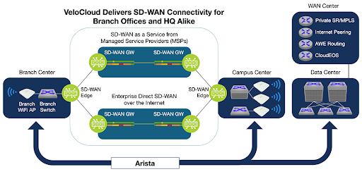
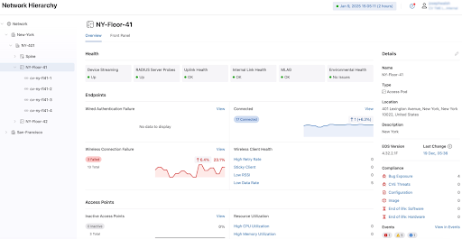
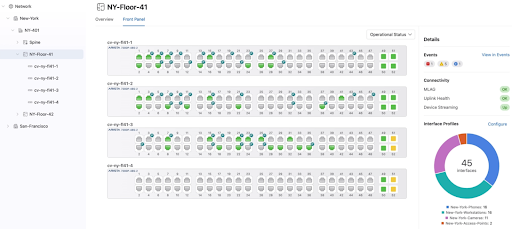

 

# Arista Southwest Region Newsletter

Welcome to the October 2025 newsletter for Arista customers in the U.S. Southwest Region!  

Did you hear? VeloCloud is now a part of Arista. Check out the latest blog, written by our CEO, Jayshree Ullal below!  
[Next Generation SD-WAN in the AI Era, by Arista CEO Jayshree Ullal](https://blogs.arista.com/blog/next-generation-sd-wan-in-the-ai-era)  

Check out additional Blog Posts below!  
[CloudVision: The First Decade](https://blogs.arista.com/blog/cloudvision-the-first-decade-2025)  
[All Blogs](https://blogs.arista.com/blog)  
 
We welcome your feedback on the newsletter. If you have any ideas on what you want to see, please reach out to southwest@arista.com.  

---

## **VeloCloud SD-WAN - Now Part of Arista**
By: Chris Donovan, Systems Engineer (VeloCloud)  

Arista Networks, known for its campus and data center switching, has completed the purchase of VeloCloud in order to provide a full end-to-end intelligent network. You might be wondering: why VeloCloud? VeloCloud has led in the Gartner Magic Quadrant for SD-WAN for 7 years straight. Using our Dynamic Multi-Path Optimization (DMPO) technology, VeloCloud is able to provide improved performance and resilience between corporate sites as well as between corporate sites and the cloud.  

<figure markdown="span">
  
  <figcaption>Arista VeloCloud</figcaption>
</figure>  

**What is DMPO**  

DMPO is our overlay technology. DMPO allows us to measure loss, latency and jitter on WAN links in real time and in both directions independently. We then identify applications using Deep Packet Inspection and direct them over the best available bandwidth based on their performance needs. Realtime traffic can be directed to the WAN link with the lowest loss, latency and jitter and when those characteristics change, can be moved to the new best path, transparently to the users. Large file transfers can be spread across multiple WAN links of different speeds to use all available bandwidth without choking higher priority applications.     

**What about Cloud and SaaS applications?**  

Most SD-WAN solutions work great between corporate sites where an SD-WAN device can be installed on both ends. As more applications move to the cloud, requiring an SD-WAN device on both ends becomes cumbersome. VeloCloud solves this by hosting gateways (VCGs) in major datacenters around the world. These hosted VCGs enable you to leverage the capabilities of DMPO from the branch to the front doors of all the major Cloud and SaaS providers without any additional effort.   

While there are many other features in the VeloCloud portfolio, DMPO and the hosted VCGs provide two of the biggest differentiators for us. As a Systems Engineer that came over with the VeloCloud acquisition, I am excited about the future under Arista and the integrations that are taking shape. If you want to find out more about VeloCloud, I look forward to meeting with you and showing you what we can do.  

For more information on Arista VeloCloud SDWAN, please select link below:
[Arista VeloCloud SDWAN](https://www.arista.com/en/solutions/sd-wan)  

---

## **Simplifying Campus Network Operations with CloudVision Network Hierarchy**
By: Alex Bojko, Advanced Services Engineer, Southwest Region    

Managing modern campus networks can prove to be a challenging task that can feel overwhelming at times. Campus networks encompass large numbers of remote sites, each with unique characteristics and various devices to manage. In order to simplify the management of such a distributed infrastructure, Arista has introduced Network Hierarchy in CloudVision.     

Overseeing such a deployment and gaining visibility into various sites and device connections is a difficult task to accomplish. When an issue arises, locating that issue and pinpointing it to a specific site can be an extremely difficult task. Configuration across sites can also be difficult to standardize and modify when needed.  

Network Hierarchy is a feature meant to simplify campus network management, and was introduced to Arista CloudVision to help address these pain points at scale.  

Network Hierarchy in CloudVision provides a logical, tree-like structured view that allows you to group devices together by location. Instead of a linear list of devices that are scattered across your infrastructure, Network Hierarchy provides an organized, simple to comprehend view that allows you to navigate seamlessly between campus networks that you manage using the tree-like structured navigation panel. This structure works at scale, making it easy to oversee and manage large deployments with many physical locations. Each Campus is organized within the hierarchy, with devices grouped by physical location and operational use.  

<figure markdown="span">
  
  <figcaption>Network Hierarchy Page</figcaption>
</figure>  

Within each Campus defined in Network Hierarchy, statistics and metrics are displayed that provide a comprehensive overview tailored to what is happening at each individual site. Metrics include statistics from both the wired and wireless side, Uplink health, MLAG Status, authentication information, connectivity monitor status, and a logical topology view of the Campus network.  This allows operators to quickly go from a global, network wide view, to a site/device specific, interface specific, drilled down view. Having this flexibility allows for faster MTTR, as issues are able to be isolated far more quickly and efficiently. Operators can locate issues that are specific to a site, and from there drill down to determine the exact device or devices experiencing the issues.  

<figure markdown="span">
  
  <figcaption>Network Hierarchy Port Specific View</figcaption>
</figure>   

Network Hierarchy also allows for access layer interface configuration via the Access Interface Configuration Quick Action in CloudVIsion. Here, the operator can rapidly assign access layer port configuration to individual or groups of interfaces. This further simplifies day 2 operations, as any campus device switchport configuration can be viewed and modified as needed, all from the Network Hierarchy view.  

To learn more about Network Hierarchy, the metrics it provides, how to run diagnostics, and how it can simplify your Campus network management, click the link below.  
[Arista Network Hierarchy Guide](https://www.arista.io/help/articles/bmV0d29ya0hpZXJhcmNoeS5BbGwubmV0d29ya0hpZXJhcmNoeQ==) 

---

## __*Upcoming Events*__  
Arista hosts various events throughout the year for you! Members of our team organize these informative events to showcase Arista's ability to not only help improve your network, but to also assist by providing a set of tools to improve your operations!  

Click on the boxes below to be directed to Arista's website for additional lists of Webinars and Events.

-   __Webinars__  

    --- 

    We make is easy for you to view products that are of interest, all virtually! Technical memebers of the team showcase outstading explanation of the products. Click below to see our list of Webinars. 

    [Arista Webinars](https://www.arista.com/en/company/news/webinars){.md-button}

-   __Events__ 

    ---
    Join us in person to get a closer look in our list of produts and solution, as well as get the chance to meet members of the team. Click below to see our list of ipcoming Events. 

    [Upcoming Events](https://www.arista.com/en/company/news/events){ .md-button }

--- 

## __*Software Updates*__
<figure markdown>
{: style="height:200px;width:300px"}    
    <figcaption></figcaption>
</figure>
For new code releases, click [here](https://www.arista.com/en/support/software-download) 

   |  Softwares    | Versions      |  Release Date |
   | :-----------: | :-----------: | :-----------:
   | __EOS__           | 4.34.2F  4.32.6.1M   4.33.4M   4.32.6M    | August 3rd, 2025  July 2nd, 2025   June 23rd, 2025   June 20th, 2025   
   | __CVP__           | Portal 2025.2.1   Appliance 7.0.1   Sensor 1.1.1      | August 21st, 2025   January 28th, 2025  July 14th, 2025  
   | __DMF__           | 8.8.0  | August 15th, 2025   
   | __WLAN__  CV-CUE  |   19.0.0        |   July 25th, 2025   
   | __Arista NDR__         | 5.3.5         | July 16th, 2025
   | __TerminAttr__    | 1.39.1         | July 18th, 2025    
   | __VeloCloud SD-WAN__   Orchestrator/ Gateway / Edge   |  6.4.0         |   May 2nd, 2025   

---

## __*Software Advisories*__
Below is a list of advisories that are announced by Arista. To view more details on the specific advisories, please click the links in the middle row.

| Name          | Advisory Link           | Date of Advisory Notice  |
| :-----------: |:-------------:| :-----:|
|  __Global Common Encryption Key__   | [Security Advisory 0122](https://www.arista.com/en/support/advisories-notices/security-advisory/22022-security-advisory-0122)  | July 22nd, 2025   |  
|  __UDP Source Port 3503 Packets__   | [Security Advisory 0121](https://www.arista.com/en/support/advisories-notices/security-advisory/22021-security-advisory-0121)  | July 22nd, 2025   |  
|  __AP Kernal Panics__   | [Field Notice 0115](https://www.arista.com/en/support/advisories-notices/field-notice/22422-field-notice-0115)  | September 20th, 2025   |  
|  __Updated Redirector for AP__   | [Field Notice 0114](https://www.arista.com/en/support/advisories-notices/field-notice/22418-field-notice-0114)  | September 19th, 2025   |  
|  __Guest Manager UI to CV-CUE__   | [Field Notice 0113](https://www.arista.com/en/support/advisories-notices/field-notice/22417-field-notice-0113)  | September 19th, 2025   |  
|  __Update of Radsec Certificates__   | [Field Notice 0112](https://www.arista.com/en/support/advisories-notices/field-notice/22400-field-notice-0112)  | September 11th, 2025   |  
|  __CVP Reverse Proxy__   | [Field Notice 0111](https://www.arista.com/en/support/advisories-notices/field-notice/22238-field-notice-0111)  | September 3rd, 2025   |  
|  __CVP Disc Usage__   | [Field Notice 0110](https://www.arista.com/en/support/advisories-notices/field-notice/22237-field-notice-0110)  | September 3rd, 2025   | 
 

For a list of the most current advisories and notices, click [Here](https://www.arista.com/en/support/advisories-notices)

---

## __*Product Updates*__
<figure markdown>
{: style="height:200px;width:400px"}   
    <figcaption></figcaption>
</figure>
**End of Sale** notices are listed below.

| Device        | Name           | End Of Sale Date  |
| :-----------: |:-------------: |     :----:        |
| Software      | [End of Software for CloudVision Portal 2023.2](https://www.arista.com/en/support/advisories-notices/end-of-support/21412-end-of-software-support-for-cloudvision-portal-2023-2-release-train) [End of Software Support for EOS 4.28](https://www.arista.com/en/support/advisories-notices/end-of-support/21275-end-of-software-support-for-eos-4-28) [DMF and CCF Deployments on Accton/ Edgecore Switches](https://www.arista.com/en/support/advisories-notices/end-of-support/21094-end-of-support-for-dmf-and-ccf-deployments-on-accton-edgecore-switches) [EOS-4.34 and later no longer supported on select switches](https://www.arista.com/en/support/advisories-notices/end-of-support/21089-end-of-software-support-for-7280r-r2-7500r-r2-and-7020r-series)  | May 27th. 2025   March 14, 2025  January 31st, 2025  January 15th, 2025   |
| CVP           | [CVP IPAM Application](https://www.arista.com/en/support/advisories-notices/endofsupport)   [CVP 2023.3](https://www.arista.com/en/support/advisories-notices/end-of-support/21627-end-of-software-support-for-cloudvision-portal-2023-3-release-train)          |  July 14th, 2025   June 17th, 2025   |
| DMF           | [DMF 8.3](https://www.arista.com/en/support/advisories-notices/end-of-support/21417-end-of-software-support-for-dmf-8-3)          |  June 3rd, 2025           |  
| CCF           | [CCF Product Line](https://www.arista.com/en/support/advisories-notices/end-of-sale/22430-end-of-sale-end-of-life-for-arista-ccf-product-line)          |  October 1st, 2025           |  
| Switches      | [7010TX-48-DC Switch](https://www.arista.com/en/support/advisories-notices/end-of-sale/22421-end-of-sale-of-the-arista-7010tx-48-dc-switches)  [7050CX3-32S Switch](https://www.arista.com/en/support/advisories-notices/end-of-sale/22419-end-of-sale-of-the-arista-7050cx3-32s-switches)  [CCS-720XP-96ZC2 Switch with 4GB DRAM](https://www.arista.com/en/support/advisories-notices/end-of-sale/22403-end-of-sale-of-the-arista-ccs-720xp-96zc2-switches-with-4gb-dram)  [CCS-720D Switches with 4GB DRAM](https://www.arista.com/en/support/advisories-notices/end-of-sale/22402-end-of-sale-of-the-arista-ccs-720d-switches-with-4gb-dram)  [CCS-710P-12 Switch](https://www.arista.com/en/support/advisories-notices/end-of-sale/22401-end-of-sale-of-the-arista-ccs-710p-12-switch) |  September 19th, 2025  September 19th, 2025  Septemebr 12th, 2025  September 12th, 2025  September 12th, 2025 |
| VeloCloud      | [SASE Secured by Symantec](https://www.arista.com/en/support/advisories-notices/end-of-sale/22072-end-of-sale-life-velocloud-sase-secured-symantec)  [Software Defined (SD) Access](https://www.arista.com/en/support/advisories-notices/end-of-sale/21653-end-of-sale-end-of-life-for-velocloud-software-defined-sd-access)   |  August 20th, 2024   July 1st, 2025 | 

**New Releases** of Arista's device are listed below 

|  Device       | More Information |  Release Date 
    | :-----------: | :-----------:    | :-----------:
    | Arista VeloCloud | [VeloCloud Acquisition](https://www.arista.com/en/company/news/press-release/21646-pr-07012025) | Q3 2025
    |  Arista SWAG    |   [Modern Stacking for Campus](https://www.arista.com/en/company/news/press-release/20693-pr-12032024)                | Q1 2025 
    | Arista Multi-Domain Segmentaton Service  | [Arista MSS](https://www.arista.com/en/company/news/press-release/19297-pr-20240430)         | Q3 2024
    | Arista CV UNO  | [CloudVision Universal Network Observability](https://www.arista.com/en/company/news/press-release/19195-pr-20240305)  | Q1 2024

---
# *Feel Free to Reach Out To Us For Your Network Needs* 
<figure markdown>
{: style="height:300px;width:800px"}  
    <figcaption></figcaption>
</figure>
We thank you for taking the time to read out newsletter today. Feel free to reach out to your SE or ASE for more information or questions regardsing your network operations. Until next month, have a good one! 

